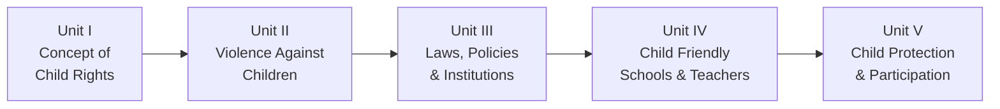

# Child Rights and Protection — Exam Preparation Notes

!!! tip "About These Notes"
    These notes are prepared from the textbook **"Child Rights and Protection"** by **Dr. K. Nagarajan** (2024 Edition). They are formatted for easy revision, memorization, and exam writing.

---

## 📚 Unit-wise Study Guide

---

### Unit I — Concept of Child Rights

📖 [Read Unit I Notes](unit1.md)

**Key Topics:**

- Concept and Definition of Child and Child Rights
- Definition of 'Child' under Various Laws in India
- History of Child Rights in Tamil Nadu and India
- Non-Governmental Organisations (NGOs) Working for Child Rights
- Historic Treatment of Children
- Understanding Child Rights from the Perspective of Affected People
- Importance and Need for the Rights of Children
- United Nations Convention on the Rights of the Child (UNCRC)
- Millennium Development Goals (MDGs)
- Sustainable Development Goals (SDGs)
- Child Rights and Sustainable Development Goals

---

### Unit II — Violence Against Children

📖 [Read Unit II Notes](unit2.md)

**Key Topics:**

- Violence Against Children — Various Forms and Trends in Tamil Nadu
- Child Abuse and Abuse of Trust
- Discrimination (Racism, Gender, Caste, Age, Disability, etc.)
- Drug Dependency among Children
- Online Abuse
- Suicidal Tendency among Children
- Intersectionality
- Consequences of Impact of Violence on Children
- Factors Leading to Vulnerability of Children in Tamil Nadu and Root Causes

---

### Unit III — Child Rights: Laws, Policies and Institutions

📖 [Read Unit III Notes](unit3.md)

**Key Topics:**

- Juvenile Delinquency — Meaning, Definition, Causes, Reforming
- Juvenile Justice (Care and Protection of Children) Act, 2015
- Right to Free and Compulsory Education Act, 2009
- Protection of Children from Sexual Offences Act (POCSO), 2012
- Prohibition of Child Marriage Act, 2006
- Child Labour (Prohibition and Regulation) Act, 1986
- National and State Policies for Child Protection
- Vishakha Committee
- Suppression of Immoral Traffic in Women and Girls Act, 1956
- Child Protection System in India
- UN Human Rights Council
- UN Committee on the Rights of Children
- Special Rapporteurs on Issues Related to Children

---

### Unit IV — Child Friendly Schools and Role of Teachers

📖 [Read Unit IV Notes](unit4.md)

**Key Topics:**

- Child Friendly Schools — Six Essential Aspects and Key Principles
- Importance of Child Friendly Schools
- Role of Teachers in Safeguarding the Rights of Children
- Role of School in Child Protection
- Importance of Child Protection Policy in Schools
- Creating Space and Opportunity for Student-Voice
- Child Rights Clubs in Schools
- Role of School Management Committees
- Challenges of Teachers as Child Rights Practitioners

---

### Unit V — Child Protection and Participation

📖 [Read Unit V Notes](unit5.md)

**Key Topics:**

- Identification of Children in Vulnerable Situations
- Child Abuse and Neglect — Types, Signs and Symptoms
- Skills to Deal with Children Affected by Violence
- Role of Teachers in Diagnosing and Reporting Suspected Cases
- Psycho-social Support and Referral Services
- Teachers as Mentors of Children
- Positive Discipline Techniques
- Skills for Celebrating Child Rights

---

## 📝 Exam Pattern

| Question Type | Answer Length | Marks |
|---|---|---|
| **Essay Type** | About 5 pages | High weightage |
| **Short Answer Type** | About 2½ pages | Medium weightage |
| **Objective Type** | One-line / MCQ | Low weightage |

!!! important "Exam Tip"
    Review Questions are categorised under **Objective**, **Short-Answer** and **Essay Type**. Each unit ends with review questions — practice them for exam preparation.
