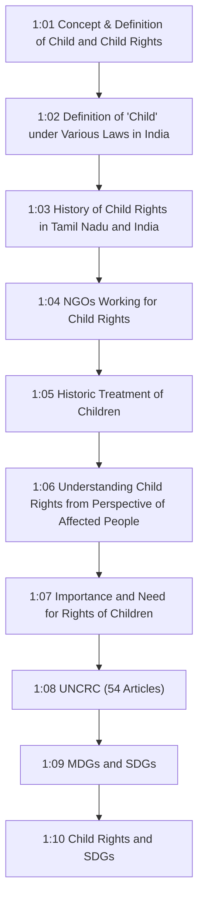
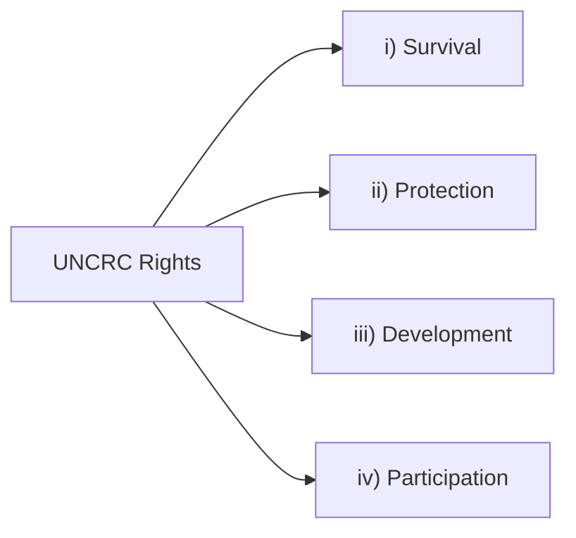
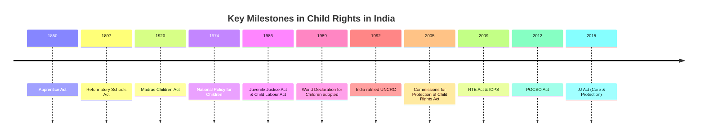
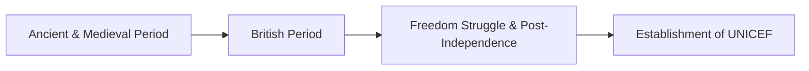
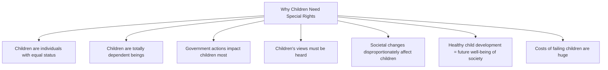
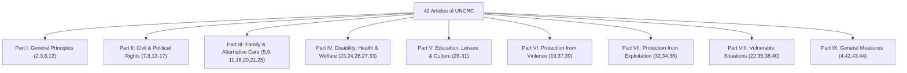
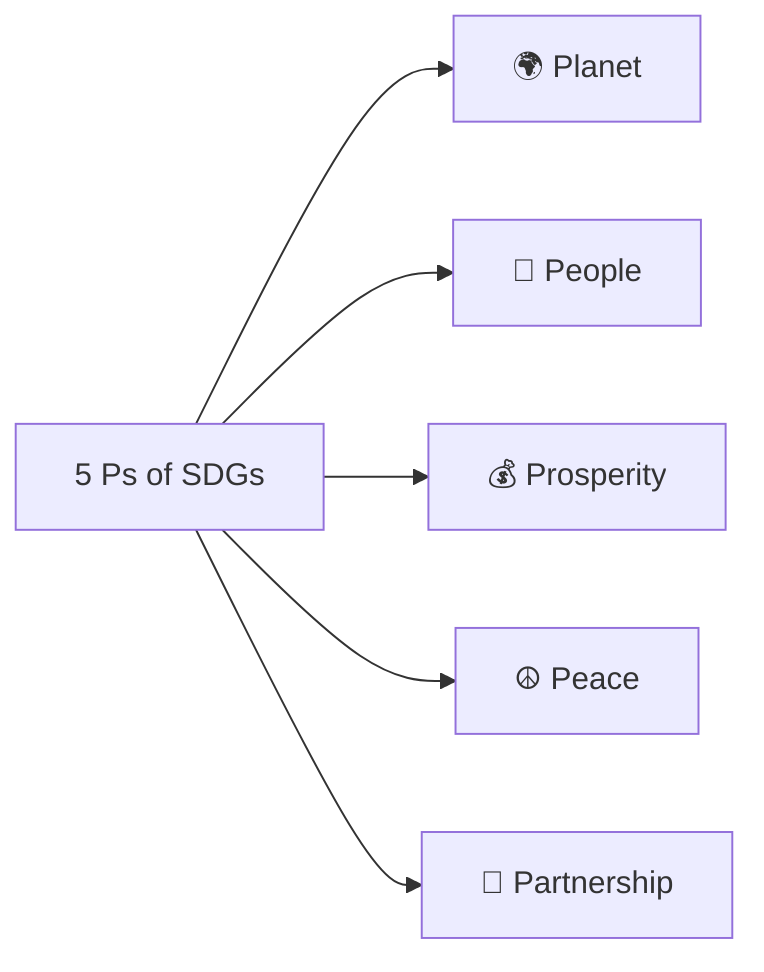
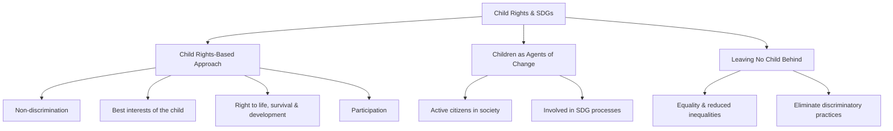

# Unit I: Concept of Child Rights

## 1:00 Introduction

Children are one of the **most vulnerable sections** of any society. Violation of the rights of children is a complex process, as multiple factors are at play. To provide protection against violations, the legal framework provides children with **legislative support**. Different legislations in India define children differently — some view children as **independent agents** who can take responsible decisions, while others consider them **wholly dependent** on adults for survival and decisions about life.

!!! note "Topics Covered in This Unit"
    - Concept and definition of child and child rights
    - Definition of child under various laws in India
    - History of child rights in Tamil Nadu and India
    - Non-Governmental Organisations (NGOs) working for child rights
    - Historic treatment of children
    - Understanding child rights from the perspective of affected people
    - Importance and need for the rights of children
    - United Nations Convention on the Rights of the Child (UNCRC)
    - The Millennium Development Goals (MDGs) and Sustainable Development Goals (SDGs)
    - Child Rights and Sustainable Development Goals

---

## 1:01 Concept and Definition of Child and Child Rights

### 1:01:1 Concept and Definition of Child

!!! tip "Key Definition"
    **Child** — Etymologically, the term comes from the Latin word **"infans"** meaning **"the one who does not speak"**.

- **Biological sense:** A child is a person between **birth and puberty**, or between the developmental period of **infancy and puberty**.
- **Legal sense:** The term "child" may refer to anyone **below the age of majority** or some other age limit as prescribed by the laws of the respective countries.
- The term may also refer to someone below another legally defined age limit unconnected to the age of majority.

| Country / Law | Definition of Child |
|---|---|
| **Singapore** (Children and Young Persons Act) | Under the age of **14** (age of majority is 21) |
| **U.S. Immigration Law** | Under the age of **21** |
| **UNCRC** (United Nations Convention on the Rights of the Child) | Below the age of **18 years** (unless majority is attained earlier under applicable law) |

!!! important "Key Fact for Exams"
    The UNCRC defines a child as **"a human being below the age of 18 years unless under the law applicable to the child, majority is attained earlier."** This is ratified by **192 of 194** member countries of the U.N.O. According to International Law, a child means every human being **below the age of 18 years**.

---

### 1:01:2 Concept and Definition of Child Rights

**Children's rights are human rights.** They protect the child as a human being. As human rights, children's rights are constituted by **fundamental guarantees** and **essential human rights**.

Children's rights recognize fundamental guarantees to all human beings:

- **Right to life**
- **Non-discrimination principle**
- **Right to dignity** through the protection of physical and mental integrity

!!! note "UNCRC Framework"
    The rights of all children are laid out in the **54 Articles** of the **United Nations Convention on the Rights of the Child (UNCRC)**. The Convention lays out the **Civil, Political, Social, Cultural and Economic rights** that all children under the age of 18 are entitled to, and the responsibilities of governments and adults to ensure these rights are upheld. **All rights are linked**, and no right is considered more important than another.

**Significant Features of the UNCRC:**

- Apply to **both girls and boys** up to the age of **18**, even if they are married or already have children of their own
- Guided by the principles of **"Best Interest of the Child"** and **"Non-discrimination and Respect for Views of the Child"**
- Emphasise the importance of the **family** and the need to create an environment conducive to the **healthy growth and development** of children
- Obligate the **State** to respect and ensure that children get a **fair and equitable deal** in society

#### Four Sets of Rights under UNCRC

| Right Category | Key Rights Included |
|---|---|
| **i) Right to Survival** | Right to life, Highest attainable standard of life, Nutrition, Adequate standard of living, A name and nationality |
| **ii) Right to Protection** | Freedom from exploitation, Freedom from abuse, Freedom from inhuman or degrading treatment, Freedom from neglect, Special protection in special situations (emergency, armed conflicts, disability, etc.) |
| **iii) Right to Development** | Right to education, Right to support for early childhood care and development, Right to social security, Right to leisure, recreation and cultural activities |
| **iv) Right to Participation** | Right to respect for the views of the child, Right to freedom of expression, Right to access to appropriate information, Right to freedom of thought, conscience and religion |

---

### 1:01:3 Child Rights in India

All people under the age of **18** are entitled to the standards and rights guaranteed by the laws that govern our country and the international legal instruments we have accepted by ratifying them.

**The Constitution of India guarantees all children certain rights:**

| Article | Right Guaranteed |
|---|---|
| **Article 21A** | Right to **free and compulsory elementary education** for all children in the age group **6–14** |
| **Article 24** | Right to be **protected from any hazardous employment** till the age of **14 years** |
| **Article 39(e)** | Right to be protected from being **abused and forced by economic necessity** to enter occupations unsuited to their age or strength |
| **Article 39(f)** | Right to **equal opportunities and facilities** to develop in a healthy manner and in conditions of freedom and dignity; guaranteed protection of childhood and youth against exploitation and against moral and material abandonment |

**Rights as Equal Citizens of India:**

| Article | Right Guaranteed |
|---|---|
| **Article 14** | Right to **equality** |
| **Article 15** | Right against **discrimination** |
| **Article 21** | Right to **personal liberty** and due process of law |
| **Article 23** | Right to be protected from being **trafficked and forced into bonded labour** |
| **Article 46** | Right of **weaker sections** to be protected from social injustice and all forms of exploitation |

!!! note
    Besides the Constitution, there are **several laws** that specially apply to children.

---

## 1:02 Definition of 'Child' under Various Laws in India

In India, different laws related to children define **'child' differently**. The following table summarises the definitions:

| Law | Definition of 'Child' | Key Details |
|---|---|---|
| **The Child Labour (Prohibition and Regulation) Act, 1986** — Section 2(ii) | A person who has **not completed 14 years** of age | Aims at prohibiting the engagement of children in work |
| **The Plantations Labour Act, 1951** — Section 2(c) | A person who has **not completed 15 years** | Formed for the welfare of people engaged in plantation. Section 24 further states no child below **12 years** shall work in any plantation |
| **The Motor Transport Workers Act, 1961** | A person who has **not completed 15 years** | Regulates conditions of work of motor transport workers. Section 21 prohibits employment of a child in a motor transport undertaking |
| **The Beedi and Cigar Workers (Conditions of Employment) Act, 1966** — Section 2(b) | A person who has **not completed 14 years** of age | Section 24: No child is required or allowed to work in any industry premises |
| **The Prohibition of Child Marriage Act, 2006** | **Male:** not completed **21 years**; **Female:** not completed **18 years** | Section 3 makes child marriage void at the option of the person who was a child at the time of marriage |
| **The Juvenile Justice (Care and Protection of Children) Act, 2015** | A person who has **not completed 18 years** of age | Juveniles aged **16–17** may be tried as adults if charged with **heinous crimes** (post-Nirbhaya Case amendment) |
| **The Protection of Children from Sexual Offences Act (POCSO), 2012** — Section 2(d) | Any person **below the age of 18 years** | Aims to protect children from sexual offences and harassment |

!!! important "Exam Tip"
    Note that the age defining a "child" varies from **12 years to 21 years** depending on the specific legislation and its purpose.

---

## 1:03 History of Child Rights in Tamil Nadu and India

### 1:03:1 History of Child Rights in Tamil Nadu

The State of Tamil Nadu recognizes that every child has **equal rights to learning, knowledge and education**. The State reaffirms its commitment to make available an enabling setting conducive to the educational requirement and well-being of the child on par with **international standards**.

#### Key Milestones in Tamil Nadu

| Year | Milestone |
|---|---|
| **1992** | **Chief Minister's Girl Child Protection Scheme** introduced |
| **1994** | **Tamil Nadu Compulsory Education Act** passed (received President's assent on 21st November 1995) |
| **2003** | **Corporal punishment** was abolished in schools |
| **2011** | **Tamil Nadu Right of Children to Free and Compulsory Education Rules, 2011** notified |
| **2012** | **Tamil Nadu Commission for Protection of Child Rights (TNCPCR) Rules** notified |
| **2021** | **Tamil Nadu State Policy for Children** |

**Chief Minister's Girl Child Protection Scheme (1992):**

A pioneering and path-breaking scheme for the welfare of the girl child, aimed at **preventing gender discrimination** by empowering and protecting rights of girl children through **direct investment from Government**.

The scheme aims to:

- **Promote enrolment and retention** of the girl child in school and ensure her education at least up to intermediate level
- **Encourage girls** to get married only after the age of **18 years**
- **Encourage parents** to adopt family planning norms with two girl children
- **Protect the rights** of the girl child and provide social empowerment
- **Strengthen the role of the family** in improving the status of the girl child

**Tamil Nadu Compulsory Education Act, 1994:**

Key provisions:

1. **Elementary education to be compulsory** for every child of school age
2. Government shall provide such number of elementary schools with **trained teachers** as may be necessary
3. **Duty of every parent or guardian** to cause such child to attend an elementary school
4. **Exemptions:** Attendance at an elementary school for a child of school age shall not be compulsory (under specified conditions)

**Tamil Nadu Commission for Protection of Child Rights (TNCPCR):**

- In **1974**, the National Policy for Children recognized that programmes for children should find a prominent place in national plans for human resource development
- On **11.12.1992**, the Indian Government acceded to the **Convention on the Rights of the Child (CRC)**
- The **National Charter for Children 2003** was adopted on **09.02.2004**
- **TNCPCR** was formed vide G.O. (Ms) No.45, dated **28.03.2012**, as per Section 17(1) of the Commissions for Protection of Child Rights Act, 2005
- From **18.01.2013**, the TNCPCR has been functioning effectively

**Tamil Nadu Child Rights Protection Network:**

- Formed at the **State-Level Consultation** on the Promotion and Protection of Child Rights in Tamil Nadu at Chennai on **February 9th and 10th** (year not specified in source)
- Formed with a **42-member committee** representing **16 districts** and an Advisory Committee
- On **30 June 2001**, the First State Level Co-ordination Committee was held at Chennai

**Functions of TNCPCR:**

- Implementation of all child welfare/rights Acts in force
- Recommending the relevant Government Departments and institutions to resolve child rights issues
- Submitting annual report on activities to the State Government as per Section 23 of the Commissions for Protection of Child Rights Act, 2005

---

#### 1:03:1:01 Tamil Nadu State Policy for Children, 2021

Child welfare and development are paramount concerns for any society. The Government of Tamil Nadu has taken significant strides with its comprehensive **Tamil Nadu State Policy for Children (TNSPC) of 2021**.

!!! note "Challenges Addressed"
    While the state has made commendable progress, certain challenges persist:

    - **Child marriage**
    - **Child labour**
    - **Crimes against children**
    - **Juvenile delinquency**

**Vision of TNSPC:**

The overarching vision is to ensure **holistic development within a secure environment** for every child, empowering them to reach their full potential and achieve the **Sustainable Development Goals (SDGs)**.

**Mission:** To protect children from **violence, abuse, and exploitation**; provide access to **quality healthcare and education**; enable children to **express their opinions**; and uphold the principle of **"Leave no one behind."**

**Guiding Principles:**

The TNSPC is firmly rooted in international standards, deriving its guiding principles from:

- **UN Convention on the Rights of the Child (UNCRC)**
- **National Policy for Children 2013**
- **National Plan of Action 2016**
- **UN's 2030 Agenda for Sustainable Development**

**Midday Meal Scheme — History in Tamil Nadu:**

The Midday Meal Scheme was introduced to:

- Improve the effectiveness of primary education by improving **nutritional status** of children
- Attract children from **disadvantaged sections**, especially girls from Dalits and Adivasi tribes
- Increase attendance and **reduce dropout rates**
- Promote a feeling of **oneness and secularism** amongst various religions and cultures

| Year | Development |
|---|---|
| **1920** | World's first Midday Meal Scheme was started in **Chennai** |
| **1956** | Chief Minister Mr. K. Kamaraj introduced a scheme to provide noon-meal to poor children in all Panchayat Schools |
| **1982** | **Puratchi Thalaivar MGR Nutritious Meal Programme** was introduced |
| **1989** | Chief Minister Kalaignar M. Karunanidhi introduced the provision of **boiled egg every fortnight** |
| **2013** | Chief Minister Selvi J. Jayalalithaa introduced **variety meals with masala eggs** |
| **2023** | Chief Minister Mr. M.K. Stalin introduced **free breakfast scheme** |

---

### 1:03:2 History of Child Rights in India

From ancient days, Indian culture has been based on traditional values of **sacrifice, mercy, donation, non-violence and equality**. The values of human rights are rooted in Indian culture. During the twentieth century, numerous factors including **age of child, gender of child, caste and kinship** led to biased behaviour against children in India.

**Role of UNICEF in India:**

- The **Second World War** caused indescribable sufferings to children across the globe
- United Nations on **11 December 1946** established **UNICEF** (United Nations International Children's Emergency Fund) to provide care and protection to children worldwide
- In **October 1953**, the mandate was changed to provide **long-term assistance** to deprived children resulting from economic and political turmoil due to war
- Presently known as **United Nations Children's Fund**
- UNICEF has been operating in India since **1949**
- Government of India in collaboration with UNICEF runs various programmes to support child rights, rights of teenagers and women

#### Important Child-Related Legislations in India

| S.No. | Legislation |
|---|---|
| 1 | The **Factories Act of 1948** (amended in 1986 as the Child Labour Act, then as **Child Labour (Prohibition and Regulation) Act of 2016**) |
| 2 | **Immoral Traffic Prevention Act, 1986** |
| 3 | **The Child Marriage Prohibition Act, 2006** |
| 4 | **The Right of Children to Compulsory and Free Education Act, 2009** |
| 5 | **The Juvenile Justice Act of 1986** (amended in 2000, 2006, 2011; finally the **Juvenile Justice (Care and Protection of Children) Act, 2015**) |
| 6 | **Protection of Children from Sexual Offences Act, 2012 (POCSO)** |

#### Constitutional Rights for Children

| Article | Right |
|---|---|
| **Article 21-A** | Right to free and compulsory elementary education for all children in the age group **6–14** |
| **Article 24** | Right to be protected from any hazardous employment till the age of **14 years** |
| **Article 39(e)** | Right to be protected from being abused and forced by economic necessity to enter unsuitable occupations |
| **Article 39(f)** | Right to equal opportunities and facilities to develop in a healthy manner with freedom and dignity |
| **Article 45** | Right to early childhood care and education to all children until they complete the age of **six years** |

!!! important "Key Fact"
    The **Declaration of the Rights of the Child (DRC)** was endorsed and adopted by the United Nations General Assembly in **1959**. India confirmed and accepted the **UNCRC in December 1992**.

#### Important Milestones in the Genesis of Child Rights in India

| S.No. | Year | Milestone |
|---|---|---|
| 1 | **1850** | **The Apprentice Act** — the first law in India to cater to special needs of children within the criminal justice apparatus |
| 2 | **1897** | **The Reformatory Schools Act** — separated children from adults for the first time in India in the criminal justice system |
| 3 | **1920** | **The Madras Children Act** — introduced following the recommendations of the Indian Jails Committee 1919–1920 |
| 4 | **1974** | India formulated its first **"National Policy for Children" (NPC)** |
| 5 | **1986** | **The Juvenile Justice Act** — the first juvenile law in India |
| 6 | **1986** | **The Child Labour (Prohibition and Regulation) Act** |
| 7 | **1989** | India adopted the **World Declaration for Survival, Protection and Development of Children** adopted by the UN General Assembly on 20th November 1989 |
| 8 | **1993** | **National Human Rights Commission** (statutory body) established on 12th October 1993 under the Protection of Human Rights Act, 1993 |
| 9 | **2000** | Government appointed an Expert Committee under Justice V.R. Krishna Iyer for drafting the **"National Commission for Children Bill 2000"** |
| 10 | **2000** | Supreme Court of India **banned corporal punishment** for children on December 1, 2000 |
| 11 | **2006** | Department of Women and Child Development became a **full-fledged Ministry**; child protection matters transferred to this new ministry |
| 12 | **2006** | Juvenile Justice Act amended as the **Juvenile Justice (Care and Protection of Children) Amendment Act, 2006** (again in 2011) |
| 13 | **2005** | Government enacted the **Commissions for Protection of Child Rights Act, 2005** (notified in Gazette on 20th January 2006) |
| 14 | **2006** | **NCPCR** (National Commission for Protection of Child Rights) constituted on **31st July 2006** |
| 15 | **2006** | **Prohibition of Child Marriages Act, 2006 (PCMA)** enacted (effective from 1st November 2007) |
| 16 | **2009** | **Integrated Child Protection Scheme (ICPS)** launched by Ministry of Women and Child Development on 26th February 2009 |
| 17 | **2009** | **The Right of Children to Free and Compulsory Education (RTE) Act, 2009** came into force from **1st April 2010** |
| 18 | **2011** | Guidelines governing **adoption of children** in India were formulated |
| 19 | **2012** | **The Protection of Children from Sexual Offences Act (POCSO) 2012** was enacted |
| 20 | **2013** | Union Cabinet of India on **18th April 2013** approved the **National Policy for Children** |

---

## 1:04 Non-Governmental Organisations Working for Child Rights in Tamil Nadu and India

### 1:04:1 Non-Governmental Organisations Working for Child Rights in Tamil Nadu

A **non-governmental organization (NGO)** is a non-profit group or institution with a social mission, which operates independently of any government.

| S.No. | NGO Name | Location | Key Focus |
|---|---|---|---|
| 1 | **Centre for Child Rights and Development (CCRD)** | Chennai (est. 1988) | Partner of ICCO/Kerkinactie (Netherlands) since 2002; provides Capacity Enhancement Trainings; established as a "Resource Centre for Child Rights" at the State level |
| 2 | **Hand in Hand** | Kancheepuram | Abolish child labour; provide refuge and education to neglected women and children |
| 3 | **Eureka Child** | Tamil Nadu | Quality education to children from weaker sections; free books, play kits, writing materials, food; training in Tamil, English, Maths, and Science |
| 4 | **Sri Sakthi Trust** | Dindigul (est. 2001) | Create consciousness among rural public about physical cleanliness, importance of education, and other social activities |
| 5 | **Kaakkum Karangal** | Chennai (est. 1992) | Care for old persons and street children; provide education, employment, and meal aid |
| 6 | **Bhumi** | Tamil Nadu | Provide education to orphan children in under-developed areas through young volunteers |
| 7 | **Mithra** | Chennai (est. 1977) | Free education up to age 16 for mentally and physically challenged persons |
| 8 | **Agaram Foundation** | Chennai (est. 2006) | Founded by Tamil Film Actor Surya; student scholarships; free training for aptitude and personality development |
| 9 | **Save the Children** | London (International) | Improve lives of children through healthcare, education, emergency aid, economic development |
| 10 | **Amar Seva Sangam** | Ayikudy, Tirunelveli | Disability control in rural areas; centralized resource centre for differently-abled and intellectually challenged development |
| 11 | **EKAM Foundation** | Tamil Nadu | Healthcare of neonates, children, adolescents, and mothers from underprivileged communities |
| 12 | **Annai Charitable & Educational Trust** | Tamil Nadu | Founded by Mr. T. Joseph Xavier; services for the less privileged, oppressed, women, children and disabled |

---

### 1:04:2 Non-Governmental Organisations Working for Child Rights in India

| S.No. | NGO Name | Key Focus |
|---|---|---|
| 1 | **Save the Children** | Founded in 1919; global non-profit present in **80+ countries**; provides quality education, healthcare, protection from harm and abuse, and life-saving aid during emergencies |
| 2 | **CRY (Child Rights and You)** | Committed to ensuring children have access to free and quality education, primary healthcare, and are safe from violence, abuse, and exploitation; works to reduce child malnutrition |
| 3 | **CHF (Child Help Foundation)** | Founded in 2010; child-centric national non-profit; focuses on Health (medical emergency support), Quality Education, Clean Water and Sanitation, and Zero Hunger; Pan India Operations |
| 4 | **Smile Foundation** | Runs projects on education, healthcare, livelihood, and women empowerment in over **1000 remote villages and slums** across **25 states** of India |
| 5 | **Pratham Education Foundation** | Established in **1995** in Mumbai slums; one of the largest NGOs in India; focuses on high-quality, low-cost, replicable interventions; **Teaching at the Right Level (TaRL)** approach |
| 6 | **The Akshaya Patra Foundation (TAPF)** | Non-profit operating on **Public-Private Partnership (PPP)** model; implementing partner of the **Mid-Day Meal Scheme**; vision: "No child in India shall be deprived of education because of hunger" |
| 7 | **Katha** | Started in **1988** with a magazine for children from underserved communities; works on literacy to literature continuum; helped over **one million children** out of poverty |
| 8 | **KC Mahindra Education Trust (Nanhi Kali)** | **Project Nanhi Kali** provides 360-degree support to underprivileged girls from **Class 1–10**; daily academic support and annual school supplies kit |

---

## 1:05 Historic Treatment of Children

The emergence of the concept of child rights took place during the **20th century**. This shifted the focus from **child welfare to child rights**, implying obligations and goals. The emergence of child rights is mainly associated with issues of **social justice, non-discrimination, equality and empowerment**.

---

### 1:05:1 Treatment of Children Upto the Medieval Age

**Ancient Period:**

- Indian culture was based on traditional values of **sacrifice, mercy, donation, non-violence and equality**
- The **Vedas, Upanishads and Arthashastra** contain concepts of equal rights to men and women, sympathetic concern for women and children, and equal treatment of all human beings
- Under ancient Indian law, the child was bestowed with rights, but children were only the beneficiaries of protective measures and the **father was the sole guardian**
- Persistent bias in the nurturing of children is clearly indicated in historical records
- Numerous factors including **age, gender, caste and kinship** led to biased behaviour against children during the post-Vedic period

**Medieval Age (11th to 17th centuries):**

- Arrival of the **Arabs, Turks, Afghans and the Mughals** witnessed aggravated misery and deterioration in India
- Wealth and socio-cultural philosophy of India was completely plundered and destroyed by foreign invasions
- Children faced adverse circumstances because of the overall **economic deterioration**
- Families, particularly in rural India, could not afford **nutritious food and other basic facilities** for their children
- Focus on **basic education slowly faded away**
- Elementary education among Hindus was given only to **higher castes** (Brahmins and Kshatriyas)
- Among Muslims, basic education was confined to **upper-class families**, provided by the Maulvis
- **Girls were rarely given education** and their status remained inferior compared to boys
- No steps were taken by either the rulers or people to curtail the situation

---

### 1:05:2 Treatment of Children During the British Period in India

- The troubles of children, particularly those belonging to families of **lower income group or lower class**, during the British rule in no way decreased
- This period brought **economic, social and political chaos** throughout the nation, posing great plight and uncertainty
- Children were **worse impacted** during those times
- Atrocities towards children like **inflicting physical punishment** were perpetuated during the growth of British imperialism
- Children were **oppressed in all possible forms**

---

### 1:05:3 Treatment of Children in India During Freedom Struggle and in Post-Independent Period

- The **Freedom Struggle** spread over a century, aimed not only to achieve independence from the British but also to **revitalize Indian culture** which under decades of slavery had lost its ideals and vitality
- Leaders like **Mahatma Gandhi, Lala Lajpat Rai, Lal Bahadur Shastri** stimulated Indians and awakened them to conquer orthodox opinions on various forms like **illiteracy, socio-cultural practices like child marriage** or neglected upbringing of children
- Freedom struggle encompassed **"Social action"** to overcome customary weakness in society and develop self-reliant attitude in Indians
- The **proper upbringing of the child** emerged as significant and came to be viewed as an essential factor in the restoration of the nation
- Social concerns for children gained significance during the **formulation of the Indian Constitution**
- Various laws (like **Apprentices Act, Reformatory Schools Act**, etc.) were the initial effective steps for creating a suitable environment for children

**Declaration of Geneva (1924):**

- In **1923**, a five-point declaration was adopted by the **'Save the Children International Union'** as its charter
- It described the basic conditions a society should adopt to provide sufficient protection and care for its children
- The Union persuaded the **League of Nations** to adopt the same declaration in the next year
- The **1924 'Declaration of Rights of the Child'** was known as the **'Declaration of Geneva'** (as the meeting of League of Nations was held in Geneva)

!!! important "Significance of the Declaration of Geneva"
    The Declaration of Geneva, in its **five chapters**, identified and discussed the welfare of children and acknowledged the responsibilities of adults for providing support to the right to development, support, growth and protection to children. It was the **first document** that acknowledged and declared the existence of **rights specific to children** and the **responsibility of adults towards children**.

---

### 1:05:4 Establishment of UNICEF

- The **Second World War** caused indescribable sufferings to children across the globe
- U.N.O. on **11 December 1946** established a specialised agency — **The United Nations International Children's Emergency Fund (UNICEF)** — with a directive to provide care and protection to the children of the entire world, particularly those who became homeless, lost family and any prospect for care and protection due to war
- Its mandate was redefined in **October 1953** to provide **long-term assistance** to deprived children resulting from economic and political turmoil due to conflicts and war
- Presently, UNICEF is known as **'United Nations Children's Fund'**
- UNICEF has been operating in India since **1949**
- Government of India in collaboration with UNICEF runs various programmes to support child rights, rights of teenagers and women for their basic survival, all-round growth, upliftment, constant participation and protection by reducing inequalities based on **caste, customs, gender, financial status, region or religion**

---

## 1:06 Understanding Child Rights from the Perspective of the Affected People

Compared to any other group in society, children suffer the most from human rights violations because they **lack self-defence and depend on others**. As such, they are the easy prey to offences committed by adults such as **child labour involving severe manual work, sexual exploitation, human trafficking**, etc.

A broad range of research on children's views on their rights and their recommendations for improving their enjoyment of those rights highlighted the following themes:

### Key Themes from Children's Perspectives

**1. Violence:**

- Children report experiencing **high levels of violence** in the home and elsewhere
- They wish to be **believed and supported** where they report it
- Recommendations: ending **physical punishment**, services better suited to children's needs, and greater control over action taken to deal with the problems they report

**2. Justice:**

- Children wish to be **better informed** about their rights in the justice system
- Authorities must seek ways to help children in the system
- Children should **not be in custody**; alternatives such as **community service** should be used instead
- Children in custody have numerous recommendations for improving **living conditions**
- **Children of prisoners** require explicit acknowledgement and assistance

**3. Child Participation:**

- Children strongly believe they should have a **say in key decisions** that affect their lives
- They face obstacles such as **over-complex procedures** and **adult indifference**
- A wide range of mechanisms should be developed to facilitate participation
- Children should always get **feedback** on how and whether their views have had an impact

**4. Children in Care:**

- Being **heard** is of huge importance to children in care, but many feel they are not listened to
- Better supports and interventions are necessary to **avoid children being taken into care** and to ensure the best care experience possible
- Children in care place great emphasis on the **quality of their placement** and on **retaining links with birth families**

**5. Discrimination:**

- Children suffer discrimination on various bases and can therefore suffer **'double discrimination'** — i.e., on the basis of childhood and their other status
- Discrimination against children on the basis of **age** is little understood or acknowledged
- Should be tackled through **awareness-raising and legislation**
- Children from disadvantaged groups such as **cultural and ethnic minorities** and **children with disabilities** wish for greater understanding of their experiences and cultures

**6. Education:**

- Children want more **opportunities to participate** at school and on decisions concerning their education
- Children from disadvantaged groups are especially concerned about education and require **special measures**
- **Bullying at school** is an issue of huge concern — could be tackled through more opportunities to discuss it and better responses from teachers

**7. Child Poverty and Austerity:**

- Children are affected by the current economic climate and concerned about their own financial situation and that of their families
- Recommendations include:
    - Better **work-based training and employment opportunities** for young people
    - **Welfare systems** which ensure adequate incomes and security for those out of work
    - **Free services** such as youth and leisure centres
    - Children want to be included in **decision-making about government expenditure**

!!! tip "Universal Themes from Children's Views"
    1. Children overwhelmingly wish to be **heard** and to have some influence on matters regarding their rights
    2. Children enormously value their **families and friends** — service providers should think about how to better involve family
    3. Children recognize that adequate protection of rights requires sufficient **allocation of public resources**, particularly targeting more marginalised groups

---

## 1:07 Importance and Need for the Rights of Children

There are many bases for singling out children's rights in a separate human rights convention:

### 1. Children are individuals

Children are **neither the possessions of parents, nor of the State**, nor are they mere people-in-the-making; they have **equal status** as members of the human family.

### 2. Children start life as totally dependent beings

Children must rely on adults for the **nurture and guidance** they need to grow towards independence. Such nurture is ideally found from adults in children's families, but when primary adult caregivers cannot meet children's needs, it is up to the **State as the primary duty bearer** to find an alternative in the best interests of the child.

### 3. The actions, or inactions, of government impact children more strongly than any other group in society

Practically every area of government policy — from **education to public health** — affects children to some degree. Short-sighted policymaking that fails to take children into account has a **negative impact on the future** of all members of society.

### 4. Children's views should be heard and considered in the political process

Children generally **do not vote** and do not traditionally take part in political processes. Without special attention to the opinions of children — as expressed at home and in schools, in local communities and even in governments — children's views go **unheard** on the many important issues that affect them now or will affect them in the future.

### 5. Many changes in society are having a disproportionate, and often negative, impact on children

Transformation of the family structure, **globalization, climate change, digitalization, mass migration**, shifting employment patterns and a shrinking social welfare net in many countries all have strong impacts on children. The impact of these changes can be particularly devastating in situations of **armed conflict and other emergencies**.

### 6. The healthy development of children is crucial to the future well-being of any society

As children are still in the process of developing, they are **highly vulnerable** — more so than adults — to poor living conditions such as **poverty, inadequate health care, nutrition, safe water and housing, and environmental pollution**. The effects of disease, malnutrition, and poverty threaten the future of children and therefore the future of the societies in which they live.

### 7. The costs to society of failing its children are huge

Social research shows that children's earliest experiences **significantly influence their future development**, determining their contribution to society over the course of their lives.

---

## 1:08 United Nations Convention on the Rights of the Child (UNCRC)

The **Declaration of the Rights of the Child (DRC)** was endorsed and adopted by the United Nations General Assembly in **1959**. The DRC describes **10 principles** of child rights. However, all the countries did not sign this document. Therefore, these ten principles only provided an indicative value.

The DRC paved the way to the Universal Declaration of Children's Rights, popularly known as the **United Nations Convention on the Rights of the Child (UNCRC)**.

!!! important "Key Facts about UNCRC"
    - The UN General Assembly **unanimously adopted UNCRC** on **20th November 1989**
    - This became the **first internationally recognized instrument** that described all the fundamental child rights
    - The UNCRC gave **legal expression** to the conception of child rights
    - It declared that children have **independent political, economic and social decision-making rights** similar to those of adults
    - The economic, social and cultural rights of children are described in its **54 articles**

**Basic Principles of UNCRC:**

- **Non-discrimination**
- **Best interests of the child**
- **Right to life, survival and growth**
- **Concern for the views of the child**

**UNCRC also describes:**

- Specific **civil rights and freedom**
- **Family environment and alternative care**
- **Basic health and welfare**
- **Education, leisure and cultural activities**
- **Special protection measures**

---

### 1:08:1 Articles in the UNCRC

The UNCRC has **54 articles** in total. Articles 43–54 are about how adults and governments must work together to make sure all children can enjoy all their rights. The first 42 articles are presented below with brief descriptions:

| Article | Title | Description |
|---|---|---|
| **Article 1** | Definition of the child | Everyone under the age of **18** has all the rights in the Convention |
| **Article 2** | Non-discrimination | The Convention applies to **every child without discrimination**, whatever their race, ethnicity, sex, religion, language, abilities, or family background |
| **Article 3** | Best interests of the child | The best interests of the child must be a **top priority** in all decisions and actions that affect children |
| **Article 4** | Implementation of the Convention | Governments must do all they can to make sure every child can enjoy their rights by **creating systems and passing laws** |
| **Article 5** | Parental guidance and a child's evolving capacities | Governments must respect the rights and responsibilities of parents and carers to provide guidance as children grow up, recognising the child's **increasing capacity** to make their own choices |
| **Article 6** | Life, survival and development | Every child has the **right to life**. Governments must do all they can to ensure that children survive and develop to their **full potential** |
| **Article 7** | Birth registration, name, nationality, care | Every child has the right to be **registered at birth**, to have a **name and nationality**, and to know and be cared for by their parents |
| **Article 8** | Protection and preservation of identity | Every child has the right to an **identity**. Governments must prevent the child's name, nationality or family relationships from being changed unlawfully |
| **Article 9** | Separation from parents | Children must **not be separated** from their parents against their will unless it is in their best interests. Children whose parents have separated have the right to stay in contact with both parents |
| **Article 10** | Family reunification | Governments must respond positively if a child or their parents apply to live together in the same country. If parents live in different countries, the child has the right to visit and keep in contact with both of them |
| **Article 11** | Abduction and non-return of children | Governments must do everything they can to **prevent children from being taken out of their own country** illegally by their parents or other relatives |
| **Article 12** | Respect for the views of the child | Every child has the right to **express their views, feelings and wishes** in all matters affecting them, and to have their views considered and taken seriously |
| **Article 13** | Freedom of expression | Every child must be free to **express their thoughts and opinions** and to access all kinds of information, as long as it is within the law |
| **Article 14** | Freedom of thought, belief and religion | Every child has the right to **think and believe** what they choose and also to practise their religion |
| **Article 15** | Freedom of association | Every child has the right to **meet with other children** and to join groups and organisations |
| **Article 16** | Right to privacy | Every child has the right to **privacy**. The law should protect the child's private, family and home life |
| **Article 17** | Access to information from the media | Every child has the right to access **reliable information** from a variety of sources. Governments must help protect children from materials that could harm them |
| **Article 18** | Parental responsibilities and assistance | Both parents share responsibility for bringing up their child and should always consider what is **best for the child**. Governments must support parents by creating support services |
| **Article 19** | Protection from violence, abuse and neglect | Governments must do all they can to ensure children are protected from **all forms of violence, abuse, neglect and bad treatment** |
| **Article 20** | Children unable to live with their family | If a child cannot be looked after by their immediate family, the government must give them **special protection and assistance**, including alternative care that respects the child's culture, language and religion |
| **Article 21** | Adoption | Governments must oversee the process of adoption to make sure it is **safe, lawful** and prioritises children's best interests. Children should only be adopted outside of their country if they cannot be placed with a family in their own country |
| **Article 22** | Refugee children | Governments must provide **appropriate protection and assistance** to refugee children. Governments must help refugee children separated from their parents to be reunited with them |
| **Article 23** | Children with a disability | A child with a disability has the right to live a **full and decent life** with dignity and, as far as possible, independence and to play an active part in the community |
| **Article 24** | Health and health services | Every child has the right to the **best possible health**. Governments must provide good quality health care, clean water, nutritious food, and a clean environment |
| **Article 25** | Review of treatment in care | If a child has been placed away from home for the purpose of care or protection, they have the right to a **regular review** of their treatment and circumstances |
| **Article 26** | Social security | Every child has the right to benefit from **social security**, including financial support and other benefits to families in need |
| **Article 27** | Adequate standard of living | Every child has the right to a **standard of living** that is good enough to meet their physical and social needs and support their development |
| **Article 28** | Right to education | Every child has the right to an **education**. Primary education must be **free**. Discipline in schools must respect children's dignity and rights |
| **Article 29** | Goals of education | Education must develop the child's **personality, talents and abilities** to the fullest. It must encourage respect for **human rights**, as well as respect for parents, their own and other cultures, and the environment |
| **Article 30** | Children from minority or indigenous groups | Every child has the right to learn and use the **language, customs and religion** of their family, whether or not these are shared by the majority |
| **Article 31** | Leisure, play and culture | Every child has the right to **relax, play** and take part in a wide range of cultural and artistic activities |
| **Article 32** | Child labour | Governments must protect children from **economic exploitation** and work that is dangerous or might harm their health, development or education. Governments must set a **minimum age** for children to work |
| **Article 33** | Drug abuse | Governments must protect children from the **illegal use of drugs** and from being involved in the production or distribution of drugs |
| **Article 34** | Sexual exploitation | Governments must protect children from **all forms of sexual abuse and exploitation** |
| **Article 35** | Abduction, sale and trafficking | Governments must protect children from being **abducted, sold or moved illegally** to a different place for the purpose of exploitation |
| **Article 36** | Other forms of exploitation | Governments must protect children from **all other forms of exploitation** (e.g., for political activities, by the media, or for medical research) |
| **Article 37** | Inhuman treatment and detention | Children must **not be tortured**, sentenced to the death penalty or suffer other cruel or degrading treatment. Children should be arrested, detained or imprisoned only as a **last resort** and for the shortest time possible. Children must **not be put in prison with adults** |
| **Article 38** | War and armed conflicts | Governments must not allow children under the age of **15** to take part in war or join the armed forces. Governments must do everything they can to protect and care for children affected by war and armed conflicts |
| **Article 39** | Recovery from trauma and reintegration | Children who have experienced neglect, abuse, exploitation, torture or who are victims of war must receive **special support** to help them recover their health, dignity, self-respect and social life |
| **Article 40** | Juvenile justice | A child accused or guilty of breaking the law must be treated with **dignity and respect**. They have the right to **legal assistance** and a fair trial. Governments must set a **minimum age** for children to be tried in a criminal court |
| **Article 41** | Respect for higher national standards | If a country's laws protect children's rights better than this Convention, those **higher standards** must apply |
| **Article 42** | Knowledge of rights | Governments must actively work to make sure children and adults know about the Convention |

!!! note "Articles 43–54"
    Articles 43–54 are about how adults and governments must work together to make sure all children can enjoy all their rights.

**Article 45:** UNICEF can provide expert advice and assistance on children's rights.

**Optional Protocols:**

There are **three Optional Protocols** that strengthen the Convention and add further unique rights for children:

1. Optional Protocol on the **sale of children, child prostitution and child pornography**
2. Optional Protocol on the **involvement of children in armed conflict**
3. Optional Protocol on a **complaints mechanism for children** (called Communications Procedure)

---

### 1:08:2 The Nine Parts Under Which the 42 Articles are Placed

| Part | Category | Article Numbers |
|---|---|---|
| **Part I** | General Principles | Articles 2, 3, 6 & 12 |
| **Part II** | Civil and Political Rights | Articles 7, 8, 13, 14, 15, 16 & 17 |
| **Part III** | Family Environment and Alternative Care Rights | Articles 5, 9, 10, 11, 18, 20, 21 & 25 |
| **Part IV** | Disability, Health, and Welfare Rights | Articles 23, 24, 26, 27 & 33 |
| **Part V** | Education, Leisure, and Cultural Activities Rights | Articles 28, 29, 30 & 31 |
| **Part VI** | Protection Measures from Violence | Articles 19, 37 & 39 |
| **Part VII** | Protection Measures from Exploitation | Articles 32, 34 & 36 |
| **Part VIII** | Protection Measures for Children in Vulnerable Situations | Articles 22, 35, 38 & 40 |
| **Part IX** | General Measures | Articles 4, 42, 43 & 44 |

!!! tip "Exam Tip"
    Remember all the 42 articles. Students should especially cover Articles 19, 20, 23, 24, 28, 32, 34, 35, 36, 37, 38 and 40 in detail.

---

## 1:09 The Millennium Development Goals and Sustainable Development Goals

### 1:09:1 The Millennium Development Goals (MDGs)

!!! note "Definition"
    The **United Nations Millennium Development Goals** are the **eight goals** set by the **189 UN member States** in **September 2000** and agreed to try to achieve by the year **2015**.

The **Millennium Declaration** was signed at the September 2000 global summit held at the **UN headquarters in New York**. The 149 international leaders in attendance committed to combating **disease, hunger, poverty, illiteracy, discrimination against women and environmental degradation**.

**The Eight Millennium Development Goals:**

| Goal No. | Goal | Key Focus |
|---|---|---|
| **Goal 1** | Eradicate extreme poverty and hunger | Poverty and hunger elimination |
| **Goal 2** | Achieve universal primary education | Education for all |
| **Goal 3** | Empower women and promote gender equality | Gender equality |
| **Goal 4** | Reduce child mortality | Child health |
| **Goal 5** | Promote maternal health | Maternal health |
| **Goal 6** | Fight malaria, HIV/AIDS, and other diseases | Disease control |
| **Goal 7** | Ensure environmental sustainability | Environment |
| **Goal 8** | Develop a global partnership for development | Global cooperation |

!!! important
    The first seven goals are **mutually reinforcing** and directed at reducing poverty in all its forms. Totally there are **21 targets** attached to the above mentioned 8 MDGs.

---

### 1:09:2 Targets of Millennium Development Goals

**MDG 1 — Eradicate Extreme Poverty and Hunger (3 targets):**

1. To halve the proportion of people whose daily income is less than **$1.25**
2. To achieve full and productive employment, as well as decent work for all, including young people and women
3. To halve the proportion of individuals suffering from hunger in the period between **1990 and 2015**

**MDG 2 — Achieve Universal Primary Education (1 target):**

4. To ensure that children everywhere, including both boys and girls, will be able to complete a full course of primary education by **2015**

**MDG 3 — Promote Gender Equality (1 target):**

5. To eliminate gender disparity in primary and secondary education by **2005**, and in all levels of education by **2015**

**MDG 4 — Reduce Child Mortality (1 target):**

6. To reduce the under-five mortality rate by **two-thirds** in the period between **1990 and 2015**

**MDG 5 — Improve Maternal Health (2 targets):**

7. To reduce the maternal mortality ratio by **75 percent**
8. To achieve universal access to reproductive health

**MDG 6 — Combat HIV/AIDS, Malaria and Other Diseases (3 targets):**

9. To have halted by 2015 and begun to reverse the spread of **HIV/AIDS**
10. To achieve universal access to treatment for **HIV/AIDS** for all those who need it by **2010**
11. To have halted by 2015 and begun to reverse the incidence of **malaria** and other major diseases

**MDG 7 — Ensure Environmental Sustainability (4 targets):**

12. To integrate the principles of **sustainable development** into every nation's policies and programmes, and reverse the depletion of environmental resources
13. To reduce **biodiversity loss** and achieve substantial reduction in the rate of loss by **2010**
14. To halve, by 2015, the proportion of the population without sustainable access to **clean and safe drinking water** and basic sanitation
15. To achieve substantial improvement in the lives of at least **100 million slum dwellers** by **2020**

**MDG 8 — Develop a Global Partnership for Development (6 targets):**

16. To further develop an open, rule-based, non-discriminatory trading and financial system
17. To address the special needs of **least developed countries**
18. To address the special needs of **landlocked developing countries** and **small island developing States**
19. To deal exhaustively with the **debt problems** of developing nations
20. To provide access to **affordable essential drugs** in developing countries in collaboration with pharmaceutical companies
21. To avail benefits of **new technologies**, especially information and communications, in collaboration with the private sector

!!! note
    The MDGs have been superseded by **"Sustainable Development Goals"**.

---

### 1:09:3 Sustainable Development Goals (SDGs)

At the historic **U.N. General Assembly summit in September 2015**, the **2030 Agenda for Sustainable Development** was adopted by U.N.'s **193 member States**. The **17 Sustainable Development Goals** and their **169 targets** are part of this agenda.

!!! tip "Key Definition"
    The **Sustainable Development Goals**, also known as **'Global Goals'**, are bold universal agreements to **end poverty** and all its dimensions and craft an equal, just and secure world for people and planet, and ensure that by **2030** all people enjoy peace and prosperity.

**Five Pillars (5 Ps) of Sustainable Development:**

**Four Major Components of Sustainable Development:**

1. **Economic**
2. **Social**
3. **Human**
4. **Environmental**

The 17 SDGs are **integrated** — they recognize that action in one area will affect outcomes in others, and that development must balance **social, economic and environmental sustainability**.

---

#### 1:09:3:01 Definition of Sustainable Development Goals

!!! note "Definition"
    **"Sustainable Development Goals (SDGs) are a set of global goals for fair and sustainable health at every level from planetary biosphere to local community. The aim is to end poverty, protect the planet and ensure all people enjoy peace and prosperity, now and in the future."**

---

#### 1:09:3:02 The 17 Sustainable Development Goals to Transform Our World

| Goal | Title | Description | Targets |
|---|---|---|---|
| **Goal I** | No Poverty | End poverty in all its forms everywhere | 7 |
| **Goal II** | Zero Hunger | End hunger, achieve food security and improved nutrition, and promote sustainable agriculture | 8 |
| **Goal III** | Good Health and Well-being | Ensure healthy lives and promote well-being for all, at all ages | 13 |
| **Goal IV** | Quality Education | Ensure inclusive and equitable quality education and promote lifelong learning opportunities | 10 |
| **Goal V** | Gender Equality | Achieve gender equality and empower all women and girls | 9 |
| **Goal VI** | Clean Water and Sanitation | Ensure availability and sustainable management of water and sanitation for all | 6 |
| **Goal VII** | Affordable and Clean Energy | Ensure access to affordable, reliable, sustainable and clean energy | 5 |
| **Goal VIII** | Decent Work and Economic Growth | Promote sustained, inclusive and sustainable economic growth, full and productive employment and decent work for all | 12 |
| **Goal IX** | Industry, Innovation and Infrastructure | Build resilient infrastructure, promote inclusive and sustainable industrialization and foster innovation | 8 |
| **Goal X** | Reduced Inequalities | Reduce inequalities within and among countries | 10 |
| **Goal XI** | Sustainable Cities and Communities | Make cities and human settlements inclusive, safe, resilient and sustainable | 10 |
| **Goal XII** | Responsible Consumption and Production | Ensure sustainable consumption and production patterns | 11 |
| **Goal XIII** | Climate Action | Take urgent action to combat climate change and its impacts | 5 |
| **Goal XIV** | Life Below Water | Conserve and sustainably use the oceans, seas and marine resources for sustainable development | 10 |
| **Goal XV** | Life on Land | Protect, restore and promote sustainable use of terrestrial ecosystems, sustainably manage forests, combat desertification, and halt and reverse land degradation and halt biodiversity loss | 12 |
| **Goal XVI** | Peace, Justice and Strong Institutions | Promote peaceful inclusive societies for sustainable development, provide access to justice for all and build effective, accountable and inclusive institutions at all levels | 12 |
| **Goal XVII** | Partnerships for the Goals | Strengthen the means of implementation and revitalize the global partnership for sustainable development | 19 |

!!! important "Key Fact for Exams"
    All together there are **17 SDGs** and **169 targets** for sustainable development.

---

## 1:10 Child Rights and Sustainable Development Goals

The **2030 Agenda for Sustainable Development** represents the highest aspirations for a bright future for the world's children and is a crucial opportunity to **realize the rights of the child worldwide**. It provides a clear framework for implementation and aims to improve children's lives through a universal agenda with clear goals and targets.

!!! important
    **Fulfilling children's rights is a prerequisite for reaching the 2030 Agenda.**

**Progress and Challenges:**

- Considerable progress has been made towards the SDGs since 2015
- Children are in **better health** and stay in education for longer
- The **under-5 mortality rate** fell to **39 deaths per 1,000 live births** in 2017 (a 6.7% decrease from 2015)
- However, progress remains slow
- **Conflicts, environmental degradation and humanitarian crises** place children at risk of multiple rights violations
- More than half of children and adolescents do not meet **literacy and numeracy standards**
- An estimated **250 million children under-5** in low and middle-income countries may not reach their developmental potential
- Children are more likely to live in **poverty**
- Overall, **945 million children** in countries where SDGs remain out of reach

**Human Rights as Accelerators for SDGs:**

- At the **2019 SDG Summit**, States called for multi-level and multi-stakeholder accelerated action to ensure that **no one is left behind**
- Human and children's rights are **essential accelerators** for implementing the SDGs
- The 2030 Agenda has **integrated human rights** into its goals and targets
- The child rights and sustainable development agendas are **mutually reinforcing**

**The 2030 Agenda and Children's Rights:**

- In **2017**, pursuant to Human Rights Council resolution 31/7, the **Office of High Commissioner for Human Rights (OHCHR)** presented a report on the protection of rights of the child and the implementation of the 2030 Agenda
- It assessed the **interlinked nature** of the rights of the child and the 2030 Agenda
- All SDGs and targets, while not explicitly naming children, are **linked to promoting children's rights**

### Child Rights-Based Approach to the 2030 Agenda

A systematic **child rights-based approach** with the Convention on the Rights of the Child at the centre is required. Four key principles should guide the Agenda's implementation:

1. **Non-discrimination**
2. **Best interests of the child**
3. **Right to life, survival and development**
4. **Participation**

States should adopt a **comprehensive approach** prioritizing children's rights and integrating them into the formulation, planning, implementation, monitoring, follow-up and review of development frameworks, policies, programmes and projects.

!!! note "Characteristics of a Child Rights-Based Approach"
    - **Multi-pronged** and **multi-level**
    - Realizes all **civil, cultural, economic, political and social rights**
    - Recognizes the inherent links between sustainable development and children's rights
    - States should ensure **child participation**, involve national human rights institutions, and conduct **child rights impact assessments**

### Children as Agents of Change in the 2030 Agenda

- The 2030 Agenda emphasizes the **participation of children** in its implementation
- It recognizes children's role as **active citizens** in society and social transformation
- Ensures their right to participate in actions and decision-making processes affecting them, in accordance with their **age and maturity**
- **Child participation** is essential for the successful implementation of universal sustainable development that leaves no child behind
- Children should be systematically involved in **SDG processes, implementation, monitoring**, and in policy and programme design

### Leaving No Child Behind

A critical element of the 2030 Agenda is the commitment to **"leave no one behind"**, especially those in vulnerable situations, including children.

- States are committed to ensure **equality** and **reduce inequalities**, including through eliminating discriminatory laws, policies and practices
- This principle is grounded in the human rights principles of **non-discrimination, equality and dignity**
- Sustainable development frameworks, strategies, policies and programmes must **integrate children's rights** to ensure that no child is left behind

---

## 1:10 Conclusion

In this unit, the following topics have been discussed in detail:

- **Concept and definition** of child and child rights
- **Definition of child** under various laws in India
- **History of child rights** in Tamil Nadu and India
- **Non-Governmental Organisations** working for child rights in Tamil Nadu and India
- **Historic treatment of children**
- **Understanding child rights** from the perspective of affected people
- **Importance and need** for the rights of children
- **United Nations Convention on the Rights of the Child (UNCRC)** — the 54 Articles with respect to child's rights
- **The Millennium Development Goals** — 8 MDGs and 21 targets
- **Sustainable Development Goals** — 17 SDGs and 169 targets
- **Children's rights and SDGs**

---

## Review Questions

### I. Objective Type Questions

**1.** As per the UNCRC, a child is defined as a human being:

- (i) between the development period of infancy and puberty
- (ii) below the age of majority
- (iii) below the age of 18
- (iv) below the age of 14

**Ans: (iii)**

**2.** According to the UNCRC, the four basic child rights are: right to survival, right to protection, right to development and right to ........

- (i) Right to Participation
- (ii) Right to Equality
- (iii) Right to Dignity
- (iv) Right to Education

**Ans: (i)**

**3.** UNCRC was adopted by UN General Assembly in the year .....

- (i) 1959
- (ii) 1969
- (iii) 1979
- (iv) 1989

**Ans: (iv)**

**4.** The United Nations Millennium Development Goals are the eight goals set by the 189 member States in the year .....

- (i) 2000
- (ii) 1990
- (iii) 1999
- (iv) 2001

**Ans: (i)**
