# Unit II: Violence Against Children

## 2:00 Introduction

Violence against children occurs when **perpetrators** such as relatives, teachers, community members, peers, or strangers violate a child's **physical, sexual, or emotional well-being**. Violence against children is a **global crisis** and a **human rights violation**. Victims exist in every country.

!!! important "Key Statistic"
    Globally, it is estimated that up to **1 billion children** aged **2–17 years** have experienced physical, sexual, or emotional violence or neglect in the past year.

!!! note "Topics Covered in This Unit"
    - Violence Against Children: Various forms and trends in Tamil Nadu
    - Child Abuse and Abuse of Trust
    - Discrimination
    - Drug Dependency among Children
    - Online Abuse
    - Suicidal Tendency among Children
    - Intersectionality
    - Consequences of Impact of Violence on Children
    - Factors Leading to Vulnerability of Children in Tamil Nadu and Root Causes

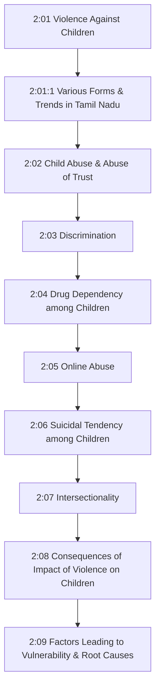

---

## 2:01 Violence Against Children

**Violence against children (VAC)** includes all forms of violence involving:

- **Mal-treatment** (physical, sexual, and psychological/emotional violence)
- **Bullying** (including cyber-bullying)
- **Child labour** and **child soldiering**
- **Intimate partner violence** and **domestic violence** against persons under **18 years old**

Violence may be perpetrated by **parents or other caregivers**, such as relatives, teachers, romantic partners, peers, community members, or strangers.

!!! important "WHO Statistic"
    According to the **World Health Organisation (WHO)**, **1 in 2 children** under 18 years experiences some form of violence — physical, sexual, or emotional violence or neglect — **every year**.

!!! tip "Key Point for Exams"
    - Experiencing violence in childhood impacts **lifelong health and well-being**.
    - **Target 16.2** of the **2030 Agenda for Sustainable Development** aims to *"end abuse, exploitation, trafficking and all forms of violence against, and torture of, children."*
    - **Poverty** exacerbates the risk of violence, abuse, and exploitation of children.
    - Children who lack basic needs are often left **vulnerable**, fending for themselves. Perpetrators of violence prey on these **marginalized children**.

---

### 2:01:1 Various Forms of Violence Against Children and Trends in Tamil Nadu

Most violence against children involves at least one of the following **six main types** of interpersonal violence that tend to occur at different stages in a child's development.

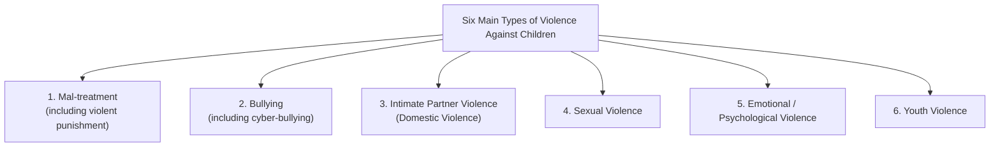

#### 1. Mal-treatment (including Violent Punishment)

- Involves **physical, sexual, and psychological/emotional violence** and **neglect** of infants, children, and adolescents
- Perpetrated by **parents, caregivers, and other authority figures**
- Occurs most often in the **home** but also in settings such as **schools** and **orphanages**

#### 2. Bullying (including Cyber-bullying)

- **Unwanted aggressive behaviour** by another child or group of children (who are neither siblings nor in a romantic relationship with the victim)
- Involves **repeated physical, psychological, or social harm**
- Often takes place in **schools**, other settings where children gather, and **online**

#### 3. Intimate Partner Violence (Domestic Violence)

- Involves **physical, sexual, and emotional violence** by an intimate partner or ex-partner
- Although males can also be victims, intimate partner violence **disproportionately affects females**
- Commonly occurs against girls within **child marriages** and **early/forced marriages**

#### 4. Sexual Violence

- Includes **completed or attempted sexual acts**, acts of a sexual nature (such as **voyeurism** or **sexual harassment**), acts of **sexual trafficking** committed against someone who is unable to consent or refuse, and **online exploitation**
- When directed against girls or boys because of their **biological sex or gender identity**, these types of violence can also constitute **gender-based violence**

#### 5. Emotional or Psychological Violence

- Includes **restricting a child's movements**, **denigration**, **ridicule**, **threats and intimidation**, **discrimination**, **rejection**, and other non-physical forms of hostile treatment

#### 6. Youth Violence

- Concentrated among children and young adults aged **10–29 years**
- Occurs most often in **community settings** between acquaintances and strangers
- Includes **bullying**, **physical assault** with or without weapons (such as guns and knives)
- May involve **gang violence**

!!! note "Domestic Violence"
    Violence can also occur within a child's family. **Abuse of substances** like alcohol and drug use may manifest as **physical and psychological aggression** towards those they are closest to, including children.

| Type of Violence | Key Features | Common Settings |
|---|---|---|
| **Mal-treatment** | Physical, sexual, emotional violence; neglect | Home, schools, orphanages |
| **Bullying** | Repeated aggressive behaviour by peers | Schools, online |
| **Intimate Partner Violence** | Violence by partner/ex-partner; affects females more | Within child/forced marriages |
| **Sexual Violence** | Sexual acts, trafficking, online exploitation | Various settings |
| **Emotional Violence** | Threats, ridicule, rejection, restriction | Home, school |
| **Youth Violence** | Physical assault, gang violence (ages 10–29) | Community settings |

---

## 2:02 Child Abuse and Abuse of Trust

### 2:02:1 Child Abuse

!!! tip "Key Definition"
    **Child abuse** is when anyone under the age of **18** is either being **harmed** or **not properly looked after**.

There are **four main categories** of child abuse:

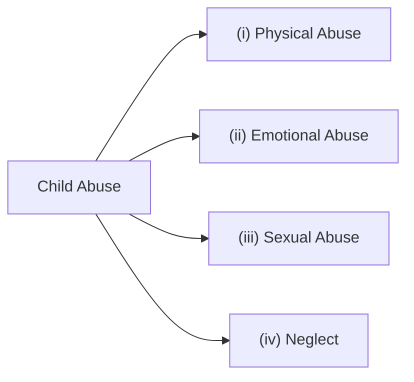

#### (i) Physical Abuse

**Physical abuse** is when someone hurts a child or young person physically on purpose.

**Examples:**

- Hitting, slapping, shaking, or throwing
- Burning or scalding
- Drowning, suffocating, or choking
- Pushing
- Using physical force to discipline

#### (ii) Emotional Abuse

**Emotional abuse** can happen in many different ways. Emotional or psychological abuse can affect how a person feels about themselves, or how they fit in with friends at school or where they live.

**Examples:**

- Being made to feel **inadequate, worthless, or unloved**
- Being **unfairly blamed**
- Being **bullied**, including over the internet (cyber-bullying)
- Being made to feel **frightened or in danger**
- Made to **witness the abuse of others** such as domestic abuse

#### (iii) Sexual Abuse

**Sexual abuse** is when a child is enticed or forced to take part in sexual activities. This kind of abuse does not always involve a high level of violence and the child may or may not be aware of what is happening. Sexual abuse may be committed by **adult men and women**, or by **other children**.

**Examples:**

- Causing or inciting a child to watch or engage in sexual activities
- Encouraging a child to behave in sexually inappropriate ways
- Involving a child in looking at sexual images or videos
- **Grooming** (being befriended online or through the internet)

#### (iv) Neglect

!!! tip "Key Definition"
    **Neglect** is when a child or young person's **basic needs** are **persistently not being met** by their parents or guardian.

Basic needs include:

- Adequate **food, clothing, and shelter**
- **Protection** from physical and emotional harm or danger
- Adequate **supervision** (not being left at home alone)
- Access to appropriate **medical care**

---

### 2:02:2 Abuse of Trust or Dominant Position

Abuse of children takes many forms — it can be **physical, emotional, sexual, or neglect**. It happens in **all countries** and in any settings — in a child's home, community, school, online, etc.

!!! note "Key Fact"
    In some parts of the world, including India, **'violent discipline'** (i.e., disciplining the child through physical punishment) is **socially accepted** and common. For many girls and boys, abuse takes place at the hands of the people they trust — their **parents or caregivers, teachers, peers, and neighbours**.

**Conditions for Abuse of Trust:**

- The relationship between the offender and victim must be one that gives rise to the offender having a **significant level of responsibility** towards the victim, on which the victim would be entitled to rely.

**Examples of Abuse of Trust relationships:**

| Relationship | Example |
|---|---|
| **Professional** | Teacher and pupil, professional adviser and client |
| **Familial** | Parent and child |
| **Care-based** | Carer (paid or unpaid) and dependant |
| **Ad hoc** | Late-night taxi driver and a lone passenger |

!!! important "Key Points"
    - Abuse of trust would **not generally** include familial relationships **without** a significant level of responsibility.
    - Where an offender has been given an **inappropriate level of responsibility**, abuse of trust is unlikely to apply.
    - A **close examination of the facts** is necessary and a **clear justification** should be given if abuse of trust is to be found.

---

## 2:03 Discrimination

### 2:03:1 Meaning of Discrimination

!!! tip "Key Definition"
    **Discrimination** is the process of making **unfair or prejudicial distinctions** between people based on the groups, classes, or other categories to which they belong or are perceived to belong — such as **race, gender, age, religion, physical attractiveness, or sexual orientation**.

- Discrimination typically leads to groups being **unfairly treated** on the basis of perceived status based on ethnic, racial, gender, or religious categories.
- It involves **depriving members of one group** of opportunities or privileges that are available to members of another group.

!!! important "United Nations Stance"
    *"Discriminatory behaviours take many forms, but they all involve some form of **exclusion or rejection**."*
    — The **United Nations Human Rights Council** and other international bodies work towards helping end discrimination.

---

### 2:03:2 What Drives Discrimination?

At the heart of all forms of discrimination is **prejudice** based on concepts of **identity** and the need to identify with a certain group. This can lead to **division, hatred**, and even the **dehumanization** of other people because they have a different identity.

**Key drivers of discrimination:**

- **Politics of blame and fear** — Intolerance, hatred, and discrimination are causing suffering in societies
- **Toxic rhetoric** — Leaders blaming certain groups of people for social or economic problems
- **Power reinforcement** — Some governments justify discrimination in the name of religion or ideology to reinforce their power and status quo
- **Discriminatory laws** — Discrimination can be cemented in national law, even when it breaks international law (e.g., criminalization of abortion which denies girls and pregnant people the health services only they need)

---

### 2:03:3 Some Key Forms of Discrimination

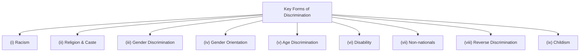

#### (i) Racism

- **Racism** affects virtually every country in the world
- It systematically **denies people their full human rights** just because of their **colour, race, ethnicity, descent (including caste), or national origin**
- Racism unchecked can fuel **large-scale atrocities** such as:
    - The **1994 genocide in Rwanda**
    - **Apartheid** and ethnic cleansing of the **Rohingya people in Myanmar**

#### (ii) Religion and Caste

- People may be discriminated based on **religion**
- In most **Muslim countries**, non-Muslims do not enjoy the same rights and privileges as Muslims
- In **India** and other countries, even within the same religion, there are numerous **castes** which are treated differently

!!! important "Key Statistics"
    - According to **UNICEF** and **Human Rights Watch**, caste discrimination affects an estimated **250 million people** worldwide.
    - Mainly prevalent in parts of **Asia** (India, Sri Lanka, Bangladesh, Pakistan, Nepal, Japan) and **Africa**.
    - As of **2011**, there were **200 million Dalits** or Scheduled Castes (formerly known as "untouchables") in India.

#### (iii) Gender Discrimination

- In many countries, **laws, policies, customs, and beliefs** exist that deny women and girls their rights
- **Examples of discriminatory laws:**
    - Women cannot dress as they like — **Saudi Arabia, Iran**
    - Women cannot work at night — **Madagascar**
    - Women cannot take out a loan without their husband's signature — **Equatorial Guinea**
- Discriminatory laws place limits on a woman's right to **own property**, exercise control over her body, and enjoy **protection from harassment**

#### (iv) Gender Orientation

- People face discrimination because of **who they love, who they are attracted to, and who they are**
- **Lesbian, Gay, Bisexual, Transgender, and Intersex (LGBTI)** people risk being unfairly treated in all areas of their lives — education, employment, housing, access to health care
- They may face **harassment and violence**

#### (v) Age Discrimination

!!! tip "Key Definition"
    **Ageism** or **age discrimination** is discrimination and stereotyping based on the grounds of someone's age. It is a set of beliefs, norms, and values used to justify discrimination or subordination based on a person's age.

- Ageism is most often directed toward **elderly people, adolescents, and children**

#### (vi) Disability

- **Disability discrimination** treats non-disabled individuals as the standard of "normal living"
- Results in **public and private places, services, educational settings, and social services** being built to serve "standard" people, thereby **excluding those with various disabilities**

#### (vii) Discrimination against Non-nationals

- Frequently based on **racism** or notions of **superiority**
- Often fuelled by **politicians** looking for scapegoats for social or economic problems

!!! note "Example"
    Since **2008**, South Africa has experienced several outbreaks of violence against **refugees, asylum seekers, and migrants** from other African countries, including killings and looting or burning of shops and businesses. Leaders of political parties exploit fears by promising to enact abusive and unlawful policies.

#### (viii) Reverse Discrimination

!!! tip "Key Definition"
    **Reverse discrimination** is the discrimination against members of a **dominant or majority group** in favour of members of a **minority or historically disadvantaged group**.

- Groups may be defined in terms of **disability, ethnicity, family status, gender identity, nationality, race, religion, caste, sex, and gender orientation**
- In some countries, **countervailing measures** such as **reserved quotas** have been used to redress the balance in favour of those believed to be current or past victims of discrimination
- These attempts have often been met with **controversy** and sometimes been called reverse discrimination

**Formal Definition:** Reverse discrimination is the unequal treatment of members of the majority groups, resulting from **preferential policies** (as in college admissions or employment) intended to remedy earlier discrimination against minorities.

#### (ix) Childism: Prejudice and Discrimination against Children

- Children experience discrimination both as a **group** and as **individuals** on various grounds — such as their age, national, ethnic or social origin, sex, language, religion, disability, gender, or other status

**Key Points:**

- Some acts are only considered **criminal if committed by someone aged under 18** (e.g., in some US states, it is illegal for children to run away from home or to repeatedly disobey parental authority — called **'incorrigibility'**)
- If a child is decided to be incorrigible by a court, sanctions can include **detention in a juvenile facility**
- In over **130 countries**, children lack full protection against **corporal punishment**
- In **England**, children can lawfully be smacked by parents if the smack can be considered **"reasonable punishment"** — this is an example of **childism**

!!! important "UNCRC Principle"
    The **Convention on the Rights of the Child** enshrines the principle of **non-discrimination**. All children should be treated, protected, and cared for in the same manner. However, many children are victims of discrimination.

**Discrimination against minority children:**

- Rights of children considered part of a **minority** are often violated — notably by acts of discrimination, racism, and non-recognition
- Children of minorities face many **barriers** to enjoy and exercise their rights
- Around the world, there are **150 million children** suffering from a disability, **80%** of whom are living in **developing countries**
- In many countries, **girls** are the first victims when children's human rights are violated and they often suffer **double discrimination**: for their **age** and for their **gender**

| Form of Discrimination | Key Feature | Example |
|---|---|---|
| **Racism** | Denial of rights based on colour/race/ethnicity | Rwanda genocide, Rohingya crisis |
| **Religion & Caste** | Unequal treatment based on religion/caste | 250 million affected worldwide |
| **Gender** | Laws/customs denying women's rights | Saudi Arabia, Iran, Madagascar |
| **Gender Orientation** | Discrimination against LGBTI persons | Harassment in education, employment |
| **Age (Ageism)** | Stereotyping based on age | Directed at elderly, adolescents, children |
| **Disability** | Exclusion of disabled persons | Inaccessible public services |
| **Non-nationals** | Discrimination against refugees/migrants | South Africa (since 2008) |
| **Reverse Discrimination** | Discrimination against majority group | Reserved quotas controversy |
| **Childism** | Prejudice against children | Corporal punishment in 130+ countries |

---

## 2:04 Drug Dependency among Children

!!! tip "Key Definition"
    **Substance dependence** (also known as **drug dependence**) is a biopsychological situation whereby an individual's functionality is dependent on the necessitated re-consumption of a **psychoactive substance** because of an adaptive state that has developed within the individual from substance consumption, resulting in the experience of **withdrawal** that necessitates the re-consumption of the drug.

**The Jellineck Curve** describes the **4 stages** of psychoactive substance use:

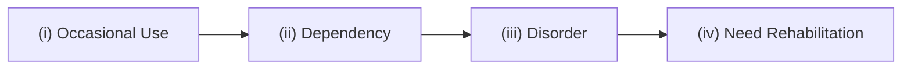

**Key Points:**

- Drug dependence is a **chronic progressive disease** characterised by significant impairment directly associated with **persistent and excessive use** of psychotic substances
- Impairment may involve **physiological, psychological, or social dysfunction**
- The incidence of drug abuse among **children and adolescents is higher** than the general population — because youth is a time for **experimentation and identity-forming**
- Many **street children** use cheap drugs to cope with daily cycles of sexual, physical, and mental abuse, or as recreation to escape a life of poverty

!!! important "Key Facts for Exams"
    - **Heroin, Opium, Alcohol, Cannabis, and Propoxyphene** are the five most common drugs being abused by children in India.
    - Children affected by substance abuse are considered as **children in need of care and protection** under the **Juvenile Justice Act, 2015**.
    - The use of drugs such as thinner, alcohol, tobacco, hard and soft drugs is especially widespread among **street children, working children, and trafficked children**.
    - In India, tobacco use kills **20 million children a year** and nearly **5,500 children a day** are drawn into tobacco use.

---

### 2:04:1 Predictive Risk Factors

Drug dependency develops from a complex interplay between the **individual (host)**, the **agent (drugs and alcohol)**, and the **environment**.

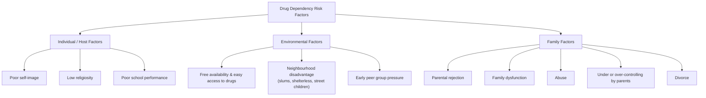

**Key risk factors during adolescence:**

- **Poor self-image** and **low religiosity**
- **Poor school performance**
- **Parental rejection** and **family dysfunction**
- **Abuse**, **under or over-controlling by parents**, and **divorce**
- **Free availability and easy access** to drugs
- **Neighbourhood disadvantage** (living in slums, shelterless and street children)
- **Early peer group pressure**

!!! note "Important Points"
    - **Biological children** of alcohol-dependent parents have an **increased risk** of developing alcoholism.
    - **Girls** seem to be more influenced by **environmental factors in the home** — unkempt, crowded, noisy, disorderly conditions where there is little emphasis on conventions and religion are very potent predictive factors of later drug use in girls.

---

### 2:04:2 Effects of Alcohol and Other Drugs on Children

Drug dependence in children leads to the development of:

- **Conduct disorder**
- **Oppositional Defiant Disorder (ODD)**
- **Attention-Deficit / Hyperactivity Disorder (ADHD)**

!!! important "Progression of Effects"
    These disorders may initially present with relatively **mild behaviour problems** and progress to **severe symptoms** such as stealing, aggression, and using heavy dosage of narcotic substances.

**Key effects:**

| Effect | Description |
|---|---|
| **Temperamental difficulties** | Exacerbate childhood troublesome behaviour; result in insecure attachment with primary caregiver |
| **ADHD in childhood** | Imparts a higher risk of later development of adult alcoholism and substance use |
| **School under-achievement** | Higher risk in adolescent population |
| **Delinquency** | Associated with alcohol and drug use |
| **Teenage pregnancy** | Risk factor in adolescent drug users |
| **Depression** | Common consequence of substance use |
| **HIV risk** | Illicit drug use is associated with increased risk of Human Immunodeficiency Virus (HIV) |

---

### 2:04:3 Protective Factors

!!! tip "Key Definition"
    **Protective factors** are characteristics within the **individual**, the **family**, and the **environment** that advance one's ability to resist adverse outcomes.

**Protective factors for children include:**

- Growing up in a **nurturing home** with **open communication** with parents and **positive parental support**
- **Teacher commitment** to didactics and maintenance of low dissension
- **Positive self-esteem**, **self-control**, **assertiveness**, **social competence**, and **good academic achievement**
- **Regular visit to places of worship** (temple, church, etc.) and a **sense of morality**

!!! important "Resiliency"
    **Resiliency** is the capacity of an individual to overcome a negative set of life circumstances. Adolescent resiliency is associated with:

    - **High intelligence**
    - **Low novelty-seeking behaviours**
    - **Avoidance of friendships** with delinquent peers

- **Sensitization and awareness programmes** about drug abuse in schools or for children out of school go a long way in the **prevention** of the use of narcotic substances by children.

---

### 2:04:4 Indian Scenario

**Key issues in India:**

- There are **no sensitization programmes** about drug abuse in schools or for children out of school
- India **does not have a substance abuse policy**
- There is a **high incidence of charging children** under the **Narcotic Drugs and Psychotropic Substances (NDPS) Act, 1985**
- Children who have no access to high-quality drugs use **volatile substances** in retail stores such as **relief ointments, glue, paint, cough syrups, paints, cleaning fluids, gasoline**, etc.
- There are **very few health centres** that deal with child substance abuse problems, especially in **rural areas**

!!! important "Tobacco Statistics in India"
    - Tobacco use kills **20 million children a year** in India.
    - Nearly **5,500 children a day** are drawn into tobacco use.
    - Compare this to the **3,000 a day** new child smokers in the U.S.

---

## 2:05 Online Abuse

In the **digital age**, children are exposed to new threats. Online interactions are not always accompanied by the **traditional protections** placed around children. In addition to the usual means by which abuse of children is perpetrated, there are risks of **sexual abuse** that is **online facilitated**.

!!! tip "Key Definition"
    **Online child abuse** is a form of child abuse due to its **virtual, anonymous nature**. It does not happen face-to-face nor necessarily require physical contact. However, online abuse can result in **negative face-to-face consequences** in the form of **statutory rape, forcible sexual assault, and harassment**.

**Types of Online Abuse:**

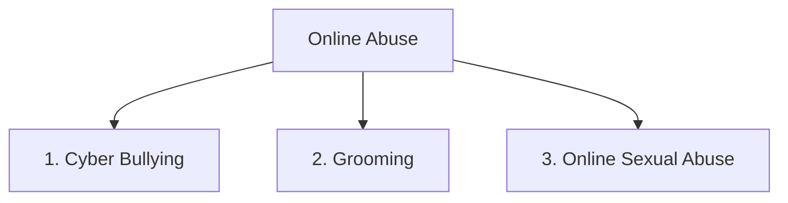

### 1. Cyber Bullying

**Cyber bullying** is when a person or group of people **hurt, threaten, humiliate, or intimidate** a child over digital devices like cell phones, computers, laptops, and tablets. It can occur through **text messages, apps, social media, forums, or gaming sites**.

!!! note "Key Fact"
    Children who are **bullied in schools** are most likely to get bullied in the **online world** as well.

**Common examples of cyber bullying:**

- **(i)** Posting comments about someone that are **mean, hurtful, and humiliating** — such statements are called **trolls**
- **(ii)** Sending, posting, or sharing **embarrassing, false, or mean content** about a child
- **(iii)** Threatening a child to make his/her **personal information, pictures, or videos** publicly available
- **(iv)** Taking **unflattering pictures** of a child offline and spreading them online
- **(v)** Sending **abusive and threatening messages** to a child and damaging his/her accounts
- Cyber bullying has been a **leading cause of depression** in children

### 2. Grooming

!!! tip "Key Definition"
    **Grooming** is an age-old method of sexual exploitation wherein an **adult befriends a child and builds trust** to engage in sexual acts.

**Offline vs. Online Grooming:**

| Feature | Offline Grooming | Online Grooming |
|---|---|---|
| **Groomer identity** | Usually a known adult, known to the child's family | Can be a known adult, a stranger, or a person who impersonates someone else or a person of influence |
| **Setting** | Physical/in-person setup | Sites and apps where young children are most active — social media, online forums, game sites |
| **Method** | Direct befriending | Send friend requests, strike conversations online |

**How online groomers operate:**

1. Develop an **emotional bond** with the child by being an encouragement, talking about similar interests, sending gifts, and flattering
2. Once they gain the child's trust, they steer **sexual conversations**
3. Ask the child to **send intimate pictures** of themselves, send sexual photos and videos, or perform sexual acts over **live streaming**
4. Children sometimes may not realize exploitation — they may see online groomers as their **friends or girlfriends/boyfriends** and feel love, loyalty, even admiration for their groomer
5. After winning trust, groomers may invite children for a **physical meet**, making things more dangerous — leading to **human trafficking, rape, and even death**

### 3. Online Sexual Abuse

**Online sexual abuse** is when a person **manipulates and forces** a child to engage in a sexual activity. It can be any type of **sexual harassment, exploitation, or abuse** that takes place through **digital mediums**.

**Examples:**

- Sending **unwanted nude photographs** to a child via chat and through live streaming
- Engaging a child in a **sexual chat** by force
- **Blackmailing** a child to share their personal images and perform sexual acts through live streaming

!!! important "How Abusers Operate"
    Abusers use the **vulnerability of children** to induce **fear and anxiety** in their minds. They threaten children by saying they will **release the sexual photos or videos** if they do not oblige. Often, abuse starts online and then takes place in person. The psychology of online child abuse is the **same as of in-person abuse**.

### Precautions to Protect Children from Online Abuse

Parents should take the following steps:

- **Encourage children to talk** about how they use the internet and show them what to do if something upsets them — come to parents for advice
- **Have agreements in place** and set boundaries for internet use — when and where they can use their devices and for how long
- **Check age ratings** that come with games, apps, films, and social networks to confirm whether they are suitable
- **Activate parental controls** on home network and all devices including mobile phones and game consoles
- **Safe settings** can also be activated on sites such as Google and YouTube

---

## 2:06 Suicidal Tendency among Children

!!! note "Key Point"
    Suicidal thoughts do not always lead to suicidal behaviour, but they are a **risk factor** for suicidal behaviour. Several factors interact before suicidal thoughts lead to suicidal behaviour.

### Key Definitions

| Term | Definition |
|---|---|
| **Suicidal behaviour** | An action intended to **harm oneself**; includes suicidal gestures, suicidal attempts, and completed suicide |
| **Suicidal ideation** | **Thoughts** and **plans** about suicide |
| **Suicide attempts** | Acts of self-harm that **could result in death** (e.g., hanging, drowning, or taking poison) |

### Underlying Causes and Triggers

Very often there is an **underlying mental health disorder** and a **stressful event** that triggers suicidal behaviour.

**Stressful events include:**

- **Death of loved ones**
- **Loss of boyfriend or girlfriend**
- **Move from familiar surroundings** (school, neighbourhood, friends)
- **Humiliation** by family members or friends
- **Being bullied at school** — especially for **Lesbian, Gay, Bisexual, and Transgender (LGBT)** students
- **Failure at academics**
- **Trouble with law**

!!! important "Key Point for Exams"
    Such stressful events are fairly **common among children** and **rarely lead to suicidal behaviour** if there are **no other underlying problems**.

### Common Underlying Problems

**(i) Depression:**

- Children or adolescents with depression have feelings of **hopelessness and helplessness** that limit their ability to consider alternative solutions to immediate problems

**(ii) Alcohol or Substance Use Disorder:**

- Alcohol and illicit drugs **lower inhibition** and interfere with anticipation of consequences of dangerous actions

**(iii) Poor Impulse Control:**

- Adolescents, particularly those with a **disruptive behavioural disorder**, may act without thinking

**(iv) Anger and Communication Difficulties:**

- Children attempting suicide are sometimes **angry with family members or friends**
- Unable to tolerate anger, they **turn the anger against themselves**
- Having difficulty in **communicating with parents** may also contribute to the risk of suicide

### Identification and Prevention

- Children with suicidal tendencies can be **easily identified** by parents and friends
- Children and adolescents often **confide only in their peers** and express overt thoughts of suicide such as *"I wish I were dead"*
- Family members and friends should **take suicide threats or attempts seriously**

### Reducing the Risk of Suicide

| Strategy | Description |
|---|---|
| **(i)** Effective care | Getting effective care for **mental, physical, and substance use disorders** |
| **(ii)** Family support | Getting support from **family and the community** |
| **(iii)** Conflict resolution | Learning ways to **peacefully resolve disputes** |
| **(iv)** Media access | Limiting media access to **suicide-related material** |
| **(v)** Cultural beliefs | Having cultural and religious beliefs that **discourage suicide** |

### Suicide Prevention Programmes

Effective programmes ensure the child has:

- A **supportive, nurturing environment**
- **Ready access** to mental health services
- Other **social settings** that promote acceptance of racial and cultural differences among individuals

---

## 2:07 Intersectionality

!!! tip "Key Definition"
    **Intersectionality** is a **sociological analytical framework** for understanding how an individual's social and political identities result in **unique combinations of discrimination and privilege**.

**Key Points:**

- Examples of identity factors include **gender, sex, race, ethnicity, class, sexuality, religion, disability, height, age, weight, species, and physical appearance**
- These intersecting and overlapping social identities may be both **empowering and oppressing**

!!! important "Origin"
    The term **intersectionality** was coined by **Kimberlé Crenshaw** in **1989**. She describes how **interlocking systems of power** affect those who are **most marginalized in society**. Activists and academics use the framework to promote **social and political egalitarianism**.

**Intersectionality and Feminism:**

- Intersectionality broadens the scope of the **first and second waves of feminism** (which largely focused on the experiences of women who were white, middle-class, and cisgender) to include the different experiences of **women of colour, poor women, immigrant women**, and other groups
- It acknowledges women's **differing experiences and identities**

**How Intersectionality Works:**

- Intersectionality **opposes analytical systems** that treat each axis of oppression in isolation
- For instance, discrimination against Black women cannot be explained as a simple combination of **sexism and racism**, but as something more complicated
- Intersectionality engages with themes such as **triple oppression** (the simultaneous experience of racism, sexism, and classism)

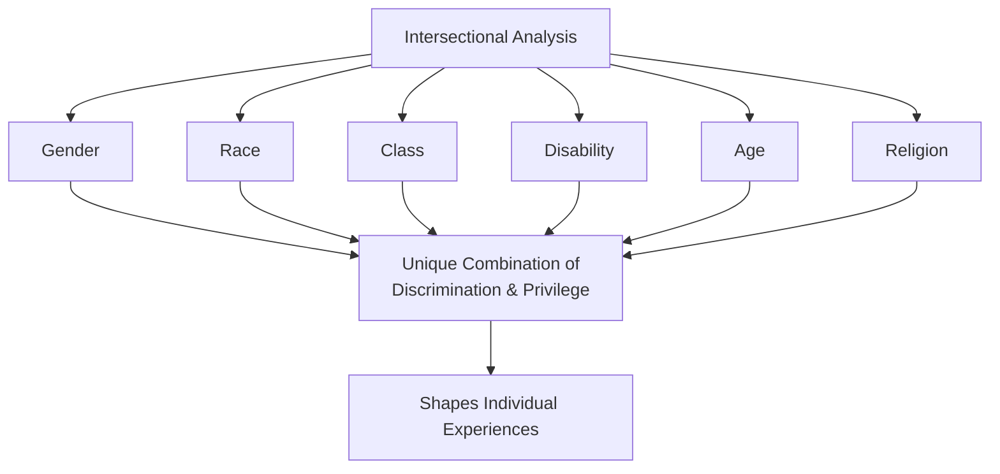

!!! note "Key Concept"
    Intersectionality is **relative** because it displays how race, gender, and other components **"intersect"** to shape the experiences of many, by making room for privilege. An intersectional analysis considers all the various factors that affect a social individual **in combination** rather than considering each factor **in isolation** (illustrated using a Venn diagram).

**Intersectionality in Critical Race Studies:**

- Demonstrates a connection between **race, gender, and other systems** that work together to **oppress**, while also allowing privilege in other areas

---

## 2:08 Consequences of Impact of Violence on Children

Violence against children has **lifelong impacts** on the health and well-being of children, families, communities, and nations.

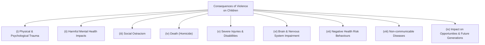

| # | Consequence | Details |
|---|---|---|
| **(i)** | **Physical and psychological trauma** | Causes direct trauma to the child |
| **(ii)** | **Harmful mental health impacts** | Leads to **anxiety and depression** |
| **(iii)** | **Social ostracism** | Leads to exclusion from social groups |
| **(iv)** | **Death (Homicide)** | Often involves weapons (knives, firearms); among the **top four causes of death** in adolescents; **boys comprise over 80%** of victims and perpetrators |
| **(v)** | **Severe injuries** | For every homicide, there are hundreds of predominantly male victims who sustain injuries from physical fighting and assault; severe injuries may result in **disabilities** |
| **(vi)** | **Brain and nervous system impairment** | Exposure to violence at an early age can impair **brain development** and damage the **nervous system**, as well as the endocrine, circulatory, musculo-skeletal, reproductive, respiratory, and immune systems — with **lifelong consequences**; can negatively affect **cognitive development** and result in **educational and vocational under-achievement** |
| **(vii)** | **Negative health risk behaviours** | Children exposed to violence are substantially more likely to **smoke, misuse alcohol and drugs**, engage in **high-risk sexual behaviour**; have higher rates of **anxiety, depression**, other mental health problems, and **suicide**; linked to **unintended pregnancies, induced abortions, gynaecological problems**, and **sexually transmitted infections including HIV** |
| **(viii)** | **Non-communicable diseases** | Increased risk for **cardiovascular disease, cancer, diabetes**, and other health conditions — largely due to negative coping and health risk behaviours associated with violence |
| **(ix)** | **Impact on opportunities and future generations** | Children exposed to violence are more likely to **drop out of school**, have difficulty in **finding and keeping a job**, and are at heightened risk for later **victimization and/or perpetration** of interpersonal and self-directed violence — violence against children can **affect the next generation** |

---

## 2:09 Factors Leading to Vulnerability of Children in Tamil Nadu and Root Causes

### 2:09:1 Factors Leading to Vulnerability of Children to Violence

Violence against children is a **multifaceted problem** with causes at the **individual, close-relationship, community, and societal levels**.

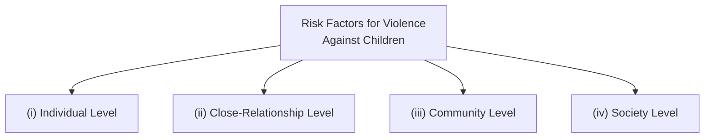

#### (i) Individual Level

- **Biological and personal aspects** such as sex and age
- **Lower levels of education**
- **Low income**
- Having a **disability or mental health problems**
- Identifying as or being identified as **lesbian, gay, bisexual, or transgender**
- **Harmful use of alcohol and drugs**
- A **history of exposure to violence**

#### (ii) Close-Relationship Level

- **Lack of emotional bonding** between children and parents or caregivers
- **Poor parenting practices**
- **Family dysfunction and separation**
- Being associated with **delinquent peers**
- **Witnessing violence** between parents or caregivers
- **Early or forced marriage**

#### (iii) Community Level

- **Poverty**
- **High population density**
- **Low social cohesion** and transient populations
- **Easy access to alcohol and firearms**
- **High concentrations of gangs** and illicit drug dealing

#### (iv) Society Level

- **Social and gender norms** that create a climate in which violence is normalized
- **Health, economic, educational, and social policies** that maintain economic, gender, and social inequalities
- **Absent or inadequate social protection**
- **Post-conflict situations** or natural disaster
- Settings with **weak governance** and **poor law enforcement**

| Level | Key Risk Factors |
|---|---|
| **Individual** | Sex, age, low education, low income, disability, LGBTI identity, substance use, history of violence |
| **Close-Relationship** | Lack of bonding, poor parenting, family dysfunction, delinquent peers, witnessing violence, early marriage |
| **Community** | Poverty, high population density, low social cohesion, easy access to alcohol/firearms, gangs |
| **Society** | Normalized violence, discriminatory policies, inadequate social protection, weak governance |

---

### 2:09:2 Root Causes for the Vulnerability of Children to Violence

Though there are innumerable causes for the vulnerability of children to violence, the following **four stand out as the root causes**:

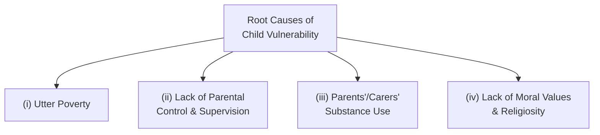

#### (i) Utter Poverty

- Poverty **exacerbates** the risk for violence, abuse, and exploitation of children
- Children who lack basic needs and care at home are **compelled to go for petty jobs** at an early age, thus becoming vulnerable to exploitation and violence
- They are left to **fend for themselves**; perpetrators of violence **prey on these children** and use the child's desperation to their advantage

#### (ii) Lack of Parental Control and Supervision

- In **low and middle income group families**, both parents have to go for a job, leaving the children at home to fend for themselves — this renders them **vulnerable to intruders**
- In **affluent families**, children are given **unbridled freedom** which makes them addicted to online use — they view aggressive and obscene pictures and videos on internet devices including cell phones
- This makes them more **aggressive and sex-prone**, leading to **sexual assault and violence** including bullying their own peers

#### (iii) Parents' / Carers' Substance Use

- Many parents resort to giving **severe physical punishment** as a method of disciplining their children
- This is especially true of parents and carers **indulging in the use of narcotics**

#### (iv) Lack of Moral Values and Religiosity in the General Public

- In the present-day world, everybody goes after **getting money and acquiring material comforts** at any cost without bothering to adhere to moral values
- Religions have lost their hold on people — leading to extreme cases such as a father sexually assaulting his own teenage daughter

!!! important "Need of the Hour"
    The urgent need of the hour is the **inculcation of moral and ethical values** among the people, especially among children, along with **tightening the laws** — making child abuse punishable with **imprisonment of minimum 20 years**.

---

## Conclusion

In this unit, the following topics have been discussed in detail:

- **Violence Against Children:** Various forms and trends in Tamil Nadu
- **Abuse of Trust**
- **Discrimination**
- **Drug Dependency among Children**
- **Online Abuse**
- **Suicidal Tendency among Children**
- **Intersectionality**
- **Consequences of Impact of Violence on Children**
- **Factors Leading to Vulnerability of Children in Tamil Nadu** and **Root Causes**

---

## Review Questions

### I. Objective Type Questions

**1.** The term intersectionality was coined by Kimberlé Crenshaw in the year...

- (i) 1985
- (ii) 1987
- (iii) 1989
- (iv) 1991

**[Ans: (iii)]**

**2.** Cyber-bullying is an example for...

- (i) Emotional abuse
- (ii) Sexual abuse
- (iii) Physical abuse
- (iv) None of the above

**[Ans: (i)]**

**3.** Mother not providing food during the lunch time as a punishment to the child for disobeying her instructions repeatedly, is an example for...

- (i) Physical abuse
- (ii) Emotional abuse
- (iii) Abuse of Trust
- (iv) Psychological abuse

**[Ans: (ii)]**

**4.** Denying a job to a transgender applicant though fully qualified, is a case of discrimination based on...

- (i) Sex
- (ii) Race
- (iii) Functional disability
- (iv) Gender orientation

**[Ans: (iv)]**

**5.** The second stage in the use of psychoactive substances get developed in individuals is...

- (i) Occasional use
- (ii) Disorder
- (iii) Dependency
- (iv) Need Rehabilitation

**[Ans: (iii)]**

### II. Short Answer Type Questions

**6.** What are the different forms of violence against children? **[Ans: 2:01:1]**

**7.** What do you mean by 'Child abuse'? Explain the different forms of child abuse. **[Ans: 2:02:1]**

**8.** Write a short note on 'Abuse of Trust' in violence against children. **[Ans: 2:02:2]**

**9.** What do you mean by drug dependency? State the predictive risk factors. **[Ans: 2:04 + 2:04:1]**

**10.** Explain the concept of 'Intersectionality' and state its applications. **[Ans: 2:07]**

**11.** Explain the consequences of impact of violence on children. **[Ans: 2:08]**
