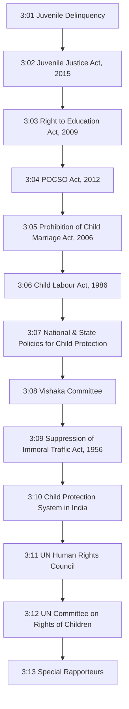
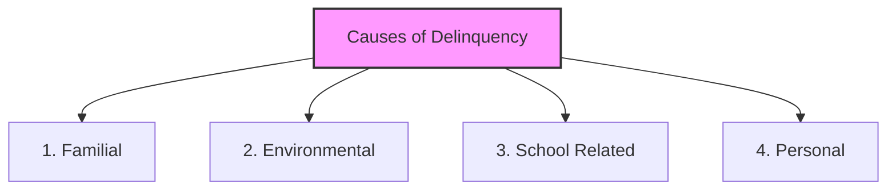
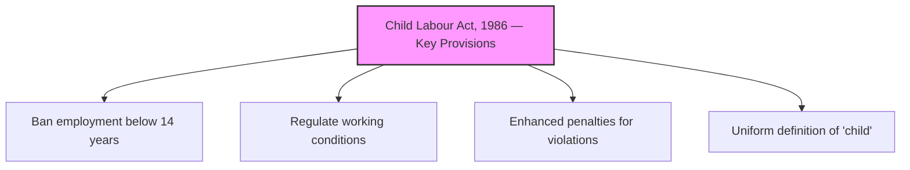
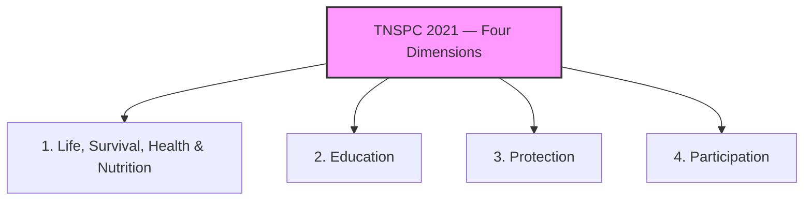
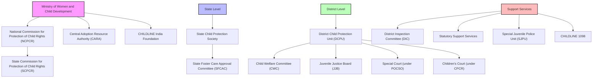
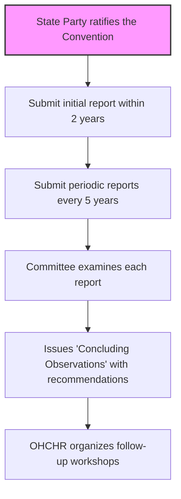

# Unit III: Child Rights — Laws, Policies and Institutions

## 3:00 Introduction

In order to effectively address **heinous crimes** and **sexual exploitation** of children, the Central and State Governments have enacted several **laws** and developed **policies** for **Child Protection**.

!!! note "Topics Covered in This Unit"
    - Juvenile Delinquency — meaning, definition, causes, and reforming
    - Juvenile Justice (Care and Protection of Children) Act, 2015
    - Right to Free and Compulsory Education Act, 2009
    - The Protection of Children from Sexual Offences Act (POCSO), 2012
    - The Prohibition of Child Marriage Act, 2006
    - Child Labour (Prohibition and Regulation) Act, 1986
    - National and State Policies for Child Protection
    - Tamil Nadu State Policy for Child Protection
    - Vishaka Committee
    - Suppression of Immoral Traffic in Women and Girls Act, 1956
    - Child Protection System in India
    - United Nations (UN) Human Rights Council
    - UN Committee on the Rights of Children
    - Special Rapporteurs on Issues Related to Children

---

## 3:01 Juvenile Delinquency

### 3:01:1 Meaning of Juvenile Delinquency

**Severe antisocial behaviour** of children and adolescents is referred to as **'Delinquency'**. Adults indulging in such antisocial behaviour are branded as **'criminals'**.

!!! tip "Key Concept — Three Categories"
    The three categories — **'Problem Children'**, **'Delinquents'**, and **'Criminals'** — differ very little from each other.

| Category | Description | Example |
|---|---|---|
| **Problem Child** | A child showing minor behavioural issues | Stealing a pen or book of classmates |
| **Delinquent** | A child engaging in more serious antisocial acts | Shop lifting |
| **Criminal** | An adult involved in unlawful activities | Stealing, looting |

!!! important "Age and Seriousness of Crime"
    In juvenile delinquency, **age alone** is not the determining factor — the **seriousness of the crime** also plays an important role. A boy aged **7–16 years** or a girl aged **7–18 years** who commits a crime punishable by **death or life imprisonment** (such as looting, treason, deadly attack) **cannot be considered a juvenile delinquent**.

---

### 3:01:2 Definition of Juvenile Delinquency

!!! tip "Key Definitions for Exams"
    - **"A delinquent is a minor who has been apprehended for violating the law; his act may range from stealing and destructiveness to sexual promiscuity."**
    - **Cyril Burt:** *"Delinquents are children below the age of 18, who indulge in such antisocial acts which if committed by adults are legally punishable."*

- Delinquents are **not sent to jail** for their crimes but are referred to **Borstal Reformatory Schools**.

---

### 3:01:3 Causes of Delinquency

Delinquency is a phenomenon of **multiple causation** — the result of various factors interacting with each other.

#### 1) Familial Factors

- **Utter poverty** and uncongenial home conditions
- **Broken homes**, single parent families
- **Unwanted children**
- Regimentation in the name of enforcing discipline
- **Over-protection** of children by parents
- Denying children the sense of **personal property**
- No good **role model** in the family
- Absence of feeling of **security** for growing children
- Inner mental conflicts, if left unresolved, may lead to delinquency

#### 2) Environmental Factors

- Friendship with **antisocial elements**
- Bad recreation media like **yellow journals, blue films** etc.
- Severe **emotional disturbances** in youths
- Families thrown to the street due to **riots, wars** etc. become breeding ground for delinquency

#### 3) School Related Factors

- Absence of **order and discipline** in school
- Harassment by **greedy and power-hungry teachers**
- Forcing students **beyond their capacities**
- These sow the seeds of **mental conflicts** and consequent maladjusted behaviour

#### 4) Personal Factors

- Mental conflicts affect not all children — capacity to resolve mental conflicts depends upon one's **intelligence and ability**
- **Males** are generally more prone to maladjustment and delinquency than females
- Males are allowed more **freedom in society** and are more exposed to the vagaries of society

!!! note "Delinquency as a Social Disease"
    Delinquency arises mainly due to the **antisocial environment** and is looked upon as a **social disease**. It is found more in cities where **inter-personal relations are very low**. Urban slums with **unhygienic surroundings** are fertile ground for delinquency. Delinquents value the appreciation of their **cliques and gangs**, and indulge in antisocial activities. Parents' influence is minimal over the delinquents — they leave their homes at an **early age** and start living independently, resorting to unlawful activities.

---

### 3:01:4 Reforming the Delinquents

Juvenile delinquents are **separated from criminals** and sent to **'Remand Homes'** or **'Reformatory Schools'** according to the serious nature of the crimes committed. Life is reconstructed through **therapeutic methods**.

!!! tip "Methods of Reformation"
    - **Skill training**
    - **Dramatics**
    - **Social work** and similar opportunities
    - All involved in **correctional treatment** of delinquents

After reformation, these youths should be given opportunities to live in a **healthy and normal environment** and not fall back to the old maladjusted behaviour. Rehabilitation institutions like **'Boys Town'** help a lot in rehabilitating reformed youths.

!!! important "Prevention is Better than Cure"
    **Prevention of delinquency** is the best approach rather than attempting to treat delinquents.

**Preventive Measures:**

| Measure | Description |
|---|---|
| **a) Education for slum children** | Arranging education, offering financial help, distributing free uniforms, reading/writing materials, noon meals to mitigate economic problems and attract children towards education |
| **b) Joyous school life** | Offering opportunities to develop different kinds of abilities, interests and skills through curricular and co-curricular programmes |
| **c) Individual differences** | Education should be according to one's interest and ability |
| **d) Youth clubs** | Civic bodies should arrange youth clubs to help youths spend leisure time usefully |
| **e) Discipline programmes** | Schools should give importance to discipline-inducing programmes like Scouts, NCC, NSS, Citizen Training etc. |
| **f) Religious and spiritual training** | Faith in God provides psychological security to an individual when faced with stress and mental conflicts |
| **g) Healthy family life** | Young parents need to be prepared and educated for a healthy family life and child rearing practices |

---

## 3:02 Juvenile Justice (Care and Protection of Children) Act, 2015

The **Juvenile Justice (Care and Protection of Children) Act, 2015** was passed by **Lok Sabha on 7th May 2015** and by **Rajya Sabha on 22nd December 2015**. It came into effect in **January 2016**.

!!! important "Key Facts"
    - It **replaced** the Indian Juvenile Delinquency Law — **Juvenile Justice (Care and Protection of Children) Act, 2000**
    - It allows children in conflict with law in the age group of **16–18 years**, involved in **heinous offences**, to be **tried as adults**

---

### 3:02:1 Key Provisions of the Act

There are **10 Chapters** and **112 Sections** in the Act.

- The **focus** of the new law is the **restoration of the child** — restoration to parents, adopted parents, and foster parents.
- There is a **complete separation** between juveniles in conflict with law and children in need of care and protection.
- **"Child"** is defined as anyone who has **not completed the age of 18 years**.
- An attempt is made at **decriminalizing** the juvenile in conflict with the law through the introduction of the **Juvenile Justice Board** in place of the Juvenile Court.
- There is provision for a **child-friendly officer**.
- The definition of **child in need of care and protection** is expanded with additional categories like:
    - Victims of **armed conflict**, civil commotion, or natural calamity
- Certain categories are **excluded**, such as:
    - A child found **begging**
    - Children who live in a **brothel**
    - **Uncontrollable children**
- The child may be produced before the Committee by:
    - Police officer
    - Public servant
    - **CHILDLINE**
    - Registered voluntary organization
    - Social worker
    - Public-spirited citizen
- **Orphans** shall be recognized for **adoption**
- Agencies for security and placement of children include **children's homes** or **state-run institutions**
- The **children's home** is envisaged as a **temporary stay** during which schemes for **adoption, foster care, sponsorship, and aftercare** are to be worked out

---

### 3:02:2 Additional Features of the Act, 2015

The 2015 Act has the following additional features:

- **Section 3** spells out certain **general principles** of care and protection to be followed in implementation
- **Section 2** is expanded with **more definitions**
- The **nomenclature** is refined:
    - The word **'arrest'** is replaced by **'apprehension'**
    - The word **'crime'** is replaced by **'offence'**

**Classification of Offences:**

| Type of Offence | Definition | Punishment |
|---|---|---|
| **1. Petty Offences** | Offences under IPC for which maximum punishment is imprisonment **up to 3 years** | Minor penalties |
| **2. Serious Offences** | Offences under IPC or any other law for which punishment is imprisonment **between 3 to 7 years** | Moderate penalties |
| **3. Heinous Offences** | Offences under IPC or any other law for which punishment is imprisonment of **7 years or more** | Severe penalties |

!!! important "Two Classes of Children in Conflict with Law"
    Under the **2000 Act**, all persons below 18 years were put in **one class** irrespective of the offence. Under the **2015 Act**, they are classified into **two groups**:

    | Group | Description | Dealt By |
    |---|---|---|
    | **Group 1** | Below 18 years (petty/serious offences) and below 16 years (heinous offences) | **Juvenile Justice Board** |
    | **Group 2** | Completed 16 years but below 18 years (heinous offences) — can be treated as adults | Kept in **place of safety** until age 21, then may be sent to **adult jail** to complete remainder of sentence |

---

### 3:02:3 Applicability of the Act

**Section 1(4)** of the Act deals with applicability:

> *"Notwithstanding anything contained in any other law for the time being in force, the provisions of this Act shall apply to all matters concerning children in need of care and protection and children in conflict with law."*

This includes:

1. **Apprehension, detention, prosecution, penalty** or imprisonment, rehabilitation and social re-integration of children in conflict with law
2. **Procedures and decisions** or orders relating to rehabilitation, adoption, re-integration, and restoration of children in need of care and protection

!!! important "Overriding Effect"
    The **Juvenile Justice Act has overriding effect on all other laws**.

!!! note "Amendment"
    This Act has further been amended by the **Juvenile Justice (Care and Protection of Children) Amendment Act, 2021**, which came into force from **1st September 2022**.

---

## 3:03 Right to Free and Compulsory Education Act, 2009

The **Eighty-Sixth Amendment** to the Indian Constitution heralded the **'Right to Education Act' (2009)**, giving a legal framework to **Article 45** under the Directive Principles.

!!! important "Key Fact"
    This Act was implemented from **1st April 2010** and has **seven chapters**.

**Salient Features:**

| S.No. | Feature |
|---|---|
| 1 | All children from age **6 to 14** have a right to receive **free and compulsory education** |
| 2 | **Drop-out children** are eligible to join the standard appropriate to their age after getting appropriate special training |
| 3 | Children have the right to **leave one school and join another school** (applicable only within government and aided schools) |
| 4 | It is the responsibility of the government and local bodies to **establish schools** in neighbourhoods which do not have schools, **within 3 years** of passing this Act |
| 5 | Funding for implementing this Act is the **joint responsibility** of the Central and State Governments |
| 6 | There should be **no discrimination** against disadvantaged groups and weaker sections in admitting students in schools |
| 7 | Every child should be assured of **quality education** |
| 8 | **Training of teachers**, preparation of curriculum and subject content should be ready within a time frame |
| 9 | **Demanding capitation fees** is a criminal offence punishable under the law |
| 10 | **No screening test** either for the child or the parent should be conducted |
| 11 | A **certificate of birth** should not be demanded to prove the age of pupils for enrolment |
| 12 | No child should be **held back or sent out** before completing elementary education |
| 13 | No child should be given **corporal punishment** or mental agony by the school |
| 14 | No **private school** should be started without the approval of the government or authorized agency |
| 15 | Government permission and recognition should **not be granted** to schools which do not have prescribed standards |
| 16 | **School Management Committee** should be formed — three-fourths should be parents, and half of the members should be women. This committee will prepare developmental plans for the school |
| 17 | All schools should be provided with **adequate classrooms**, suitable for all seasons and other facilities |

**Pupil-Teacher Ratio:**

| Level | Ratio | Details |
|---|---|---|
| **Primary Level (I to V)** | Maximum **1:40** | Two teachers up to 60 children. Schools with strength of up to 200 pupils (not including the head of the institution) |
| **Middle School (VI to VIII)** | One teacher per subject | Science – 1, Mathematics – 1, Social Science – 1, Language – 1 (minimum). Total teachers = Total classes |

**Duties of Teachers:**

- **Regularity and punctuality** in coming to school
- Completing **portions of the syllabus** within the allotted time
- Assessing the **learning ability** of every child and providing special instruction if necessary
- Meeting parents and informing them about the **progress** of the child

---

## 3:04 The Protection of Children from Sexual Offences Act (POCSO), 2012

The **Protection of Children from Sexual Offences Act, 2012 (POCSO)** came into force from **14th November 2012**.

!!! important "Key Fact"
    This is the **first special law** passed to address offences of **sexual exploitation and pornography** against children. It provides for the establishment of **Special Courts** to try such offences.

---

### 3:04:1 The Salient Features of the Protection of Children from Sexual Offences Act, 2012

**1. Definition of Child:**

- Defines a **child** as any person **below the age of 18 years**
- Provides protection to **all children** from sexual assault, sexual harassment, and pornography

**2. Stringent Punishments:**

- Punishments are **graded** as per the gravity of the offence
- Range from simple to rigorous imprisonment of varying periods
- Provision for **fine** decided by the Court

**3. Aggravated Offences:**

- An offence is treated as **"aggravated"** when committed by a person in a **position of trust or authority** over the child (e.g., member of security forces, police officer, public servant)

**4. Punishments for Offences:**

| Offence | Section | Punishment |
|---|---|---|
| **Penetrative Sexual Assault** | Section 3 | Not less than **7 years**, may extend to **life imprisonment**, and fine |
| **Aggravated Penetrative Sexual Assault** | Section 5 | Not less than **10 years**, may extend to **life imprisonment**, and fine |
| **Sexual Assault** (without penetration) | Section 7 | Not less than **3 years**, may extend to **5 years**, and fine (Section 8) |
| **Aggravated Sexual Assault** (by person in authority) | Section 9 | Not less than **5 years**, may extend to **7 years**, and fine (Section 10) |
| **Sexual Harassment of the Child** | Section 11 | **3 years** and fine (Section 12) |
| **Use of Child for Pornographic Purposes** | Section 13 | **5 years** and fine; subsequent conviction — **7 years** and fine (Section 14(1)) |

**5. Special Courts:**

- Established for trial of offences under the Act
- **Best interest of the child** is of paramount importance at every stage of the judicial process

**6. Child-Friendly Procedures:**

The Act incorporates child-friendly procedures for reporting, recording of evidence, investigation, and trial:

- Recording the statement of the child at the **residence of the child** or at the place of his/her choice, preferably by a **woman police officer** not below the rank of **Sub-Inspector**
- **No child** to be detained in the police station at night for any reason
- Police officer **not to be in uniform** while recording the statement
- Statement to be recorded **as spoken by the child**
- Assistance of an **interpreter, translator, or expert** as per the need of the child
- Assistance of **special educator** or any person familiar with the manner of communication of the child (in case the child is disabled)
- **Medical examination** to be conducted in the presence of the parent or a person in whom the child has trust
- If the victim is a **girl child**, medical examination shall be conducted by a **woman doctor**
- **Frequent breaks** for the child during trial
- Child **not to be called repeatedly** to testify
- **No aggressive questioning** or character assassination of the child
- **In-camera trial** of cases

**7. Attempt to Commit an Offence:**

- The Act recognizes that the **intent to commit an offence**, even when unsuccessful, needs to be penalized
- Attempt to commit an offence is punishable for **up to half** the punishment prescribed for the commission of the offence

**8. Abetment:**

- Punishment for **abetment** of the offence is the **same as** for the commission of the offence

**9. Mandatory Reporting:**

- It is **mandatory to report** commission of an offence
- **Failure to report** would make a person liable for punishment of imprisonment for **six months** and fine

**10. Burden of Proof:**

- For heinous offences (Penetrative Sexual Assault, Aggravated Penetrative Sexual Assault, Sexual Assault, Aggravated Sexual Assault), the **burden of proof is shifted to the accused**
- This provision is made keeping in view the **greater vulnerability and innocence** of children

**11. False Complaints:**

- Punishment for making **false complaint** or providing false information with **malicious intent**
- Punishment is kept relatively **light (six months)** to encourage reporting
- If false complaint is made **against a child**, punishment is **higher (one year)** (Section 22)

**12. Media Restrictions:**

- Media has been **restrained from disclosing the identity** of the child without the permission of the Special Court
- Punishment for breaching this provision: **six months to one year** (Section 23)

**13. Speedy Trial:**

- Evidence of the child to be recorded within **30 days**
- Special Court to complete the trial within **one year** as far as possible (Section 35)

**14. Relief and Rehabilitation:**

- As soon as the complaint is made to the **Special Juvenile Police Unit (SJPU)** or local police:
    - Immediate arrangements for **care and protection** of the child
    - Admitting the child into **shelter home** or nearest hospital within **24 hours**
    - Report the matter to the **Child Welfare Committee within 24 hours** for long-term rehabilitation

**15. Awareness and Monitoring:**

- Central and State Governments to spread awareness through **media** (television, radio, print media) at regular intervals
- **NCPCR** (National Commission for Protection of Child Rights) and **SCPCR** (State Commission for Protection of Child Rights) are the designated authorities to **monitor implementation** of the Act

---

## 3:05 The Prohibition of Child Marriage Act, 2006

This Act **replaced** the **Child Marriage Restraint Act, 1929** (enacted during the British era).

!!! important "Key Fact"
    The Prohibition of Child Marriage Act, 2006 came into force on **1st November 2007**. It consists of **21 sections** and extends all over India including the Union Territory of Pondicherry.

The Act:

- **Forbids** child marriages
- **Protects** and provides assistance to the victims of child marriage
- **Enhances punishment** for those who abet, promote, or solemnize such marriages
- Calls for appointment of **Child Marriage Prohibition Officers**

---

### 3:05:1 Salient Features of 'The Prohibition of Child Marriage Act, 2006'

- Annulling child marriages between a **boy under 21 years** and a **girl under 18 years** of age
- Defines a **child** as: **Male below 21 years** and **Female below 18 years**
- **"Minor"** is defined as a person who has not attained the age of majority as per the Majority Act
- **Legal status** of child marriage is **Voidable** if so desired by one of the parties

!!! note "When Marriage is Void (Null and Void)"
    If consent is obtained by **fraud or deceit**, or if the child is **enticed away** from lawful guardians, and the sole purpose is to use the child for **trafficking or other immoral purposes**, the marriage would be **void**.

- **Maintenance provision** for the girl child — husband is liable to pay maintenance if he is a major; if the husband is also a minor, his **parents** would be liable to pay maintenance
- **Punishment:** Rigorous imprisonment for **2 years** and/or fine of **Rs. 1 lakh**
- Appointment of **Child Marriage Prohibition Officers** to prevent child marriages and spread awareness

---

### 3:05:2 Offences and Punishment under this Act

| Offence | Punishment |
|---|---|
| **1. Male adult (above 18 years)** contracting child marriage | Rigorous imprisonment for **2 years** or fine up to **Rs. 1 lakh** or both |
| **2. Person who performs, conducts, directs, or abets** any child marriage | Rigorous imprisonment for **2 years** or fine up to **Rs. 1 lakh** or both |
| **3. Person having charge of child** (parent, guardian, member of organization) who promotes, permits, or fails to prevent child marriage (including attending or participating) | Rigorous imprisonment for **2 years** or fine up to **Rs. 1 lakh** or both |

!!! important "Nature of Offence"
    Offence under this Act is **cognizable and non-bailable**.

**Marriage shall be Null and Void when:**

1. A minor child is **taken or enticed** out of the keeping of the legal guardian
2. By **force, compulsion, or deceitful means** induced to go from any place
3. The minor is **sold for the purpose of marriage** or made to go through any form of marriage
4. The minor is **sold or trafficked** or used for **immoral purposes**

---

### 3:05:3 Child Marriage Prohibition Officers and their Duties

The Government shall appoint **Child Marriage Prohibition Officers** over the area specified in the official gazette.

**Duties:**

1. To **prevent child marriage** by taking action
2. To **collect evidence** for effective prosecution
3. To **advise the locals** not to indulge in promoting, helping, or allowing solemnization of child marriage
4. To **create awareness** of the evil of child marriage
5. To **sensitize the community** on the issue
6. To **furnish periodical returns and statistics** as the government may direct
7. Such **other duties** assigned by the Government

!!! note
    Child Marriage Prohibition Officers are deemed to be **public servants** and no suit will lie against them for actions taken in good faith.

---

## 3:06 Child Labour (Prohibition and Regulation) Act, 1986

The **Child Labour (Prohibition and Regulation) Act, 1986** was passed by both Houses of Parliament and received the assent of the President on **23rd December 1986**. It came into force on **23-12-1986**.

!!! important "Definition of Child"
    A **child** is defined as having **not finished his/her 14th (fourteenth) year** under this Act.

---

### 3:06:1 Salient Features of 'Child Labour (Prohibition and Regulation) Act, 1986'

**Aims of the Act:**

1. **Ban** the employment of children (below 14 years) in specified occupations and processes
2. Lay down a **procedure** to decide modifications to the Schedule of banned occupations or processes
3. **Regulate** the conditions of work of children in employments where they are not prohibited from working
4. Lay down **enhanced penalties** for employment of children in violation of this Act and other Acts which forbid employment of children
5. Obtain a **uniform definition** of "child" in related laws

**Prohibited Occupations (Part A of Schedule):**

Children are prevented from working in occupations including:

- **Domestic labour**
- **Dhabas** (roadside food stalls)
- **Hotels**
- **Railway catering**
- Construction or near **railway tracks**
- **Silk manufacturing**
- **Automotive garages**

**Prohibited Processes (Part B of Schedule):**

Children are also not allowed to work in sites where hazardous activities are carried out, such as:

- **Brick-making**
- **Soldering**
- **Soap manufacturing**
- **Brick and roof tile units**

**Banned Vocations/Processes include:**

| Category | Examples |
|---|---|
| **Occupations** | Railway passenger/goods, Beedi making, Carpet weaving, Match/fireworks/soap manufacturing |
| **Hazardous processes** | Slaughterhouses/abattoirs, Hazardous procedures, Printing, Cashew and cashew nut descaling/processing, Soldering procedures (electrical sector) |

!!! important "Key Numbers"
    The Act prevents children from working in **13 occupations** and **51 processes**. Article **24** of the Indian Constitution under **Right Against Exploitation** also states the prohibition of child labour in industries.

**Working Conditions Regulation:**

- Children shall **not work between 7 p.m. and 8 a.m.**
- Children shall **not be pushed to overtime**
- No child shall labour for more than **3 hours without a one-hour break**

**Penalties for Violation:**

| Violation | Penalty |
|---|---|
| First offence | **3 months to 1 year** imprisonment and fine of **Rs. 10,000 to Rs. 20,000** |

!!! note "Exclusions"
    The Act **excludes family units** and **training facilities** from its coverage. The provisions are not applicable to workshops where the occupier works with the assistance of his family and are not recognized or assisted by the Government.

---

## 3:07 National and State Policies for Child Protection

### 3:07:1 National Policy for Child Protection

!!! tip "Key Fact"
    India is a young nation with a child population of more than **472 million** — nearly **40% of the total population**.

Every child deserves a **dignified life**, safe from **discrimination**. Protecting this young population is not only about **human rights** but also about **building a robust nation**.

**Constitutional and International Framework:**

- The **Constitution of India** recognizes children as **equal right holders** and grants highest priority for their protection and well-being
- India is a signatory to the **United Nations Convention on the Rights of the Child (UNCRC)**

**Key Legislations forming the framework:**

| Legislation | Year |
|---|---|
| Juvenile Justice (Care and Protection of Children) Act | 2015 |
| Protection of Children from Sexual Offences Act (POCSO) | 2012 |
| Pre-Conception and Pre-Natal Diagnostic Techniques (PCPNDT) Act | 1994 |
| Commission for Protection of Child Rights Act | 2005 |
| Right of Children to Free and Compulsory Education Act | 2009 |
| Prohibition of Child Marriage Act | 2006 |
| Child Labour (Prohibition and Regulation) Amendment Act | 2016 |

**The National Policy draws upon:**

- Safeguards provided under the **Constitution of India**
- Various **child-centric legislations**
- **International treaties**
- Existing policies for the protection and well-being of children

**Vision:**

> *"All Children in India Stay Safe and Feel Safe in All Settings and Circumstances."*

**Aim:**

- Providing a **safe and conducive environment** for all children through **prevention** and **response** to child abuse, exploitation, and neglect
- Maps a framework for all institutions, organizations (including private sector and media houses) to understand their responsibilities in **safeguarding children** — individually and collectively

---

### 3:07:1:01 Guidelines for Organizations, Institutions and Establishments (Including Media)

The Child Protection Policy is applicable to all institutions and organizations.

**Key Guidelines:**

**A. Child Protection Policy and Code of Conduct:**

- All institutions and organizations should develop a **child protection policy** and **code of conduct** for employees in line with national guidelines and various legislations
- All employees/contractual workers must **sign the declaration** for child protection and agree to abide by it
- The policy should be based on the premise of **Zero Tolerance** of child abuse and exploitation

**B. Code of Conduct for Employees — Must Always:**

- Treat children with **empathy and respect**, regardless of race, colour, gender, sexuality, language, religion, political or other opinion, national, ethnic or social origin, property, disability, birth or other status
- Always **listen to children** and respect their views

**C. Code of Conduct for Employees — Must Never:**

- Use language or behaviour towards children that is **inappropriate, harassing, abusive, sexually provocative, demeaning, or culturally inappropriate**
- Develop or induce **physical/sexual relationships** with children
- Develop any form of relationship or arrangement with children which could be deemed **exploitative or abusive**
- Place a child at **risk of abuse or exploitation** or be aware of these and not do anything about it

**D. Institutional Responsibilities:**

- Designate **contractual responsibility** to specific member(s) of staff to ensure procedures and arrangements are in place to **protect children and report abuse/neglect**
- Display **CHILDLINE 1098** and contact details of designated officer for child protection appropriately
- Organize **orientation programmes** on child protection and related legislations — mandatory for all employees (including contractual workers)
- Ensure any individual who **abuses or exploits children** is appropriately punished as per law

**E. Reporting Obligations:**

- Any individual who suspects **physical, sexual, or emotional abuse** (including online abuse, child sexual abuse materials, child labour, child trafficking, child marriage, ill-treatment, discrimination) must report to **CHILDLINE 1098**, police, or Child Welfare Committee
- Identity of the informant is **protected** and will not be made public

**F. Emergency Procedures:**

- In cases of emergency where a child appears to be at **immediate and serious risk**:
    - Provide accurate information about child's location and circumstances
    - If the child requires **immediate medical attention**, help the child but update regarding the condition and whereabouts
    - Always **wait for the appropriate authority** (CHILDLINE 1098, police, or Child Welfare Committee) for taking action

**G. Professional Responsibilities:**

- Professionals providing services to children (teachers, counsellors, doctors, health workers) must follow **child protection policy** for reporting and taking action
- Be aware of care and support services: **CHILDLINE 1098**, Special Juvenile Police Unit, Child Welfare Committees, child care institutions, one-stop centres, drug rehabilitation centres, hospitals, mental health care providers

**H. Corporate and Institutional Obligations:**

- Corporate houses and industries must establish **monitoring mechanisms** to ensure no **child labour** in any form
- Institutions working directly with children must ensure **stringent background checks** (including police verification) of all employees, volunteers, and others in contact with children
- Must train employees on **child rights**, provisions of **POCSO Act 2012**, **JJ Act 2015**, and other legislations
- Ensure **corporal punishment, bullying, and any other form of abuse** is prevented
- All staff should be familiar with **signs indicative of child abuse**, exploitation, or neglect

**I. Medical Establishments:**

- Hospitals, clinics, doctors, and health workers **cannot refuse treatment** on the basis of gender, sexual orientation, disability, caste, religion, tribe, language, marital status, occupation, political belief, or other status
- Refusal of medical care to survivors/victims of sexual violence and acid attack amounts to an offence under **Section 166B of the Indian Penal Code** read with **Section 357C of CrPC**

**J. Research and Data Collection:**

- Organizations collecting data on children must ensure children are **not harmed or traumatized** during the process
- All research staff must be trained on **ethical practices** and child-friendly procedures

**K. Facilities for Children:**

- **Crèches/mobile crèches** for employee's children (including daily wage/contractual workers) if the number of employees is **50 or more**
- Otherwise, appropriate space and facility for **baby care** to be provided for mothers with infants
- **Child-friendly zones** must be developed in all places for public dealing
- **Safe spaces** for mothers to keep their infants

---

### 3:07:2 Tamil Nadu State Policy for Child Protection

The Government of Tamil Nadu has taken significant strides with its comprehensive **Tamil Nadu State Policy for Children (TNSPC) of 2021**.

!!! note "Challenges Acknowledged"
    While the state has made commendable progress, certain challenges persist — **child marriage**, **child labour**, **crimes against children**, and **juvenile delinquency**.

**Guiding Principles derived from:**

- **UN Convention on the Rights of the Child (UNCRC)**
- **National Policy for Children, 2013**
- **National Plan of Action, 2016**
- **UN's 2030 Agenda for Sustainable Development**

**Vision:**

> *"Holistic development within a secure environment for every child, empowering them to reach their full potential and achieve the Sustainable Development Goals (SDGs)."*

**Mission:**

- Protect children from **violence, abuse, and exploitation**
- Provide access to **quality education**
- Enable children to express their **opinions**
- Uphold the principle of **leaving no one behind**

#### 1. Life, Survival, Health, and Nutrition

- Prioritizing investment in the **first 1000 days** of a child's life
- Addressing key determinants of child mortality: **health, nutrition, water, and sanitation**
- Strengthening **public health systems** for maternal, newborn, and child health
- Ensuring universal access to **Early Childhood Care and Development** through Anganwadis
- Preventing **HIV infections** and providing appropriate care for infected children
- Promoting **behaviour change** to improve child care practices
- Timely interventions for **preventing disabilities** and offering early detection and treatment

#### 2. Education

- Facilitate **holistic development**, emphasizing strengths and empowerment
- Ensure **safe and secure** learning environments
- Provide access to **formal schooling**, especially for 5-year-olds
- Make quality **secondary education** affordable and accessible
- Incorporate **gender equality, life skills, and value education**
- Promote **digital education** in a safe and age-appropriate manner

#### 3. Protection

- Strengthen **community-based mechanisms** for child protection
- Implement **"Zero Tolerance"** for violence against children
- Introduce **child protection and safeguarding policies** in local bodies and schools
- Strengthen **child protection systems** and **alternative care**
- Build **disaster and emergency management** systems for child protection

#### 4. Participation

- Inform children of their **rights** and provide opportunities for **skill development**
- Promote **platforms** for children to express opinions and needs
- Create opportunities for children to engage in **relevant issues**
- Strengthen **community-based organizations** and partnerships

---

### 3:07:3 Significance of Tamil Nadu State Policy for Children, 2021

| Factor | Significance |
|---|---|
| **Holistic Development** | Adopts a holistic approach encompassing health, education, protection, and participation — recognizing that children's well-being results from the interplay between these dimensions |
| **Rights-Based Approach** | Rooted in the **UNCRC**, affirming the inherent rights of every child and translating these rights into actionable measures |
| **Sustainable Development Goals (SDGs)** | Aligns with SDGs, particularly **Goal 4** (Quality Education) and **Goal 16** (Peace, Justice, and Strong Institutions) |
| **Community-Centric Approach** | Emphasizes community-based mechanisms for child protection, recognizing the crucial role of families, local bodies, and civil society organizations |
| **Prevention and Intervention** | Addresses issues such as child marriage, child labour, abuse, and neglect with a proactive stance towards preventing harm. Simultaneously outlines interventions and support mechanisms to address existing challenges |

---

## 3:08 Vishaka Committee

### 3:08:1 Origin of Vishaka Committee

**Sexual harassment** at the workplace is undoubtedly a violation of women's right to **equality, life, and liberty**. It creates an impediment in women's participation in constructive activities and renders workplaces **hostile and insecure** for them.

!!! important "Landmark Judgement"
    **Vishaka and Others v. State of Rajasthan and Others (1997)** is a landmark judgement of the **Supreme Court of India**. It stated that sexual harassment in the workplace is a serious breach of **fundamental rights under Articles 14, 19, and 21**. The Court issued a set of guidelines known as **Vishaka Guidelines** to prevent sexual harassment in the workplace.

---

### 3:08:2 Background of Vishaka Case

The Vishaka case is named after an NGO called **Vishaka** that works for **women's rights in Rajasthan**.

**Background:**

- **Bhanwari Devi** was working as a community worker to promote women's empowerment and development
- She used to raise awareness about **anti-dowry** and **child marriage** campaigns
- In **1992**, she was **gang-raped** by influential members of a rural village in Rajasthan after stopping a child marriage in a Gujjar family
- Initially, due to **lack of evidence**, the accused were acquitted by the local court
- Bhanwari Devi and others filed a **writ petition** with the Supreme Court of India under the Vishakha platform
- The **Public Interest Litigation (PIL)** sought to address the issue of sexual harassment of women in the workplace
- A **three-judge bench** of the Supreme Court heard the case and issued **Vishakha Guidelines** in its judgement delivered on **13th August, 1997**
- The SC bench comprised **Chief Justice Verma**, **Justice Sujata V. Manohar**, and **Justice B.N. Kripal**

---

### 3:08:3 Important Points in the Vishaka Guidelines

In the absence of enacted law to provide for the effective enforcement of basic human rights and prevention of sexual abuse at workplaces, the Supreme Court, with the power available under **Article 32 of the Constitution**, issued guidelines under three heads:

1. **Duty of the Employer** or other responsible persons in the workplace
2. **Definition of Sexual Harassment**
3. **Preventive Measures**

---

#### 3:08:3:01 Duty of the Employer or other Responsible Persons in Work Places

It shall be the duty of the employer or other responsible persons in workplaces or other institutions to:

- **Prevent or deter** the commission of acts of sexual harassment
- Provide **procedures** for the resolution, settlement, or prosecution of acts of sexual harassment
- Take all **steps required**

---

#### 3:08:3:02 Definition of Sexual Harassment

!!! tip "Definition for Exams"
    **Sexual harassment** includes such unwelcome sexually determined behaviour (whether directly or by implication) as:

    - **(a)** Physical contact and advances
    - **(b)** A demand or request for sexual favours
    - **(c)** Sexually coloured remarks
    - **(d)** Showing pornography
    - **(e)** Any other unwelcome physical, verbal, or non-verbal conduct of sexual nature

---

#### 3:08:3:03 Preventive Steps

Employers should take the following steps to prevent sexual harassment:

| Step | Details |
|---|---|
| **1) Notification** | Sexual harassment at the workplace as defined above should be **notified, published, and circulated** in appropriate ways |
| **2) Government/Public Sector Rules** | Rules/regulations relating to conduct and discipline should include **prohibiting sexual harassment** and provide for appropriate penalties |
| **3) Private Employers** | Steps should be taken to include the aforesaid prohibitions in the **standing orders** under the Industrial Employment (Standing Orders) Act, 1946 |
| **4) Criminal Proceedings** | Where such conduct amounts to a specific offence under the **Indian Penal Code** or any other law, the employer shall initiate appropriate action by making a complaint with appropriate authority |
| **5) Disciplinary Action** | Where such conduct amounts to **misconduct in employment**, appropriate disciplinary action should be initiated by the employer in accordance with the rules |
| **6) Complaint Mechanism** | Whether or not such conduct constitutes an offence under law, an appropriate **complaint mechanism** should be created in the employer's organization for redressal of complaints. Such mechanism should ensure **time-bound treatment** of complaints |
| **7) Complaints Committee** | The complaint mechanism should provide a **Complaints Committee**, a special counsellor, or other support including maintenance of **confidentiality** |

!!! important "Composition of Complaints Committee"
    - Should be **headed by a woman**
    - **Not less than half** of its members should be women
    - Should involve a **third party** (NGO or any other body familiar with the issue of sexual harassment) to prevent undue pressure from senior levels

| Step | Details |
|---|---|
| **8) Central/State Government Direction** | Governments are directed to adopt suitable measures including legislation to ensure guidelines are observed by employers in the **private sector** |
| **9) Human Rights Act** | These guidelines will **not prejudice** any rights available under the **Protection of Human Rights Act, 1993** |

!!! note
    The Supreme Court directed that the above guidelines and norms are to be observed in **all workplaces** and are **binding and enforceable in law**, until suitable legislation is enacted in this field.

---

### 3:08:4 The Objectives of Vishaka Committee

Almost all organizations/institutions in both the **public and private sectors** have constituted the Vishaka Committee in their workplace, with the objective to promote the principle of **gender equality** enshrined in the Indian Constitution.

In big establishments/organizations having numerous branches, a **'Vishaka Cell'** has been constituted in each unit.

**Objectives:**

- To **safeguard the rights** of female staff/employees/students
- To maintain a **healthy and safe environment** for girls, female staff, and employees
- To **prevent any sexual invectives and abuses** towards girls, female staff, and employees
- To provide a **platform for listening to complaints** regarding sexual harassment
- To **obtain evidence** and take appropriate action against the guilty
- To **prevent any kind of sexual harassment** by using secret monitoring services like vigilance cameras
- To create a setting of **gender justice** in the workplace where men and women work together with a sense of personal security and dignity
- To **augment the self-worth and confidence** in the female staff and employees
- To keep a **vigilant eye** on the entire campus/premises/workplace

---

### 3:08:5 Responsibilities of Vishaka Committee

- Determine whether the complaint makes out a case of **"sexual harassment"** as per the definition contained in the Policy
- **Look into the truth** of the allegations contained in the complaint
- Look into the truth of any allegation of **retaliation against/victimization** of the complainant or any other person assisting her
- **Recommend penalties** (including termination) against any person found guilty of having sexually harassed the complainant, to the Management
- Recommend penalties/action against any person found guilty of having **retaliated against/victimized** the complainant or any other person assisting her
- Recommend appropriate **psychological, emotional, and physical support** (counselling, therapy, and other assistance) for the victim, to the Management
- **Follow-up** on the action taken by the Management on the receipt of the Report of the Committee

---

## 3:09 Suppression of Immoral Traffic in Women and Girls Act, 1956

The **Suppression of Immoral Traffic in Women and Girls Act** was enacted in pursuance of the **International Convention** signed at New York on the **9th day of May, 1950**, for the suppression of immoral traffic in women and girls.

!!! important "Key Fact"
    The **Immoral Traffic (Prevention) Act, 1956 (ITPA)** is the premier legislation to prevent trafficking for **commercial sexual exploitation**. It was initially called the **All India Suppression of Immoral Traffic Act (SITA)**. Any person found keeping or allowing any woman in any place for the purpose of prostitution may be imprisoned for **seven years**.

---

### 3:09:1 Salient Features of Suppression of Immoral Traffic (Prevention) Act, 1956

- The Act aims to **prevent the trafficking** of women and girls and curbs the **immoral aspects** of prostitution
- It **criminalizes** various activities related to prostitution — including soliciting, running brothels, and living on the earnings of prostitution
- Provides for **penalties and punishment** for those involved in such activities
- Establishes **protective measures** for victims of trafficking
- Delineates the **legal framework** surrounding sex work

!!! note "Important Distinction"
    The Act itself **does not declare sex work illegal**, but it **prohibits running brothels**. Engaging in prostitution is legally recognized, but **soliciting people and luring them** into sexual activities are considered **illegal**.

---

### 3:09:2 Definitions as per Section 2 of the Act

| Term | Definition |
|---|---|
| **"Brothel"** | Any house, room, or place (or any portion thereof) which is used for purposes of prostitution for the gain of another person or for the mutual gain of two or more prostitutes |
| **"Girl"** | A female who has **not completed the age of 21 years** |
| **"Magistrate"** | A District Magistrate, Sub-Divisional Magistrate, Presidency Magistrate, or a Magistrate of the first class specially empowered by the State Government |
| **"Prescribed"** | Prescribed by rules made under this Act |
| **"Prostitute"** | A female who offers her body for promiscuous sexual intercourse for hire, whether in money or in kind |
| **"Prostitution"** | The act of a female offering her body for promiscuous sexual intercourse for hire, whether in money or in kind |
| **"Protective Home"** | An institution in which persons/girls may be kept in pursuance of this Act — includes: (i) a shelter where undertrials may be kept; (ii) a corrective institution where women and girls rescued/detained may be imparted training and instruction for reformation and prevention of offences |
| **"Public Place"** | Any place intended for use by, or accessible to, the public — includes any public conveyance |
| **"Special Police Officer"** | A police officer appointed by or on behalf of the State Government to be in charge of police duties within a specified area for the purpose of this Act |
| **"Woman"** | A female who has **completed the age of 21 years** |

---

### 3:09:3 Punishments under the Immoral Traffic Prevention Act

The penalties are listed in **Sections 3–9, 11, 18, 20**, and the following offences are penalized:

- **Maintaining and utilizing** the property as a brothel
- **Subsisting off** the proceeds of prostitution
- **Pimping** or otherwise soliciting for prostitution
- **Seducing** a person in detention
- **Prostitution in public place**

---

## 3:10 Child Protection System in India

The **Institutional Mechanism** for Child Protection System in India is presented below:

---

## 3:11 UN Human Rights Council

The **Human Rights Council** is the main **inter-governmental body** within the United Nations system for human rights.

!!! important "Key Facts"
    - Established in **2006** by the UN General Assembly
    - Composed of **47 Member States**
    - Responsible for strengthening the promotion and protection of **human rights around the globe**

The Council:

- Provides a **multilateral forum** to address human rights violations and country situations
- Responds to **global human rights emergencies**
- Makes recommendations on how to better implement human rights on the ground
- Benefits from substantive, technical, and secretariat support from the **Office of the High Commissioner for Human Rights (OHCHR)**

---

### 3:11:1 Functions of The Council

- Serves as an **international forum** for dialogue on human rights issues with UN Officials, mandated experts, states, civil society, and other participants
- **Adopts resolutions or decisions** during regular sessions that express the will of the international community on human rights issues. Adopting a resolution sends a **strong political signal** which can prompt governments to take action
- Holds **crisis meetings** known as **Special Sessions** to respond to urgent human rights situations (**36 held to date**)
- Reviews the human rights records of all UN Member States via the **Universal Periodic Review (UPR)**
- Appoints **Special Procedures** — independent human rights experts who serve as the "eyes and ears" of the Council by monitoring situations in specific countries or looking at specific themes
- Authorizes **commissions of inquiry and fact-finding missions**, which produce hard-hitting evidence on **war crimes and crimes against humanity**

---

### 3:11:2 Council Membership and Elections

| Feature | Details |
|---|---|
| **Total Members** | 47 Member States |
| **Election** | Elected by **absolute majority** of the 193 members of the UN General Assembly |
| **Election Frequency** | Every year |
| **Seat Distribution** | Equitably distributed among the **five UN regional groups**, with about one-third of members being renewed each year |
| **Term** | Each member serves a **three-year term** |
| **Consecutive Terms** | Limited to **two consecutive terms** |
| **Total Members Served** | As of now, **123 of 193** UN Member States have served as Council members |

!!! note "Membership Obligations"
    - Members commit to **upholding human rights** and are expected to **cooperate fully** with the Council
    - The General Assembly may **suspend a membership** in the case of **gross and systematic violations** of human rights

---

### 3:11:3 The Different Mechanisms and Entities of the Council

The Human Rights Council consists of different mechanisms and entities, as set out in the Council's **Institution-Building Package (Resolution 5/1) of 2007**:

| Mechanism | Description |
|---|---|
| **Universal Periodic Review (UPR)** | A State-led mechanism that regularly assesses the human rights situations of **all UN Member States** |
| **Special Procedures** | Individuals or groups (not employed by the UN) who speak out on themes such as education, health, free speech, human trafficking, as well as on country situations (Ukraine, DPRK, Eritrea, Iran, etc.) |
| **Advisory Committee** | Serves as the Council's **"think tank"**, providing expertise and advice on thematic human rights issues |
| **Complaint Procedure** | Allows people and organizations to bring **human rights violations** to the attention of the Human Rights Council |

---

## 3:12 UN Committee on the Rights of Children

!!! important "Key Facts"
    - Consists of **18 independent experts** who monitor the implementation of the **Convention on the Rights of the Child**
    - Established under **Articles 43, 44, and 45** of the Convention
    - Also monitors the **Optional Protocols** on: children in armed conflict; sale of children, child prostitution, and child pornography; and establishing an international complaints procedure for violations of children's rights

**Meetings:**

- Meets in **Geneva**
- Holds **three sessions per year** (January, May–June, September) for a period of **three weeks** each
- At each session, examines reports from approximately **10 State Parties**

**Reporting Process:**

- All State Parties that have ratified the Convention must submit **regular reports** on how children's rights are being implemented
- States must report initially **two years** after becoming party to the Convention and then **every five years**
- The Committee examines each report and addresses recommendations through **"Concluding Observations"**
- The **OHCHR** (Office of the UN High Commissioner for Human Rights), in cooperation with NGOs, occasionally organizes **regional and sub-regional workshops** to follow up on implementation

**Optional Protocols:**

- The Committee also examines reports from States who have ratified the Optional Protocols on:
    - **Sale of children, child prostitution, and child pornography**
    - **Children in armed conflict**

**Guidelines and Alternative Reports:**

- At its first session in **October 1991**, the Committee adopted **guidelines for State Parties** when writing initial reports
- **Alternative reports** from NGOs give the Committee a different perspective and information on what's happening on the ground
- Alternative reports are a great way for advocates to get children's rights issues **under the UN spotlight** and put pressure on governments

**Pre-Session Working Group:**

- A working group of the Committee meets **before each Committee session** for a preliminary examination of reports
- They meet with **UN agencies, NGOs, and National Human Rights Institutions** who have submitted information
- The result is a **"List of Issues"** that the CRC will examine during its review
- This gives the government a **preliminary indication** of the issues the Committee considers priorities for discussion
- The government gets the opportunity to request **additional updated information** in writing

**General Comments and Day of General Discussion (DGD):**

- The Committee occasionally publishes its interpretation of provisions of the Convention in the form of **General Comments** (sometimes following a Day of General Discussion debate)
- These are important as they represent the Committee's **latest thinking** on a particular right and allow the Convention to **evolve**
- Once a year (at its **September session**), the Committee holds a **Day of General Discussion (DGD)** on a provision of the Convention
- Children, NGOs, and experts are invited to submit documents to inform the Committee's one-day debate
- Once a year, the Committee submits a **report to the Third Committee** of the UN General Assembly

---

## 3:13 Special Rapporteurs on Issues Related to Children

**Special Rapporteurs** are **independent experts** responsible for monitoring specific human rights issues.

!!! important "Establishment"
    This monitoring system was established by the **United Nations (UN) Commission on Human Rights** and taken over by the **Human Rights Council** within the **Special Procedures mechanism**. The Commission's mandate was firmly recognized in the **Economic and Social Council's Resolution 1235 (XLII) of 6 June 1967**.

**Key Features:**

- Appointed to examine either the **human rights situation of a specific country** or to study a **specific thematic aspect** of human rights at an international level
- Nominated pursuant to resolutions adopted by the **Human Rights Council**, confirmed by another resolution adopted by the **UN Economic and Social Council**
- Mandate is officially granted for **one year**, renewable each year
- However, Special Rapporteurs with **thematic mandates** are nominated on the basis of a **three-year mandate** on average

**International Investigative Mechanisms:**

In addition to the work of Special Rapporteurs, the international system has created and mandated **international commissions of inquiry** to investigate situations of violations of international humanitarian law and international human rights law, whether resulting from sudden events.

These mechanisms are established by various UN bodies such as:

- The **Security Council**
- The **General Assembly**
- The **Human Rights Council** (and its predecessor, the Commission on Human Rights)
- The **Secretary-General**
- The **High Commissioner for Human Rights**

!!! note
    These investigative mechanisms are now seen as an essential tool in the UN's response to violations — particularly in promoting **accountability** and combating **impunity**. The **Office of the High Commissioner for Human Rights (OHCHR)** provides guidance on methodology and international standards and serves as the **repository and institutional memory** of their work.

---

## Conclusion

This Unit covered the following topics in detail:

| Topic | Section |
|---|---|
| Juvenile Delinquency | 3:01 |
| Juvenile Justice (Care and Protection of Children) Act, 2015 | 3:02 |
| Right to Free and Compulsory Education Act, 2009 | 3:03 |
| The Protection of Children from Sexual Offences Act (POCSO), 2012 | 3:04 |
| The Prohibition of Child Marriage Act, 2006 | 3:05 |
| Child Labour (Prohibition and Regulation) Act, 1986 | 3:06 |
| National and State Policies for Child Protection | 3:07 |
| Vishaka Committee | 3:08 |
| Suppression of Immoral Traffic in Women and Girls Act, 1956 | 3:09 |
| Child Protection System in India | 3:10 |
| UN Human Rights Council | 3:11 |
| UN Committee on the Rights of Children | 3:12 |
| Special Rapporteurs on Issues Related to Children | 3:13 |

---

## Review Questions

### I. Objective Type Questions

**1.** In Juvenile Justice Act, 2015, the offences committed by juveniles in conflict with law are categorized into how many classes?

- (i) 1
- (ii) 2
- **(iii) 3** ✓
- (iv) None of the above

**[Ans: (iii)]**

---

**2.** Right to Free and Compulsory Education Act — implemented from the year:

- (i) 2005
- (ii) 2009
- **(iii) 2010** ✓
- (iv) 2011

**[Ans: (iii)]**

---

**3.** The Prohibition of Child Marriage Act, came into force from:

- (i) 2005
- **(ii) 2007** ✓
- (iii) 2009
- (iv) 2006

**[Ans: (ii)]**

---

**4.** Child Labour Prohibition and Regulation Act, 1986 defines 'Child' as any one below the age of:

- **(i) 14** ✓
- (ii) 18
- (iii) 15
- (iv) 16

**[Ans: (i)]**

---

**5.** Which among the following statements is FALSE according to Immoral Traffic (Prevention) Act, 1956?

- (i) Prohibits running brothels
- (ii) Prohibits prostitution in public places
- (iii) Engaging in prostitution is legally recognized
- **(iv) Declares sex work as illegal** ✓

**[Ans: (iv)]**

---

### II. Short Answer Type Questions

**6.** What do you mean by 'Juvenile Delinquency'? **[Ans: 3:01:1]**

**7.** State the causes for delinquency. **[Ans: 3:01:3]**

**8.** State the key provisions of the 'Juvenile Justice Act, 2015'. **[Ans: 3:02:1]**

**9.** State the salient features of 'Right to Education Act (2009)'. **[Ans: 3:03]**

**10.** State the salient features of 'The Prohibition of Child Marriage Act, 2006'. **[Ans: 3:05:1]**

**11.** State the significance of Tamil Nadu State Policy for Children, 2021. **[Ans: 3:07:3]**

**12.** State the objectives and responsibilities of VISHAKA Committee. **[Ans: 3:08:4 + 3:08:5]**

**13.** Write briefly about 'Suppression of Immoral Traffic in Women and Girls Act, 1956'. **[Ans: 3:09 + 3:09:1]**

**14.** Depict the child protection system in India with a flow chart. **[Ans: 3:10]**

**15.** Write the functions of the 'UN Human Rights Council'. **[Ans: 3:11 + 3:11:1]**

**16.** Write about the 'Special Rapporteurs on Issues Related to Children'. **[Ans: 3:13]**

---

### III. Essay Type Questions

**17.** Discuss the meaning, definition, causes of 'Juvenile Delinquency' and the measures that could be taken to reform the delinquents. **[Ans: 3:01:1 + 3:01:2 + 3:01:3 + 3:01:4]**

**18.** Explain the 'Juvenile Justice Act, 2015' and its important features. **[Ans: 3:02 + 3:02:1 + 3:02:2 + 3:02:3]**

**19.** Explain the salient features of 'The Protection of Children from Sexual Offences Act (POCSO), 2012'. **[Ans: 3:04 + 3:04:1]**

**20.** Explain the 'Child Labour (Prohibition and Regulation) Act, 1986' and its salient features. **[Ans: 3:06 + 3:06:1]**

**21.** Explain the 'National Policy for Child Protection' and its guidelines for organizations. **[Ans: 3:07:1 + 3:07:1:01]**

**22.** Explain the 'Tamil Nadu State Policy for Child Protection' and its significance. **[Ans: 3:07:2 + 3:07:3]**

**23.** Explain the 'Vishaka Committee' — its origin, background, guidelines, objectives, and responsibilities. **[Ans: 3:08:1 + 3:08:2 + 3:08:3 + 3:08:4 + 3:08:5]**

**24.** Explain the 'UN Human Rights Council' — its functions, membership, and mechanisms. **[Ans: 3:11 + 3:11:1 + 3:11:2 + 3:11:3]**

**25.** Explain the 'UN Committee on the Rights of Children' and its working. **[Ans: 3:12]**
