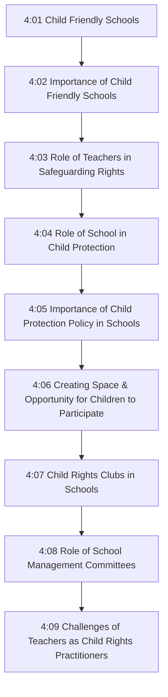
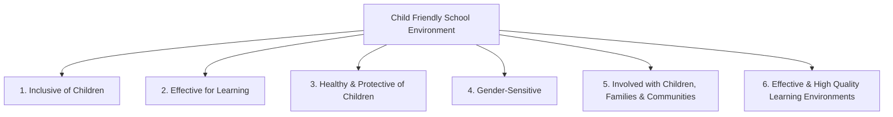
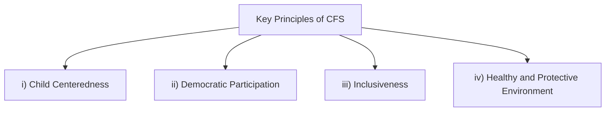
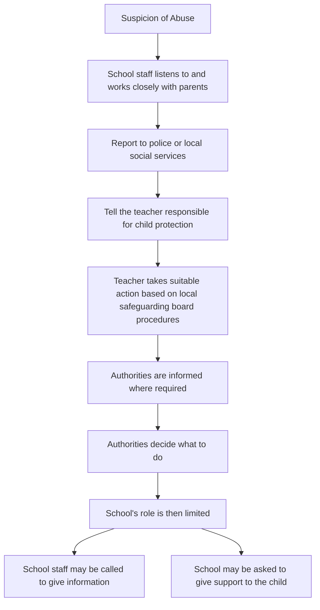
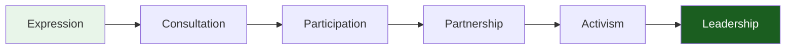

# Unit IV: Child Friendly Schools and Role of Teachers

## 4:00 Introduction

On any given day, more than **one billion** of the world's children go to school. Whether they sit in buildings, in tents, or even under trees, ideally they are **learning, developing, and enriching their lives**. For too many children, though, school is not always a positive experience:

- Some endure **difficult conditions** — extremely hot or cold temperatures, primitive sanitation
- Others lack **competent teachers** and appropriate curricula
- Still others face **discrimination, harassment, and even violence**

These conditions are **not conducive to learning or development**, and no child should have to experience them.

!!! tip "Key Definition"
    A school is considered **"Child Friendly"** when it provides a **safe, clean, healthy, and protective environment** for children. At Child Friendly Schools, **child rights are respected**, and all children — including those who are poor, disabled, living with HIV, or from ethnic and religious minorities — are **treated equally**.

!!! note "Topics Covered in This Unit"
    - Concept and importance of Child Friendly Schools
    - Role of teachers in safeguarding the rights of children in schools
    - Importance of child protection policy in schools
    - Creating space and opportunity for children to participate and express their voices/opinions
    - Importance of Child Rights Clubs in schools
    - Role of School Management Committees (SMCs)
    - Challenges of teachers as child rights practitioners

---

## 4:01 Child Friendly Schools

A **Child Friendly School (CFS)** is a school that **recognizes and nurtures** the achievement of children's basic rights. It works with all **commitment-holders**, especially parents/guardians, and values the many kinds of contributions they can make in:

- Seeking **all children to go to school**
- Developing a **learning environment** for children
- Ensuring **effective learning** according to children's current and future needs

!!! important "Key Characteristics of CFS"
    The learning environments of Child Friendly Schools are characterized by:

    - **Equity** and **Balance**
    - **Freedom** and **Solidarity**
    - **Non-violence**
    - Concern for **physical, mental, and emotional health**

Child Friendly Schools lead to the development of **attitudes, values, morals, knowledge, and skills** so that children can live together in a **harmonious way**. A child-friendly school nurtures a **school-friendly child** who supports children for development and a **school-friendly community**.

!!! note "Summary"
    A Child Friendly School revolves around the goal of making **basic education accessible, engaging, and stimulating** for all children aged **6–14 years**. The goal also requires that education is of **good quality** and **supportive of all children**.

---

### 4:01:1 Six Essential Aspects of Child Friendly School Environment

A Child Friendly School must reflect an environment of **good quality** characterised by the following **six essential aspects**:

#### 1. Inclusive of Children

- **Does not exclude or discriminate** any child on the basis of difference
- Provides education that is **free, compulsory, affordable, and accessible**, particularly to disadvantaged children
- **Respects diversity** and ensures equality of learning for all children (e.g., girls, working children, children of minority groups, those affected by HIV/AIDS, disabilities, victims of exploitation and violence)
- **Responds to diversity** by meeting the differing needs of children based on gender, social class, ability level, etc.

#### 2. Effective for Learning

- Promotes **good quality teaching and learning** processes with **individualized instruction** appropriate to each child's developmental level, abilities, and learning style
- Uses **active, cooperative, and democratic** learning methods
- Provides **structured content** and good quality learning materials and resources
- Enhances **teacher capacity, morale, commitment, status, and income** and their own recognition of child rights
- Promotes **quality learning outcomes** by defining and helping children learn what they need to learn and teaching them **how to learn**

#### 3. Healthy and Protective of Children

- Ensures a **healthy, hygienic, and safe learning environment** with adequate water and sanitation facilities
- Maintains **safe classrooms** free of drug abuse, corporal punishment, and harassment
- Provides **health services** such as nutritional supplementation and counselling
- Provides **life skills-based health education**
- Promotes the **physical, psycho-social, and emotional health** of teachers and learners
- Helps to **defend and protect** all children from abuse and harm
- Provides **positive experiences** for children

#### 4. Gender-Sensitive

- Promotes **gender equality** in enrolment and achievement
- **Eliminates gender stereotypes**
- Provides **girl-friendly facilities**, curricula, textbooks, and teaching-learning processes
- **Socializes girls and boys** in a non-violent environment

#### 5. Involved with Children, Families and Communities

- **Child-centred:** Promoting child participation in all aspects of school life where children are **active participants** in observing, exploring, listening, reasoning, and questioning
- **Family-focussed:** Working to strengthen families as the child's **primary care-givers and educators** and helping children, parents, and teachers establish **harmonious relationships**
- **Community-based:** Encouraging **local partnership** in education, acting in the community for the sake of children, and working with other actors to ensure the **fulfilment of children's rights**

#### 6. Effective and High Quality Learning Environments

A quality learning environment promotes:

- **Quality teaching** of relevant knowledge through instruction that is designed to meet students' needs
- Encourages children's **active engagement**
- Fosters **respect for each other's rights** rather than relying on traditional rote learning approaches

!!! important "Classroom Approach in CFS"
    The classroom process should **not** be one in which children are **passive recipients** of knowledge dispensed by a sole authority (the teacher). Rather, it should be an **interactive, child-centred process** in which children are active participants in **coming to know**. When children are engaged in participative learning and encouraged to do well with interesting learning opportunities, they are more likely to **stay in school and succeed academically**.

---

### 4:01:2 Key Principles Forming the Basis of Child Friendly Schools

Child Friendly Schools (CFS) are based on the following **four key principles**:

#### i) Child Centeredness

- Teachers are trained **not only in content delivery** but also on **child rights**
- Teaching and learning methods focus on a **child-centred approach**
- Lessons include **essential life skills** aimed at keeping children safe and building skills to fulfil their potential
- School should **compensate for home-based problems** and disadvantages

#### ii) Democratic Participation

- **Participation of all students** in all activities of the school including curriculum design, school management, and school design/architecture
- **Involving families and the community** in the activities of the school and to develop and improve the school's environment
- **Strengthening school governing bodies** by giving due representation to parents and members of the local community

#### iii) Inclusiveness

- **Respecting diversity** and ensuring equality of learning for all children
- **Not excluding or discriminating** anyone on the basis of religion, caste, gender, socio-economic level, disability, etc.
- **Responding to diversity** by meeting the differing needs of children including ability level
- **Equity** in relation to access, quality of education, and opportunities to participate in school activities, curriculum design, and school management

#### iv) Healthy and Protective Environment

- Ensuring a **healthy, hygienic, and self-learning environment** with adequate water and sanitation facilities
- Maintaining **healthy classrooms** with healthy policies and practices (like avoiding corporal punishment, physical and mental harassment of learners)
- Providing **health services** like nutritional supplementation and counselling regarding physical and mental health
- Providing **life skills-based health education**
- Helping to **defend and protect** all children from abuses and harm
- Providing **playground, play materials, and restrooms (toilets)** in adequate number for boys and girls

---

## 4:02 Importance of Child Friendly Schools

The importance of Child Friendly Schools can be summarised as follows:

| # | Importance |
|---|---|
| **i)** | They ensure **inclusive enrolment** and **equal treatment** of all school-aged children in safe, healthy, protective, and positive environments |
| **ii)** | They promote **learning and the acquisition of knowledge**, capacities, and attitudes through relevant curriculum and effective teaching and learning |
| **iii)** | They strive for **democratic participation** of all students, teachers, families, and the local society, making the school a **harmonious learning community** with strong leadership from school managers |

!!! important "Key Point for Exams"
    Though these elements appear to be separate, all the above three elements of the **UNICEF basic education model** are **inter-related**. Globally, child-friendly learning is recognized as the **key to delivering quality basic education** to children. Child-friendly, equitable, and quality basic education helps all young children in terms of **physical, social, emotional, and intellectual well-being**.

---

## 4:03 Role of Teachers in Safeguarding the Rights of Children in Schools

### 4:03:1 Safeguarding

**Safeguarding children** is a process of protecting children from harm, any form of maltreatment, abuse, exploitation, or neglect, as well as addressing the wider issues that can put children at risk. This includes:

- Providing a **safe environment** in the classroom and playground
- Promoting **good behaviour and discipline**
- Developing **positive relationships** with students

!!! tip "Definition of Safeguarding"
    Safeguarding is a practice that involves the following **actions and aims**:

    1. **Protecting** children from maltreatment
    2. **Preventing** the impairment of children's health and/or development
    3. **Ensuring** that children can grow up in environments that consistently provide safe and effective care
    4. **Taking action** so that all children have the best outcomes

The role of a teacher as a **safeguarding professional** is to work in a way that embodies and prioritises the above-mentioned intentions.

!!! important "Staff Responsibility"
    **All staff** in the school should be aware of their safeguarding responsibilities and ensure that any concerns about the welfare or safety of students are **reported and addressed promptly**. In some cases, this may involve referring a student to **external agencies** for further support.

---

### 4:03:2 Teachers Safeguarding Children's Rights

The role of a teacher in safeguarding goes **beyond just classroom learning** and involves being aware of a range of safeguarding risks and warning signs. Teachers are responsible for students' welfare and since they spend a lot of time with them, they are **ideally placed to notice** when something seems wrong.

#### i) Child-Centred Approach

One of the key roles that a teacher plays in safeguarding is adopting a **child-centred approach** in their work. This means:

- The **needs and best interests** of the child are always considered and often prioritised when making decisions
- A child is always **better off when looked after by their family**, as long as this is a safe place for them
- Taking a child from its family is a **last resort**, unless the child is in immediate danger

This approach is based on what children said about what they want from safeguarding professionals:

| What Children Want | Description |
|---|---|
| **Understanding** | Professionals who understand their situation |
| **Vigilance** | Adults who are watchful and alert |
| **Respect** | Being treated with dignity |
| **Support** | Receiving help when needed |
| **Advocacy** | Someone to speak on their behalf |
| **Protection** | Being kept safe from harm |

!!! note "Teacher's Responsibility"
    If you work with children, you have a responsibility to **speak and listen**, take them seriously, and work with them **collaboratively** to support their needs.

#### ii) Early Help

- All teaching staff should know the **signs of a child that may benefit from help** and be ready to start and investigate as soon as a problem emerges
- Teachers are responsible for understanding the situations that indicate **early help** may be required

**Warning signs to look out for include:**

- Becoming **withdrawn**
- **Unexplained changes** in behaviour
- **Aggression**
- Other indicators of **abuse or neglect** (physical violence, neglect by parents or teachers, sexual exploitation and abuse, discriminatory treatment, etc.)

#### iii) Teachers' Responsibilities

When a child comes to a teacher directly and shares that he/she is being abused, mistreated, or exploited, the teacher should:

- **Listen** to the child and take them seriously
- Let them know they will be **kept safe**
- Help them feel they have **done the right thing**
- **Not indulge in interrogation** by asking leading questions — let the child explain in his/her own words

!!! important "Key Responsibilities"
    - Teachers should **build relationships** with students so they are seen as **trusted figures**
    - Teachers should know **whom to report** safeguarding issues to in their school
    - Teachers should understand the importance of keeping situations **confidential** and only involving relevant staff members
    - Teachers should know which **additional services** may get involved and how they may have to contribute

---

## 4:04 Role of School in Child Protection

Schools have a **key duty as duty-holders** to ensure the well-being of all children studying in them. For this to happen, schools need to lay down necessary structures to ensure the effectiveness of child protection policies and procedures.

!!! tip "Definition"
    **Child protection** is a process of protecting individual children from any form of harm, maltreatment, or abuse. It involves measures, structures, and policies laid down by the organisation/institution, designed to **prevent and respond immediately and effectively**. Protection is about **improving the safety of children**.

### Structures/Systems to Protect Children in Schools

| Structure/System | Description |
|---|---|
| **Designated Liaison Person (DLP)** | Having a DLP in place for dealing with child protection |
| **Standard Reporting Procedures** | Having standard reporting procedures and ensuring they are followed |
| **Prompt Referral** | Ensuring any child protection cases are identified and referred promptly to relevant services and authorities |
| **Staff Vetting** | Having procedures for checking staff before they work with children |
| **Child Protection Policy** | Having a policy which includes procedures if a teacher or staff member is accused of harming a child |
| **Staff Training** | Making sure staff are trained to identify signs of abuse including what to do if worried about a child |

### Teaching Children to Protect Themselves

The school should teach children **how to protect themselves**. **Personal, Social, and Health Education (PSHE)** lessons explain:

- Risky behaviour
- Appropriate and inappropriate physical contact
- Dealing with pressure

### Dealing with Suspected Cases of Abuse

### Preventing Inappropriate Relationships in School

- It is a **crime** to have a sexual relationship with a child under the age of **16**
- It is also an **offence** for an adult to have a sexual relationship with a young person under **18** if the adult is in a **'position of trust'** with that young person
- **Position of trust** covers the relationships between school/college staff and students
- It applies as long as the young person is **under 18**

### Vetting of School Staff

- Every person employed in a school is to be **vetted by a criminal record check**
- The school needs to **train staff and volunteers** how to identify abuse, including what to do if they or someone else is worried about a child

---

## 4:05 Importance of Child Protection Policy in Schools

Schools are often referred to as a **child's second home**. It is the school where the actual foundation of a child's life is laid. If this basic foundation goes weak, it becomes really difficult to grow into a **confident, responsible adult**. That is why it is important that schools not only promote social and creative learning but also provide an **encouraging, well-protected environment** to children where they feel safe and sound.

!!! important "Need for Child Protection Policy"
    With the younger generation massively prone to abuse and violence of all kinds, it is high time that schools give **highest priority for safety of children**. There is a need for schools to implement a **firm child protection policy** to handle every situation and devise ways to keep children safe and secure.

In general, child protection policies are designed to **strengthen the environment, capacities, and activities** to prevent/protect children from any kind of abuse, exploitation, violence, neglect, and consequences of conflict. Having an appropriate child protection policy enables schools to provide a **safe learning environment** to children by identifying distressed and vulnerable pupils and taking suitable action.

### Key Facets of a Child Protection Policy

#### i) Empowering Children to Stay Conscious of Their Safety

- Children should be taught to **express their concerns, fears, and needs**
- It is essential to teach children about **'good touch' and 'bad touch'**
- They should know **what is right and wrong** and that no one can control, dominate, or threaten them
- They should know **when and where to say 'no'**
- Children should be made aware of **what is appropriate and what is not** so they know how to act in different situations

#### ii) Creating a Safe Learning Environment

Schools should have a **child protection plan** in place to address:

- **Bullying, discrimination**, or any sort of violence
- A **child counsellor** to support students and parents on issues like bullying, violence, sexual abuse, etc.
- A **suggestion/complaint box** to help students and parents bring issues to the attention of authorities without being singled out or harassed
- **Procedures** to be followed if a teacher or staff member is accused of harming a child
- A **set procedure for checking staff** before they are allowed to work with children

!!! note "Reporting Protocol"
    If any member of the staff suspects that a child is being abused, he/she should **report it to the headmaster/principal** who will ultimately decide whether to seek the assistance of external agencies or refer it to relevant authorities.

#### iii) Training and Workshops

- Quality **training and workshops** conducted through experts and resource persons help parents, teachers, and the school staff to have good knowledge about various issues and how they should be handled
- Having **children's clubs and workshops** at school can provide more awareness to students, parents, and teachers
- A **healthy and open conversation** can often enable teachers to identify potential flashpoints and take early action

!!! important "Comprehensive Policy"
    A child protection policy should take into account **all factors** including:

    - Transportation
    - Infrastructure
    - Medical facilities
    - Sanitation
    - Forms of punishments and abuse
    - Routine check-ups in every nook and corner of the school
    - **24x7 CCTV surveillance** facilities with security personnel
    - All features of the policy should be made clear to **parents, students, and visitors**

---

## 4:06 Creating Space and Opportunity for Children to Participate and Express their Voices / Opinions

In democratic societies, children and young people have the **right to be heard** and not to feel afraid to express themselves. Schools have a **key role** in upholding this principle. At the same time, students need to be aware of both their **rights and responsibilities**.

Learning about **human rights and democracy** is the fundamental first step for becoming an informed and responsible citizen. Students need to participate in activities such as **debating and community work**. Skills, knowledge, and critical understanding must be coupled with **attitudes and values** that form part of democratic culture. All this should be promoted through a **whole-school approach**.

---

### 4:06:1 Meaning of Student Voice

!!! tip "Definition"
    **'Student Voice'** is the right of students to have a say in matters that affect them in their schools, and to have their views and opinions taken seriously. It encompasses **all aspects of school life** and decision-making where young learners are able to make meaningful contributions, adapted to their age and stage of development.

Student voice stretches from **informal situations** (where students express opinions to peers or staff members) to participation in **democratic structures or mechanisms** such as student parliaments and consultations.

Student voice can vary from simple **self-expression** to taking on a **leadership role** in an aspect of school life. It can be categorized according to a **6-fold typology** of increasing complexity and responsibility:

| Level | Type | Description |
|---|---|---|
| **i)** | **Expression** | Voice an opinion |
| **ii)** | **Consultation** | Asked for an opinion |
| **iii)** | **Participation** | Attend and preferably play an active role in a meeting |
| **iv)** | **Partnership** | Have a formal role in decision-making |
| **v)** | **Activism** | Identify a problem, propose a solution, and advocate its adoption |
| **vi)** | **Leadership** | Plan and make decisions |

!!! note "Where Can Student Voice Be Expressed?"
    Given that the relevant activities are age-appropriate (applicable for students from **upper primary classes and above**), student voice can be expressed anywhere in the school community, in and out of lessons, e.g.:

    - Inviting students to **comment on teaching approaches** and techniques
    - Suggesting **topics for class discussion**
    - Participating in **school policy committees** and/or consultations
    - Joining in a **casual conversation** on school matters with a teacher or staff member

---

### 4:06:2 Importance of Student Voice at School

Student voice is rooted in the concept of **children's rights and human rights**. In particular:

!!! important "UNCRC Connection"
    **Article 12** of the United Nations Convention on the Rights of the Child (UNCRC) establishes the right of every child to **have a say in matters which affect them**, whether in or out of school, as well as to be involved in decisions that affect them. The UNCRC also includes other articles that seek to increase students' voice, including the right to **seek and receive information**, to **express their own views**, and to **associate with others**.

**Benefits of Student Voice:**

- **Participation in school decision-making** fosters a sense of citizenship in young learners, helping them develop important competencies (e.g., cooperation and communication skills, self-efficacy, responsibility, civic-mindedness, and respect for the value of democracy)
- **Contributing to their school community** gives young learners a sense of belonging, develops self-esteem, and can lead to more respectful relationships — this has a positive influence on school discipline and helps reduce problems such as **drop-out, bullying, substance abuse, and radicalisation**
- **Engaging students in active learning activities** in class has a positive effect on the classroom atmosphere, educational achievements of students, and their peers

---

### 4:06:3 Challenges in the Development of Student Voice in Schools

There are a number of major challenges faced in the development of student voice in schools:

| Challenge | Description | Solution |
|---|---|---|
| **1. Attitudes of Stakeholders** | Parents, teachers, school leaders, and others with traditional views feel children should be "seen and not heard" — they think respect and authority are best developed in a culture of deference | School heads need to introduce elements of student voice **gradually**, explaining the process clearly to stakeholders and sharing successes |
| **2. Genuine Participation vs. Tokenism** | Ensuring that student participation is genuine and not "window-dressing" | Give students opportunities to make a **real difference** to their lives and help other stakeholders be open to sharing decision-making with young learners |
| **3. Equal Access to Opportunities** | The perception that student voice applies only to formal school structures like pupil parliaments; difficulty seeing student voice as integral to the learning process | Broaden the understanding that student voice is **integral to**, rather than separate from, the learning process in classrooms |

---

### 4:06:4 How Can Schools Get Active in Developing More Opportunities for Student Voice

There are a number of ways in which schools can develop more opportunities for student voice:

- **Encouraging teaching staff** to consider how they can involve students in the learning process in the classroom, e.g., by creating more opportunities for students to express opinions, debate issues, make suggestions, or draw up classroom rules
- **Creating mechanisms for student consultation** on issues affecting school life, e.g., through questionnaires, suggestion boxes, surveys, or focus groups
- **Establishing formal bodies or procedures**, e.g., pupil parliaments, student councils, commissions, or 'circle time'
- **Inviting students to sit on school policy development committees**, e.g., on gender equality, pupil safety, or health and well-being
- **Teaching young learners the skills** of public speaking and debate, e.g., discussion skills, active listening, or argumentation
- **Providing opportunities for peer-led activities**, e.g., peer teaching, peer assessment, or peer counselling

---

## 4:07 Child Rights Clubs in Schools and their Importance

### 4:07:1 What are 'Child Rights Clubs' in Schools?

!!! tip "Definition"
    **Child Rights Clubs (CRCs)** are **child-led groups** established to empower children, educate them about their rights and responsibilities, build their capacity to develop into great leaders, and encourage them to become **active agents** for change — to empower them to become their own actors in protecting and promoting their rights.

CRCs present an **opportunity and platform** for child-led initiatives and activities where children voice and address any issues that affect them.

---

### 4:07:2 Importance of Joining in Child Rights Club

| # | Importance |
|---|---|
| 1 | Children get to **learn about their rights**, the risks and dangers, child protection concerns within their communities, and who they can contact if they need help |
| 2 | Children get **increased awareness** of their rights and responsibilities and build their confidence and understanding about how to **report incidents of abuse** and advocate for themselves and their peers |
| 3 | Children get to **access information and experiences** that enable them to grow and develop better |
| 4 | Allows children to develop **leadership skills** within an environment of their peers |
| 5 | Fosters **creative thinking** among children |
| 6 | Children have the opportunity to **share on issues** affecting them either in schools or in the community and how to resolve them |
| 7 | Children learn to make **informed decisions** and provide sound opinions to issues affecting them |
| 8 | Children get to learn on how to become **more responsible citizens** among other national values |
| 9 | Children build their **confidence** among other skills on living with others |
| 10 | Children gain **assertiveness** in expressing their views; come up with child-led initiatives to empower self and others |

---

### 4:07:3 Possible Child Rights Club Activities

- **Engaging children in role plays** and skill-building exercises around child rights and protection themes
- Children **participating in joint trainings** with key child protection actors in schools and communities to strengthen referral and service linkages for reporting and follow-up on cases of abuse and neglect
- **School-wide and inter-school child protection events**, including music, dance, drama, sports, mural painting, school gardens, public speaking, and savings clubs
- Children **participating in joint feedback meetings** at community level; sharing feedback with duty bearers and community members; sensitising peers from schools with no CRC

---

### 4:07:4 Formation and Management of Child Rights Club

Child Rights Clubs are important avenues for encouraging **child protection education** for children of both primary and secondary schools as well as communities. **Child participation** is at the centre in the establishment of Child Rights Clubs.

!!! important "Key Features of CRC Management"
    - Child Rights Clubs are **directly run by school children**
    - CRC is supported by **patrons** who are the school teachers and are responsible for guiding members (children)
    - Participation in CRC is always **voluntary** — children willingly choose to join
    - The **interests of the children** direct the club activities
    - Club members are at liberty to **discuss and decide** what their activities will be

**Membership of the Club:**

- Each CRC has a **maximum membership of 30 members** to ensure proper management and participation
- In schools where membership is more than 30, children will be encouraged by the patron to **form a new CRC**
- Activities are carried out concurrently

**Selection of Leaders:**

Leadership of the CRC consists of:

| # | Position |
|---|---|
| i) | **Chairperson** |
| ii) | **Vice-Chairperson** |
| iii) | **Secretary** |
| iv) | **Vice-Secretary** |

The above four are referred to as **executive members** who coordinate the affairs of a CRC for a period of **1 year**. Selection of executive members will be **transparent**. CRCs meet **at least once in a week** to deliberate on thematic issues affecting them.

---

### 4:07:5 Functions of Child Rights Clubs in Schools

- They give children an **opportunity to speak out** on issues affecting them
- They also give children a chance to **speak on behalf of other children**
- Allows children to know **types of child abuse** in and around school communities
- Helps children to know **cases to be reported** when they arise
- Enables children to have a picture on **channels of handling cases**
- Allows children to **nurture their talents** in order to unleash their potential and abilities
- Equips children with **skills and knowledge** that will help them take care of themselves

---

### 4:07:6 Principles of Participation in Child Rights Clubs

| Principle | Description |
|---|---|
| **Equal Participation and Inclusion** | All children regardless of their status, ethnicity, age, gender, ability, etc. have **equal opportunity** to participate in the CRC |
| **Gender Equity** | Both male and female members of the CRC have **fair and equal opportunities** to participate and lead in CRC activities |
| **Non-discrimination** | No child should be denied their right in CRC on any ground. Every child has equal opportunity regardless of gender, race, ethnicity, nationality, religion, disability, parentage, sexual orientation, or other |
| **Voluntary** | Participation in CRC will **not be forced** on any child. A child has the right to decide whether or not to participate and when to participate |
| **Safety** | No child should be exposed to actual or potential **abuse or exploitation** by participating in the CRC activities |

---

## 4:08 Role of School Management Committees

!!! tip "Definition"
    The **School Management Committee (SMC)**, constituted under the **Right to Education Act 2009**, plays an important role in ensuring **accountability** in India's education system, especially in Government schools. The Act envisions the SMC as a **decentralized governance model** which empowers them to keep track and monitor functioning of the schools and oversee that school grants are used effectively.

**Composition of SMC:**

- Representatives of the **local authority**
- **Parents or guardians** of students
- The **principal and teachers** of the school
- **Three-fourths** of SMC members must be parents or guardians
- **Half** of the members must be women

SMCs play a pivotal role in developing the **tri-annual School Development Plans** and annual work plans for the schools. The RTE Act also highlights the critical role of parents as part of SMCs for developing a **sense of ownership** towards good education of their child and for strengthening and improving performance of schools in India.

!!! important "Overall Focus of SMCs"
    SMCs focus on **holistic development** of the schools, which not only accounts for good school infrastructure, but also supervision/monitoring of **finance, management, academic progress of children**, with equal participation and say, bringing **transparency** in India's education system.

---

### 4:08:1 Composition of School Management Committee

As per the **"Right to Free and Compulsory Education Rules 2010"**:

1. A School Management Committee shall be constituted in **every school** (other than an unaided school) within its jurisdiction, within **six months** of the appointed date, and **reconstituted every two years**

2. **Seventy-five percent (75%)** of the strength of the SMC shall be from amongst **parents or guardians** of children

3. **Fifty percent (50%)** of committee members shall be **women**

4. **Proportionate representation** shall be given to parents or guardians of children belonging to **disadvantaged groups and weaker sections**

5. The remaining **twenty-five percent (25%)** of the strength shall be from:
    - **One-third** — Elected members of the local authority (Municipal Council, Village Panchayat, etc.)
    - **One-third** — Teachers from the school
    - **One-third** — Local educationists, children in the school (to be decided by parents in the Committee)

6. The SMC shall elect a **Chairperson** and **Vice-Chairperson** from among the parent members

7. The **Head teacher** of the school (or the senior-most teacher) shall be the **ex-officio Member-Convener** of the SMC

8. Where there are two or more schools in a panchayat, the **panchayat president** will be the member of SMC of one of the schools; remaining schools shall have **ward members** as members of the SMC

9. The SMC shall meet **at least once a month** and the minutes and decisions shall be properly recorded and made available to the public

**Composition Table:**

| Member | Number | Role |
|---|---|---|
| Saviour (Panchayat President / PTA Member) | 1 | Parent (Preferably Woman, Chair Person) |
| Head Master | 1 | Member-Convener |
| Teachers' Representative | 1 | Member |
| Parents (including from disadvantaged group & weaker sections) | 12 | Members |
| Elected Member of Local Body | 1 | Member |
| Educationist / Philanthropist / Retired Official | 1 | Member |
| Self-Help Group (Parent) | 1 | Member |
| **Total** | **20** | |

!!! note "Important Notes"
    1. Out of 20 members, parents should be **75%** (i.e., **15 members** should be parents)
    2. Out of 20 members, **50%** should be women (i.e., **10 members** should be women)

---

### 4:08:2 Functions of School Management Committee

The School Management Committee shall perform the following functions:

#### A. Monitor the Functioning of the School

| # | Function |
|---|---|
| i) | Ensure the **regularity and punctuality** in attendance by teachers of the school |
| ii) | Assess the **learning ability** of each child and accordingly supplement additional instructions if required |
| iii) | Ensure the **enrolment and continued attendance** of all children from the neighbourhood of the school |
| iv) | Bring to the notice of the Local Education Authority any **deviation from the right of the child**, in particular mental and physical harassment, denial of admission, and timely provision of free entitlements |
| v) | **Communicate** in simple and creative ways to the population in the neighbourhood, the rights of the child as enunciated in the Act, as also the obligations of the appropriate Government, local authority, school, parents, and guardians |
| vi) | Ensure that **no child shall be liable to pay any kind of fee** or charges or expenses which may prevent him or her from pursuing and completing elementary education |
| vii) | **Identify the needs, prepare a plan, and monitor** the implementation of provisions where a child above six years of age has not been admitted or could not complete elementary education — he/she shall be admitted in a class appropriate to his/her age |
| viii) | Monitor the **identification and enrolment of CWSN** (Children with Special Needs) and mobilize facilities for education of children with disability as per the Equal Opportunities, Protection and Full Participation Act 1995 |
| ix) | List out specifications for **equitable quality of education** in a school |
| x) | Monitor the implementation of the **mid-day meal** in the school |
| xi) | Ensure that **no teacher shall engage** himself or herself in private tuition or private teaching activity |
| xii) | Monitor that teachers are **not burdened with non-academic duties** other than those specified in Section 27 of the RTE Act (No teacher shall be deployed for non-educational purposes other than decennial population census, duties related to elections, or disaster relief duties) |

#### B. Preparation, Recommendation, Implementation and Monitoring of the School Development Plan (SDP)

| # | Function |
|---|---|
| i) | Every SMC shall prepare a **School Development Plan** every year |
| ii) | The SMC shall prepare a School Development Plan **at least three months before the end of the financial year** in which it is first constituted |
| iii) | The School Development Plan shall be a **three-year plan** comprising three annual plans and shall contain: |
| | a) Estimates of **class-wise enrolment** for each year |
| | b) Requirement of **number of additional teachers** as per the norms given in the schedule |
| | c) Physical requirements of **additional infrastructure and equipment** as per norms |
| | d) Assess **financial requirement and needs** on the basis of the above, including for providing special training facility, entitlements of children such as free textbooks and uniforms, and any other additional requirements |
| iv) | The School Development Plan shall be **signed by the Chairperson or Vice-Chairperson and Convener** of the SMC and submitted to the local authority before the end of the financial year |

#### C. Monitoring of Utilisation of Grants Received from Government, Local Authority or Any Other Source

| # | Function |
|---|---|
| i) | Prepare an **annual account of receipts and expenditure** of the school. Any money received by the Committee for the discharge of its functions under the RTE Act shall be kept in a **separate account** to be audited annually |
| ii) | The annual account should be **signed by the Chairperson or Vice-Chairperson and Convener** and made available to the local authority within **one month** of their preparation |

#### D. Performance of Other Functions

The SMC shall play any such roles and functions as ordered by the Government from time to time. The SMC also performs the following functions:

| # | Function | Description |
|---|---|---|
| 1 | **Policy Formulation** | SMC is involved in the formulation of policies and guidelines for the school — decisions related to academic programmes, student discipline, and other operational matters; providing facilities for extra-curricular activities like sports, arts, club activities, and community service programmes; providing support for student counselling, special coaching for exams; celebrating students' achievements in educational and co-curricular activities |
| 2 | **Teacher and Staff Appointments** | SMCs may be involved in the selection and appointment of teachers and other staff members; they participate in the recruitment process, ensuring that qualified and suitable individuals are hired |
| 3 | **Monitoring and Evaluation** | SMCs play a role in monitoring the overall performance of the school — reviewing academic achievements, attendance rates, and the implementation of educational programmes |
| 4 | **Parental Involvement** | SMCs work to enhance parental involvement in school activities and emphasize the importance of a collaborative relationship between parents and the school in the education of children. Parents' involvement extends beyond merely sending their children to school regularly — it means they actively participate in their child's academic growth and behaviour |

---

## 4:09 Challenges of Teachers as Child Rights Practitioners

Children can be subjected to **neglect, abuse, violence, and exploitation** anywhere. Some abuse may happen inside the school premises, while a lot of it is what children suffer at home and in non-school environments.

!!! important "Teacher's Duty"
    A child in your class may be a victim of violence/abuse/exploitation that happens **outside the school**. You cannot ignore it. Rather, you must **help the child**. This is possible only if you are able to **identify that there is a problem** and you spend time to understand it and explore possible solutions. Your duty to protect children **does not come to an end** once you are out of the school premises.

---

### 4:09:1 Duties of a Child-Friendly Teacher

- **Understand children's rights** and human rights and create such awareness in the community as well
- **Be open to learning**
- Be a **Friend, Philosopher, and Guide** to the child
- Make the classes **interesting and interactive**
- **Avoid one-way communication** and make opportunities for children to come up with their doubts and queries
- Learn to **recognise and identify** abuse, neglect, learning disorders, and other not-visible disabilities
- **Create a relationship** where children can express their views, concerns, anguish, fear, etc. Try to engage with children in informal settings
- Be a **good listener**. Share and discuss various issues and problems which children are facing either in school or at home
- **Encourage children's participation** in matters that affect their lives
- **Build children's capacities** to participate effectively
- **Organise meetings** of children with school authorities
- **Discuss child rights issues** with the parents in the PTA meetings
- **Say NO to discrimination**. Take active steps to reach out to children from minority and other discriminated groups
- **Ensure children are protected** within the school as well as in the community, even if it requires calling the police and taking/facilitating legal action
- **Encourage education and participation of girls** through creative measures within the classroom
- All teachers can help in **creating and strengthening a protective environment** around children
- **Spend some time with the child privately**, without being imposing, humiliating, or creating an embarrassing situation for the child
- Help the child **express her/his feelings** through drawing and painting, or by simply talking to you, the school social worker, or to a friend in the class

---

### 4:09:2 Challenges Teachers Face in Practicing Child Rights Protection

Teachers, as child rights practitioners, face many hurdles and challenges in the protection of child rights within and outside the school. Some of the challenges faced by teachers in practising child rights protection are:

#### 1. Inadequate (Child Rights) Knowledge and Skills about Child Rights

- Teachers could play their role in child rights protection only if they have **adequate knowledge and skills**
- Teachers acquire very **limited knowledge** in child rights during their pre-service training
- As a measure of remediation, teachers are to be provided with **regular in-service training** in child rights practices and skills, just as they are presently being sent for upgradation of knowledge and skills in academic subjects

#### 2. Large Sized Classes

- In classrooms with **forty or more students** with diverse potentials and abilities, it becomes difficult for teachers to pay **individual attention** to students
- Difficult to resolve child rights issues of a **significant number of students**

#### 3. Lack of Supportive Policies and Services in Schools

- In most schools, child rights supportive **policies and services are conspicuously absent**
- Without clear policies and guidance, teachers find it difficult to address child rights issues appropriately
- **Support services** like counselling, special education, and facilities for children with disabilities are also not available in most schools
- This hinders the ability of teachers to cope with the **diverse needs of the learners** in the class

#### 4. Traditional Approach of Teaching and Disciplining Students

| Traditional Approach | Modern / Child-Friendly Approach |
|---|---|
| Achievement measured by **examination scores** only | Focus on **understanding subject content** |
| **Drill and practice** method; memorization and recitation | **Constructive discipline** — making students discriminate right from wrong |
| **Subject-centred** approach | **Student-centred** approach |
| Discipline through **rules and regulations**; violations punished by physical force | Social discipline through **cooperative/collaborative learning** |
| "Spare the rod and spoil the child" mentality | Teaching **social skills** like rights and responsibilities |
| **Corporal punishment** | **Self-discipline** in students; physical punishments completely avoided |

!!! important "Key Point"
    **Physical punishments** should be completely avoided as they do **more harm than benefit** to students. The modern concept of **'constructive discipline'** — ensuring social discipline through cooperative/collaborative learning, understanding, projects, and teaching social skills — goes a long way in promoting self-discipline in students.

#### 5. Lack of Parental Involvement

- Parents are excessively worried about the **academic achievements** of their wards rather than their **wholistic development**
- Parents do not have adequate **control over the behaviour** of their children
- They often expect teachers to **correct the behaviour** of students
- Without **parental cooperation and involvement**, this is not possible
- The involvement of **parents and community** is essential in promoting child rights
- It is the **shared responsibility** of teachers, parents, and community to make available a safe and nurturing environment both in school and at home so that child rights could prosper

---

## Conclusion

In this Unit, the following topics have been discussed elaborately:

- Concept and importance of **Child Friendly Schools**
- Role of teachers in **safeguarding the rights of children** in schools
- Role of school in **child protection**
- Importance of **child protection policy** in schools
- Creating space and opportunity for children to **participate and express their voices/opinions**
- **Child Rights Clubs** in schools and their importance
- Possible child rights club activities
- Formation and management of Child Rights Clubs
- Role of **School Management Committees**
- Duties of a child-friendly teacher
- Challenges of teachers as **child rights practitioners**

---

## Review Questions

### Objective Type Questions

**1.** Which among the following statements is **not true** about child-friendly schools?

- (i) Healthy and safe environment to all pupils
- (ii) Good quality teaching and learning process
- (iii) Unbridled freedom to students
- (iv) Accessibility to all students without discrimination

**[Ans: (iii)]**

---

**2.** Which among the following statements is **false**? An example for creating opportunity for children to express their voice is:

- (i) Making students debate important issues in the class
- (ii) Inviting students to give suggestions to draw up classroom rules
- (iii) Making students join in a conversation on school development matters
- (iv) Making students to sit in a staff appointment committee

**[Ans: (iv)]**

---

**3.** In the formation of 'School Management Committee' (SMC) recommended under the Right to Education Act 2009, what percentage of members should be parents?

- (i) 50%
- (ii) 75%
- (iii) 33.33%
- (iv) 20%

**[Ans: (ii)]**

---

**4.** Which among the following statements is **not true**? 'Child Rights Clubs' (CRCs):

- (i) Provide a platform for students to protect incidence of abuse/neglect in the school
- (ii) Make children to learn about their rights, risks, and dangers
- (iii) Make children know how to report incidence of abuse
- (iv) Provide opportunity to students to share on issues affecting them in school

**[Ans: (i)]**

---

**5.** Pick the correct answer from among the following: Patrons of 'Child Rights Clubs' (CRCs) are:

- (i) Parents
- (ii) Teachers
- (iii) Elected Member of a local body
- (iv) Educationists

**[Ans: (ii)]**

---

### Short Answer Type Questions

**6.** Explain the concept and importance of child-friendly schools. **[Ans: 4:01 + 4:01:2 + 4:02]**

**7.** What is a 'child-friendly school'? Explain the essential aspects of Child-friendly School environment. **[Ans: 4:01 + 4:01:1]**

**8.** Explain the role and responsibilities of teachers in safeguarding the rights of children. **[Ans: 4:03:1 + 4:03:2]**

**9.** Explain the role of school in child protection. **[Ans: 4:04]**

**10.** Explain the importance of child protection policy in schools. **[Ans: 4:05]**

**11.** What are 'Child Rights Clubs' in schools? Explain their importance in schools. **[Ans: 4:07:1 + 4:07:2]**

**12.** What are 'Child Rights Clubs in Schools'? How could they be formed and managed? State the functions of child rights clubs in schools. **[Ans: 4:07:1 + 4:07:4 + 4:07:5]**

**13.** Explain briefly the role of the 'School Management Committees'. **[Ans: 4:08]**

**14.** Explain the composition of the School Management Committee as per the Right to Free and Compulsory Education Rules 2010. **[Ans: 4:08:1]**

**15.** Explain the functions of the School Management Committee. **[Ans: 4:08:2]**

**16.** Explain the challenges faced by teachers as child rights practitioners. **[Ans: 4:09:2]**

**17.** Explain the duties of a child-friendly teacher. **[Ans: 4:09:1]**
