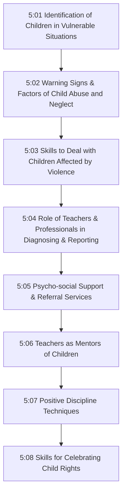
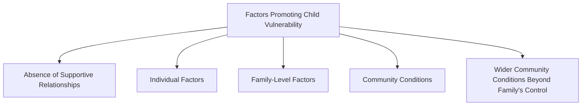
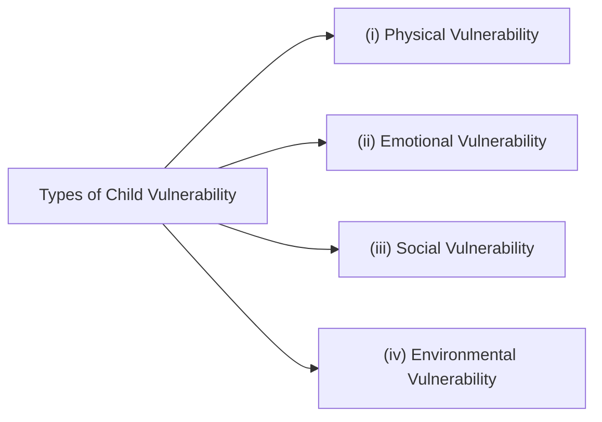
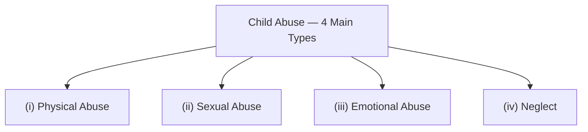
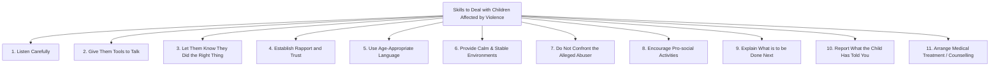
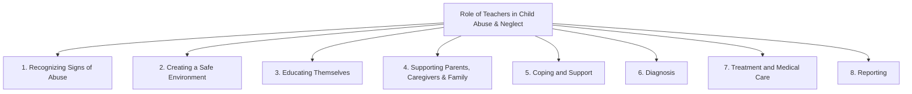
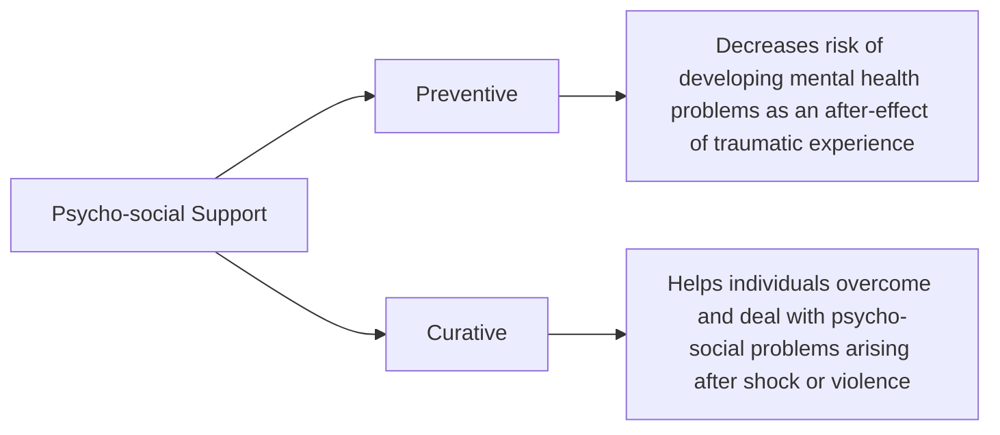
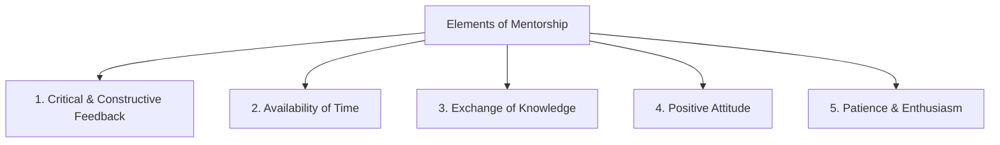
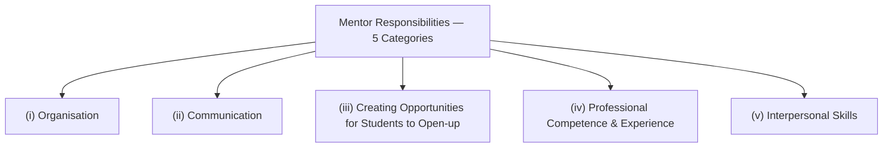
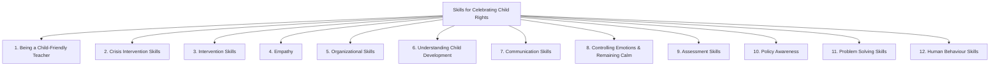

# Unit V: Skills for Child Protection and Participation

## 5:00 Introduction

The term **'vulnerability'** is derived from the Latin word **"vulnus"** meaning **'wound'**. Vulnerability refers to a state that has a high chance of getting **physically or emotionally wounded**.

!!! tip "Key Definition"
    **Vulnerable children** are those who are at great risk of experiencing **physical or emotional harm**. Child vulnerability is the outcome of the interaction of a range of **individual and environmental factors**, which grows over time.

- Types and degrees of child vulnerability vary depending on many factors
- Children with **disabilities** (physical, emotional, sensory, communication impairments) have limited individual functioning and are **highly vulnerable** to child abuse compared to normal children
- The **UNCRC** stipulates the government's responsibilities to take **protective and preventive measures** against child abuse of all forms

!!! note "Topics Covered in This Unit"
    - Identification of children in vulnerable situations
    - Warning signs and factors of varying types of child abuse and neglect
    - Skills to deal with children affected by violence
    - Role of teachers and professionals in diagnosing and reporting suspected cases
    - Psycho-social support and referral services for vulnerable children
    - Teachers as mentors of children
    - Positive discipline techniques for teachers
    - Skills for celebrating child rights

---

## 5:01 Identification of Children in Vulnerable Situations

A **vulnerable child** is one who has been identified as being at **greater risk** of experiencing physical or emotional harm, or at risk of achieving **poor outcomes**, due to the interactions of factors in their lives — both **individual** and **environmental**.

!!! important "Definition"
    A child below the age of **18** who is currently or likely to be in **adverse conditions**, thereby subjected to significant **physical, emotional or mental stress**, is termed as **'vulnerable'**.

**Some vulnerable groups may include children who:**

- Are **orphaned**
- Are living without the **basic necessities**
- Are suffering from some type of **abuse or exploitation**
- Are facing **discrimination** (e.g., belonging to a particular ethnic or religious group)
- Are involved in **exploitative labour**

---

### 5:01:1 Factors Promoting Vulnerability in Children

Factors promoting child vulnerability include:

| Factor | Description |
|--------|-------------|
| **Absence of supportive relationships** | Lack of caring adults or mentors in the child's life |
| **Individual factors** | Physical/mental disabilities, chronic illness, emotional problems |
| **Family-level factors** | Single-parent families, parental ill-health, substance abuse |
| **Community conditions** | Poverty, unsafe neighbourhoods, lack of facilities |
| **Wider community conditions** | Conditions beyond a family's control (conflict, disaster, systemic inequality) |

---

### 5:01:2 Recognizing the Different Kinds of Vulnerable Situations for Children

Vulnerable children could be identified by the **type of vulnerable situations** in which they find themselves, i.e., the type or kind of vulnerability they are exposed to.

There are **four types** of children's vulnerability:

#### 5:01:2:01 Physical Vulnerability

Physical vulnerability includes **lack of or limited access** to:

- **Food**, clothing, shelter
- **Healthcare** and education
- Suffering from **HIV infection**
- **Disabilities**
- **Exploitation** and abuse

!!! note
    These factors adversely affect the child's **health, development and learning**.

#### 5:01:2:02 Emotional Vulnerability

Emotional vulnerability is mainly related to:

- **Parental care**, love and support
- **Positive interactions** among family members
- **Space to grieve** and containment of emotions

#### 5:01:2:03 Social Vulnerability

Social vulnerability refers to:

- **Absence of a supportive social group**
- **Absence of role models** to follow
- Lack of **guidance** in difficult situations
- Issues in the **immediate environment** — neighbourhood, residence, and school

#### 5:01:2:04 Environmental Vulnerability

Environmental factors with a bearing on child's vulnerability operate at both the **family** and **community** levels.

| Level | Factors |
|-------|---------|
| **Family Level** | Material deprivation, parental ill-health, low family income, family stress |
| **Community Level** | Poverty and abuse, poor and abusive neighbourhood, poor school environment |

!!! important
    Children face **greater hardships and hazards** in environmental vulnerability.

---

### 5:01:3 Indicators for Vulnerability in Children

There are specific indicators for children's vulnerability in the **individual**, **family**, and **community** contexts which help teachers, parents, and counsellors identify children in vulnerable situations.

#### 5:01:3:01 Indicators of Vulnerability for Children in Individual Context

| No. | Indicator |
|-----|-----------|
| i | Any **physical or mental disability** or chronic illness that limits the functioning of the child |
| ii | **HIV** or other major illness |
| iii | **Emotional or psychological** problems |
| iv | **Physical, emotional or sexual** abuse |
| v | Looking **sad** at most times, sleepy, wearing **torn or dirty clothes** all the time |
| vi | Use of **drugs** such as alcohol, cigarettes, cocaine, ganja etc. |
| vii | **Not attending school** regularly, performing poorly in school and neglecting school work |
| viii | Lacking **personal hygiene** and not showing interest in personal care |
| ix | Lack of **parental love and care**, guidance and support |

#### 5:01:3:02 Indicators of Vulnerability for Children in Family Situations

| No. | Indicator |
|-----|-----------|
| i | **Single parent** family |
| ii | Parents/caregivers are **not able to give due care** to the child |
| iii | **Handicapped or chronically ill** parents, bedridden parents |
| iv | Lack of **resources** to provide adequate care to the child |
| v | **Unstable residence** of the child or ratio of children to caregivers is too high |
| vi | **Alcoholic or emotionally disturbed** parents |
| vii | **Abusive** parents/family/caregivers, not performing parental duties properly |
| viii | Lack of **guidance and direction** available from the family |

#### 5:01:3:03 Indicators of Vulnerability for Children in the Community Context

| No. | Indicator |
|-----|-----------|
| i | Risk of being exposed to **dangerous situations** |
| ii | High levels of **poverty** prevailing in the community |
| iii | **Unsafe environment** — temporary settlements, lack of toilets, high crime rate |
| iv | Lack of **facilities for children** — schooling, transport, play and medical care |
| v | **Exposure to crime**, gangs and drug use at an early age |

---

## 5:02 Identifying and Recognizing the Warning Signs and Factors of Varying Types of Child Abuse and Neglect

### 5:02:1 Child Abuse and Neglect, its Various Types and their Factors

!!! tip "Key Definition"
    **Child abuse** happens when someone harms a child's body or emotional health, development and well-being. A **factor** is a circumstance or fact that contributes to an outcome.

There are **4 main types** of child abuse:

#### 5:02:1:01 Physical Abuse

**Physical abuse** means that someone **intentionally hurts** a child's body, puts it in physical danger or inflicts pain. It does not matter if the child gets seriously hurt or if it leaves a mark — **any harm is abuse**.

Physical abuse includes when someone:

- **Burns** a child
- **Hits, kicks, or bites** the child
- **Shakes or throws** the child
- **Throws objects** at the child
- **Ties up** the child

#### 5:02:1:02 Sexual Abuse

**Sexual abuse** is any kind of sexual activity with a child, not just physical contact. It includes when someone:

- Forces a child to take part in **pornographic pictures or videos**
- Has **any sexual contact** with the child — from kissing in a sexual way to having sex
- Makes **phone calls or sends e-mails/texts** that are sexual in any way
- **Shows pornography** to the child
- **Shows someone else's genitals** (e.g., "flashing")

#### 5:02:1:03 Emotional Abuse

**Emotional child abuse** means injuring a child's **self-esteem or emotional well-being**. It includes continual verbal and emotional assault such as:

- **Belittling or berating** a child
- **Isolating** a child
- **Ignoring or rejecting** the child
- **Abusing others** when the child is around (e.g., a parent, sibling, or pet)
- **Failing to show love** and affection
- **Ignoring** the child and not giving emotional support and guidance
- **Shaming, criticizing, or embarrassing** the child
- **Teasing, threatening, bullying, or yelling** at the child

#### 5:02:1:04 Neglect

**Child neglect** is when a caregiver does not give the child **basic care and protection**.

Neglect involves failure to provide:

| Basic Need | Example |
|------------|---------|
| **Food** | Inadequate or no meals |
| **Clothing** | Insufficient or inappropriate clothing |
| **Shelter** | No safe place to live |
| **Clean living conditions** | Unsanitary environment |
| **Heat in cold weather** | Exposure to harsh conditions |
| **Supervision** | Left alone for long stretches or in dangerous conditions |
| **Education** | Not enrolled or not attending school |
| **Medical care** | Untreated illness or injury |

---

### 5:02:2 Warning Signs and Symptoms of Varying Types of Child Abuse

A child who is being abused may feel **guilty, ashamed, or confused**. The child may be afraid to tell anyone about the abuse, especially if the abuser is a **parent, relative, or family friend**.

!!! important "General Warning Signs (Red Flags)"
    - **Withdrawal** from friends or usual activities
    - **Changes in behaviour** — aggression, anger, hostility, hyperactivity — or changes in school performance
    - **Depression, anxiety** or unusual fears, or sudden loss of self-confidence
    - **Sleeping problems** and nightmares
    - **Fear or anxiety** about leaving school or going home or to a particular place/person
    - Engaging in **high-risk activities** such as using drugs or alcohol
    - Lack of **personal care or hygiene**
    - **Frequently absent** from school
    - **Rebellious or defiant** behaviour
    - **Self-harm** or attempts at suicide
    - **Inappropriate sexual behaviour**

!!! note
    Warning signs are just that — **warning signs**. The presence of warning signs does **not necessarily** mean that a child is being abused.

#### 5:02:2:01 Signs and Symptoms of Physical Abuse

**Physical indicators:**

- **Bruises, broken bones (fractures)** that cannot be explained or do not match the child's story
- **Burns**, especially from cigarettes, that cannot be explained
- **Injuries at different stages** of healing

**Behavioural indicators — the child may also:**

- **Avoid** any kind of touch or physical contact
- Be **afraid to go home**
- Seem to **always be on high alert**
- **Wear clothing** that does not match the weather (e.g., long sleeves on hot days) to cover up bruises
- **Withdraw** from friends and activities

#### 5:02:2:02 Signs and Symptoms of Sexual Abuse

| Sign / Symptom | Description |
|----------------|-------------|
| **Avoiding a certain person** | For no clear reason |
| **Bloody, torn or stained underwear** | Physical evidence |
| **Bruising or bleeding** | Around the genital area |
| **Pain or itching around genitals** | May cause problems walking or sitting |
| **Pregnancy or STDs** | Especially for children under 14 years |
| **Refusing to change clothes** | In front of others |
| **Running away from home** | Escape behaviour |
| **Inappropriate sexual activity/knowledge** | Not appropriate for the child's age |
| **Inappropriate sexual behaviour** | With other children |

#### 5:02:2:03 Signs and Symptoms of Emotional Abuse

- **Delayed or inappropriate** emotional development
- **Loss of self-confidence** or self-esteem
- **Social withdrawal** or loss of interest/enthusiasm
- **Depression**
- Appears to **desperately seek affection**
- **Avoidance of certain situations** (e.g., refusing to go to school or ride the school bus)
- **Decrease in school performance** or loss of interest in school
- The child does **not seem close** to a parent or caregiver
- **Loss of previously acquired developmental skills**
- Showing **little interest** in friends and activities

#### 5:02:2:04 Signs and Symptoms of Neglect

- **Poor personal cleanliness**
- Lack of **clothing and supplies** to meet physical needs
- **Eating more than usual** at a meal or saving food for later
- Being **left alone** or in the care of other young children
- **Poor weight gain** and growth
- **Poor record of school attendance**
- Lack of appropriate attention for **medical or dental problems** or lack of necessary follow-up care

#### Parental Behaviour Warning Signs

!!! important "Warning Signs in Parent's Behaviour"
    A parent who:

    - Shows **little concern** for the child
    - Appears **unable to recognize** physical or emotional distress in the child
    - **Blames the child** for all the problems
    - Consistently **belittles or berates** the child, using negative terms like "worthless" or "evil"
    - Demands an **inappropriate level** of physical or academic performance
    - Uses **harsh physical punishment**
    - Strongly responds to **negative behaviours** but ignores child's **positive behaviours**
    - **Ridicules** the child in public
    - Severely **limits the child's contact** with others
    - Shows **lack of emotional interaction** with the child
    - Offers **conflicting or unconvincing explanations** for child's injuries, or no explanation at all

---

## 5:03 Skills to Deal with the Children Affected by Violence

Dealing with children affected by violence requires a **compassionate and supportive approach**. The following are important skills required to effectively interact with children affected by violence/abuse and provide a supportive environment.

### 1. Listen Carefully to What They Are Saying

- Remain **patient** and focus on what the affected/abused child is telling you
- Do **not** express your own views and feelings
- Do **not** appear shocked or as if you do not believe them
- Such reactions could make them **stop talking** and take back what they have said

### 2. Give Them the Tools to Talk

- Show **empathy** and create a **supportive environment** for the abused child to express their feelings
- **Do not interrupt** or invalidate their emotions
- Use **simple prompts** to help them share what happened and how they are feeling

### 3. Let Them Know They Have Done the Right Thing by Telling You

- **Reassure** the child that he/she has done the right thing in telling you
- Make sure the child understands that the **abuse is not his/her fault**

### 4. Establishing Rapport and Trust

- Show **genuine interest and concern**
- Children may keep abuse secret because they fear they **may not be believed**
- Make sure they can **trust you** by carefully and attentively listening and reassuring them of your support

### 5. Using Age-Appropriate Style and Language

- Use **age-appropriate style and language** while discussing the violence/abuse

### 6. Providing Calm and Stable Environments

- Children exposed to trauma may be highly sensitive to environmental elements like **intense light, loud noise, or changes in routines**
- Provide a **quiet environment** with low-level lighting to make them feel safe
- Provide **structured and consistent routines** to help them remain calm

### 7. Not Confronting the Alleged Abuser

- **Do not confront** the alleged abuser — it could make the situation **worse for the child**

### 8. Encouraging Pro-social Activities

- Encourage the violence-affected child to participate in **pro-social activities** like playing, exercising (yoga), taking deep breaths, and getting engaged in regular activities
- These can help **reduce their mental stress**

### 9. Explaining What is to be Done Next

- For **younger children**: explain that you are going to speak to someone like a school counsellor who will be able to help
- For **older children**: explain that it is better to report the abuse to someone who can help

### 10. Reporting What the Child Has Told You

- Report **as soon as possible** so that details are fresh in your mind and action can be taken quickly

### 11. Arranging for Medical Treatment and/or Counselling

- With the help of school authorities and parents, arrange for **medical treatment** (both physical and psychological)

!!! tip "Summary: DOs and DON'Ts When a Child Discloses Violence/Abuse"

    **DO:**

    1. Remain **calm**
    2. **Believe** the child
    3. **Allow** the child to talk
    4. Show **interest and concern**
    5. **Reassure and support** the child
    6. **Take action** — it may save a child's life

    **DON'T:**

    1. Become **angry**
    2. **Press** the child to talk
    3. **Promise** anything you cannot control
    4. **Confront** the offender
    5. **Blame or minimise** the child's experience
    6. **Overwhelm** the child with questions

---

## 5:04 Role of Teachers and Other Professionals in Diagnosing and Reporting Suspected Cases of Child Abuse and Neglect

Since children spend most of their day with teachers, the teacher's role becomes **extremely important** in mitigating child abuse and neglect.

### 1. Recognizing Signs of Abuse

- As stated by the **Child Welfare Information Gateway**: *"Educators are in an excellent position to notice behavioural indicators. As trained observers, they are sensitive to the range of behaviours exhibited by children at various developmental stages, and they are quick to notice behaviours that fall outside this range."*
- Since educators spend a significant amount of time with children, they can better notice **physical, emotional, and behavioural changes**
- They can also talk to **other educators** the child has interacted with, to gain a better understanding of the child's usual behaviour and any changes
- Resources such as the **Child Welfare Training System (SWTS)** can help teachers learn more about recognizing signs of abuse

### 2. Creating a Safe Environment

- Educators have the opportunity to create a **safe environment** in their classrooms and schools
- This allows children to feel **comfortable to confide** in them about potential abuse
- Helping children feel safe in the school environment opens them to **adults they can trust** and talk to

### 3. Educating Themselves

- Educating oneself and children about **disparities in society** can help better understand the society and the world around them
- Building a classroom or school environment that **respects all experiences** can allow children to feel safer and more trusting of educators
- **Racial disparities** still exist within child welfare; by helping children and parents understand this, educators introduce their community to the ways inequality might play a part in child abuse and neglect

### 4. Supporting Parents, Caregivers and Family

- Educators also interact with caregivers, providing an **ideal time to advise parents** on at-risk strategies that can prevent child abuse and neglect
- By building **relationships with families**, educators can have an opinion in protecting the children around them
- Most importantly, by teaching this type of information, teachers can take a **deep dive into biases**, allowing them to take action to be better educators and guides for children and families

### 5. Coping and Support

If a child tells you he/she is being abused, **take the situation seriously**. The child's safety is most important.

| Step | Action |
|------|--------|
| **(i)** | **Encourage** the child to tell what happened. Assure the child it is all right to talk about the experience. Focus on **listening, not investigating**. Allow the child to tell what happened and leave detailed questioning to professionals. |
| **(ii)** | **Remind** the child he/she is **not responsible** for the abuse. |
| **(iii)** | **Offer comfort** — talk politely, assure you are accessible to talk or listen at any time, and assure you will do everything to help. |
| **(iv)** | **Report the abuse** — contact a local child welfare agency or the police department. Authorities will investigate and take steps to ensure the child's safety. |
| **(v)** | **Help the child remain safe** — separate the child and abuser, and provide supervision if the child is in the presence of the abuser. |

### 6. Diagnosis

Identifying abuse or neglect requires **careful evaluation** of the situation, including checking physical and behavioural signs.

**Steps in diagnosing child abuse/neglect:**

| Step | Action |
|------|--------|
| **(i)** | **Physical examination** of the child — identification and evaluation of injuries or signs and symptoms |
| **(ii)** | **Medical tests** including X-rays and/or scans |
| **(iii)** | **Obtaining information** regarding the medical and developmental history of the child |
| **(iv)** | **Observation** of the child's behaviour |
| **(v)** | **Observing interactions** between the child and parents/caregivers |
| **(vi)** | If possible, **talking with the child** |
| **(vii)** | **Discussions** with parents/caregivers |

### 7. Treatment and Medical Care

The first priority is ensuring the **safety and protection** of children who have been abused. Ongoing treatment focuses on **preventing further abuse** and reducing the **long-term psychological and physical consequences**.

- Seek **immediate medical attention** if the child has signs of injury or fainting
- Follow up with a **healthcare provider**
- In severe cases, **psycho-therapy** or **trauma-focussed cognitive behavioural therapy (CBT)** may be required

### 8. Reporting

- If child abuse or neglect is suspected, a **report should be made** to the appropriate local child welfare agency or the police department
- The purpose is to **investigate further**, take steps to ensure the child's safety, **stop abuse**, and **prevent future abuse**

---

## 5:05 Psycho-social Support and Referral Services for the Vulnerable Children

### 5:05:1 Psycho-social Support

!!! tip "Key Definition"
    The term **'psycho-social'** refers to the close relationship between psychological and collective/social aspects of any social entity. **'Psycho-social support'** is defined as a process of facilitating **resilience** within individuals, families, and communities.

**At the individual level, psycho-social support aims to:**

- Strengthen individuals' abilities to **cope with stress**
- **Manage emotions**
- Build **resilience**
- Maintain **healthy relationships** with others in the community

!!! note
    Psycho-social support addresses both **psychological and social needs** of individuals. It addresses **emotional, mental, and spiritual needs** — all of which form essential elements of positive human development.

Psycho-social support can be provided in particular situations to respond to the **psychological and physical needs** of people concerned, by helping them to **accept the situation and cope with it**. In short, psycho-social support helps people **recover after a crisis** has disrupted their lives.

#### 5:05:1:01 Who Needs Psycho-social Support?

- **All children** need psycho-social support for their psychological and emotional well-being, as well as their physical and mental development
- Some children need **additional, specific psychological support** if they have experienced **extreme stress or adversity** or are not receiving necessary caregiver support
- **Poverty, illness, conflict, neglect, and abuse** can all affect a child's psycho-social well-being
- As a result of **HIV and AIDS**, children may experience multiple traumas such as illness and death of parents, violence, exploitation, stigma, discrimination, isolation, loneliness, and lack of adult support

#### 5:05:1:02 Need for Psycho-social Support

Psycho-social support should be an **integral part** of any emergency response programme.

- It helps individuals **heal psychological wounds** and **rebuild social relationships** after a critical event
- It can help individuals become **active survivors** rather than passive victims
- Both preventive and curative aspects contribute to building **resilience** in the face of new crises

#### 5:05:1:03 Benefits of Psycho-social Support

| No. | Benefit |
|-----|---------|
| **(i)** | Helps to **build protective factors** for the child, including the ability to identify dangerous situations |
| **(ii)** | Can contribute to **holistic child and adolescent development** — physical, emotional, and social |
| **(iii)** | Through provision of **life skills activities**, it can strengthen children's resilience and ability to cope with difficult situations |
| **(iv)** | Activities can help to **keep children safe** and can be an avenue to identify risk factors in a child's life |
| **(v)** | Regular provision can help **re-establish relationships** between children, and between children and adults, contributing to a sense of normality and routine |
| **(vi)** | Can support children, adolescents, and caregivers in having a **sense of control** of their own life, a sense of **belonging**, and help create **relationships and bonds** with family, friends, and community members |
| **(vii)** | Can be offered at **community level** through community and family support activities (e.g., schooling, activating social networks, age-friendly spaces) |
| **(viii)** | Through **community-based support**, resilience of communities and their capacities to support one another can be strengthened |

---

### 5:05:2 Referral Services for the Vulnerable Children

#### 5:05:2:01 Meaning of 'Referral' and its Functions

!!! tip "Key Definition"
    In the context of child protection, a **referral** happens when someone contacts children's services because they are concerned about a child's **safety and well-being**.

- A referral can be made by **anyone** — a parent, extended family member, friend, doctor, teacher, or health visitor
- An **initial contact** is made to the Children's Social Care Service Centre about a child who may be a **Child in Need** or a **Child in Need of Protection**
- The initial contact may progress to a **Referral** where the social worker considers an assessment and/or services may be required

**When information is received through a referral, children's services have 24 hours to determine the type of response required. The social worker must consider whether:**

- The child requires **immediate protection**
- The child is **in need**
- There are reasonable grounds to suspect the child is suffering or likely to suffer **significant harm**
- Any **further enquiries** are to be made
- Any **services** are required for the child and/or family
- Any further **specialist assessments** are needed
- Any **action** needs to be taken
- If no further action can be taken, whether to **refer to a more appropriate agency**

!!! important "Definition of Referral"
    **'Referral'** is the process of noticing a concern about a child, deciding what actions need to be taken, and reporting the concern to the person who made the referral. This may be done directly or by giving information to the family.

#### 5:05:2:02 Needs Assessment

Assessment plays a significant role in determining what activities are planned in a psycho-social response. The **Social Worker** conducts multi-agency assessments.

**The objective of the assessment is to help the social worker to:**

- Collect information to **analyse the nature and level** of any risk of harm to the child
- Determine what **further investigations** are required
- Conduct an **interview with the child** away from the family
- **Liaise with other professionals** involved with the child and/or family
- Assess the **developmental needs** of the child
- Assess the **capacity of the affected child** to help itself
- Assess the **ability of the parents** to respond to the child's needs
- Consider the impact of the **family, family history, wider family, and environmental factors** on the parent's capacity
- Determine how the violence/abuse has affected the child **physically, emotionally, and socially**
- Determine what is needed to help the child achieve **psychological well-being**

#### 5:05:2:03 Referral Services of Psycho-social Support Offered by Children's Social Care Services Centre

Some of the important referral services of psycho-social support are briefly explained below:

##### 1. Psychological First Aid (PFA)

!!! tip "Key Definition"
    **Psychological First Aid (PFA)** is an evidence-based approach built on the concept of **human resilience**. PFA aims to **reduce stress symptoms** and assist in **healthy recovery** following a traumatic event, natural disaster, public health emergency, or personal crisis.

**PFA addresses basic needs and reduces psychological distress by:**

- Providing a **caring and comforting presence**
- Showing **empathy, concern, and education** on common stress reactions
- **Empowering** the individual by supporting strengths and encouraging existing coping skills
- Providing connections to **natural support networks** and referrals to professional help

**Basic Steps in PFA:**

| Step | Action |
|------|--------|
| **(i)** | **Establishing contact** and rapport |
| **(ii)** | **Enquiring** about what happened; allowing the individual to talk about his/her experience, concern, and feelings without forcing |
| **(iii)** | **Assuring** the individual that his/her emotional reactions are quite normal |
| **(iv)** | If necessary, **helping in decision-making** |
| **(v)** | **Providing information** about where and how to get specific assistance |

!!! note
    PFA is a tool that each of us can use to reduce stress levels. It does not require direct services by mental health professionals, but rather relies on skills that most of us already have.

##### 2. Psychological Counselling

- **Counselling** is an effective way for people who are having problems they cannot handle or control to find help from a trained or professional counsellor
- Counsellors use **empirically supported interventions** and specialized interpersonal skills to facilitate change and empower clients
- A counsellor will **actively listen** and ask probing questions to get at a deeper level of the issue
- The therapist will then explore ways to **change the client's thinking, attitudes, and responses**, or teach **coping skills**

!!! note
    In **psycho-social counselling** with regard to child abuse, it **reaffirms the child's rights** and alleviates the feeling of guilt or shame. Services include screening, psycho-social assessment, planning, counselling intervention, and follow-up.

##### 3. Capacity Building

- The primary goal of capacity building is to **improve the ability of the child** based on needs
- This is a **continuous process** where all stakeholders participate to enhance the skills and knowledge of children vulnerable to abuse/exploitation
- Helps achieve the desired objectives

##### 4. Providing Legal Information

- **Legal information** regarding the rights and range of options available to the affected child should be provided
- Services which are **appropriate, child-friendly** should be provided to the affected children

##### 5. Social Workers Support

- Social workers are the **most important actors** in the referral mechanisms for vulnerable children and child protection
- They **process applications** for social care and protection programmes
- They help vulnerable children develop **social skills and practical life skills**

##### 6. Family Referral Services

- Family Referral Services **engage and assist** vulnerable children, young people, and families to access the support services they need to prevent further harm
- They link families to a range of **local support services** including case coordination, education, supported play, alcohol/mental health services, and respite care
- They also have a role in **improving the knowledge** of service providers about local support services and strengthening **co-ordination and collaboration**

!!! important "Summary"
    Psycho-social support services and referral services offered to vulnerable children mostly dwell on fulfilling their **physical, emotional, and social belonging needs**. The psycho-social support services professional requires certain **skills, qualification, and training** to provide comprehensive care and support.

---

## 5:06 Teachers as Mentors of Children for Ensuring their Participation and Protection

### 5:06:1 Meaning of 'Mentor' and 'Mentoring'

!!! tip "Key Definitions"
    - A **'mentor'** is someone who takes special interest in helping a pupil to develop into a successful professional
    - **'Mentoring'** is defined as *"the process of encouraging individuals to manage their own learning in order that they may maximise their potential, develop their skills, improve their performance and become the person they want to be"* (Parsloe, 2009)

- Mentoring is a **dynamic and collaborative** process
- Effective mentoring increases **higher performance, retention of knowledge, and commitment**
- **Empowerment** generates monitoring, where both the mentor and mentee share their skills
- The mentor must try to **remove obstacles**, help with **emotional support**, and allow for **recognition of achievements** (Grossman, 2012)

---

### 5:06:2 Elements of Mentorship

Huybrecht et al. (2011) identified the following elements considered important for mentors:

#### 1. Ability to Give Critical and Constructive Feedback

- Each student has the right to know their **strengths and weaknesses**
- Feedback should be **specific**, focussing on both positive and negative aspects of performance
- This gives scope for **improvement in performance**
- Feedback should be delivered **frequently and as scheduled**

#### 2. Availability of Time

- Frequent **student-teacher interaction** is a critical component of mentoring
- Mentors should be **available and accessible** to open communication and questions

#### 3. Exchange of Knowledge

- During conversation between mentor and mentee, there should be **exchange of knowledge**, ways to improve skills, strategies to apply knowledge into practice, and **willingness to share information**

#### 4. Positive Attitude

- Mentors are **role models** — students look out for them
- A mentor should clearly be a **positive role model** for students
- His/her **positive vibe** impacts the students
- A mentor should **highlight strengths** and dilute weaknesses of the student
- Develop strategies to explore **possible solutions** for weaknesses

#### 5. Patience and Enthusiasm

- A good mentor exhibits **patience and enthusiasm**, motivating students and grooming them into **responsible human beings**
- The mentor needs to take interest in the **needs of students**
- Great mentors tide over momentary periods of frustration by **exercising patience**

---

### 5:06:3 Difference Between a Teacher and Mentor

| Aspect | Teacher | Mentor |
|--------|---------|--------|
| **Primary Role** | Teaches or instructs — reaches out knowledge to students | Shares knowledge **and** gives advice, guidance, emotional support, critical feedback |
| **Relationship** | Students develop skills on their own to achieve goals | A **closer bond** forms between mentor and mentee — fundamental to great mentorship |
| **Requirement** | Good teaching does not require a personal relationship | If the relationship does not exist, the mentee will be less likely to follow guidance or trust |
| **Performance Measure** | Measured through **students' grades** | Measured through **holistic development** — fulfilling vision |
| **Scope** | Focused on **knowledge delivery** | More **holistic, complex**, and based on fulfilling vision |

!!! note
    A person can be **both a teacher and a mentor** at the same time by developing a special relationship with students. Mentorship is more holistic, complex, and based on fulfilling vision.

---

### 5:06:4 Roles and Responsibilities of a Mentor

#### 5:06:4:01 Roles of a Mentor

Mentorships are designed to **help and guide people to overcome challenges and achieve goals**.

- For **adults**: a mentor helps advance their career
- For **children**: a mentor's role is usually to act as a **role model**, provide support to improve self-esteem, and help talk through problems

**A mentor might:**

- Act as a **positive role model** for children to follow
- **Improve confidence and self-esteem** in children
- Provide **emotional support**
- Help with **personal development**
- Provide help and guidance to **achieve personal goals**
- Be a **friendly face** to chat or play with

!!! note
    Mentor sessions often take place in a **relaxed, informal environment** to encourage open discussion.

#### 5:06:4:02 Important Responsibilities of a Mentor

The important responsibilities of a mentor teacher revolve around the qualities required of a teacher to be good in mentoring. These may be organised into **five general categories**:

##### (i) Organisation

1. Organizes activities and schedules with proper planning but keeps scheduling **flexible**
2. Has a **pre-arranged time** to communicate, plan, and assess
3. Comes well prepared with **questions, ideas, and dilemmas**
4. Recognizes priorities that may pull him/her away from scheduled planning and **establishes alternatives**
5. **Efficient use of time**

##### (ii) Communication

1. Able to articulate **effective instructional strategies**
2. **Listens attentively** for understanding
3. Offers critiques in **positive and productive** ways
4. Uses technology (e-mail, WhatsApp, etc.) **effectively**
5. Has **enthusiasm and passion** for teaching
6. Is **discreet** and maintains **confidentiality**

##### (iii) Creating Opportunities for Students to Open-up

1. Promotes **student participation** in classroom mentoring sessions
2. Is **open to new ideas**
3. Asks **probing questions** facilitating critical thinking
4. Asks for **justifications** and rationalizes ideas with data

##### (iv) Professional Competence and Experience

1. **Child-friendly** teacher
2. Has excellent knowledge of **pedagogy and subject matter**
3. Regarded as an **outstanding teacher** by colleagues
4. Has **confidence** in his/her instructional skills
5. Demonstrates excellent **classroom management** skills
6. Maintains a **network of professional contacts**
7. Understands the **policies and procedures** of the school and teachers' association
8. Engages in **professional development** to enhance knowledge and skills
9. Is a **meticulous observer** of classroom practice
10. **Collaborates well** with other teachers and administrators

##### (v) Interpersonal Skills

1. Able to maintain a **trusting professional relationship**
2. Knows how to express care for a student's **emotional and professional needs**
3. Works well with students from **different cultures**
4. **Treats all students with respect**
5. Is **approachable**
6. Is **flexible** — easily works with others
7. Is **patient**

#### 5:06:4:03 Benefits of Mentoring

| No. | Benefit |
|-----|---------|
| **(i)** | Builds **strong relationship** between the mentor teacher and students |
| **(ii)** | Develops **higher self-esteem and confidence** in students |
| **(iii)** | Reduces risk of **addiction to alcohol/illegal drug use** among students |
| **(iv)** | Improves **behaviour** of students at home and school |
| **(v)** | Better **school performance** of students |
| **(vi)** | **Healthier life choices** |
| **(vii)** | Helps students **identify and achieve career goals** |
| **(viii)** | Encourages students and **empowers personal development** |
| **(ix)** | Students feel **safe and secure** |

!!! important "Summary"
    Mentoring is about supporting and encouraging students to manage their own learning in order that they **maximize their potential**, develop their skills, improve their performance, and become the person they want to be.

#### 5:06:4:04 Role of Mentor in the Protection of Children

- Children can be subjected to **neglect, abuse, violence, and exploitation** anywhere
- Some abuse may happen **inside the school premises**, while a lot of it is what children suffer **at home and in non-school environments**
- A child in the class may be a victim of violence/abuse/exploitation that happens **outside the school**
- As a mentor, the teacher **cannot ignore it** — he/she must help the child
- This is possible only if the teacher is able to **identify that there is a problem** and spends time to understand it and explore possible solutions
- A mentor always thinks that his/her duty to **protect children does not end** once he/she leaves the school premises
- The life of a child who is out of the school system can be changed with the **mentor's positive intervention**
- The mentor teacher just has to **prepare himself/herself** and know more about their problems and what can be done to help

---

## 5:07 Positive Discipline Techniques for the Teachers

### 5:07:1 Concept of Positive Discipline

!!! tip "Key Definition"
    **Positive discipline** is a fair methodology based on technology which allows teachers and students to **adapt their behaviours** to meet the needs of the classroom, while simultaneously teaching them **how to make better choices** in both childhood and adulthood. It is a more effective way to manage misbehaving students in the classroom rather than using **shame or rewards**.

**The five principles of 'Positive Discipline'** (according to Dr. Jane Nelson):

| No. | Principle |
|-----|-----------|
| **1** | It is **kind and firm** at the same time |
| **2** | It helps children feel a sense of **belonging and significance** |
| **3** | It is **effective long-term** |
| **4** | It teaches valuable **social and life skills** for good character |
| **5** | It invites children to discover how **capable** they are and to use their personal power in **constructive ways** |

---

#### 5:07:1:01 Classroom Discipline Techniques

If a student misbehaves in the classroom, a teacher must have a few techniques to **reduce or eliminate** the unwanted behaviour. There are many ways to deal with unwanted behaviour including punishment, discipline, or even using rewards.

However, the most effective method is using **positive discipline**.

!!! important
    According to the **American Academy of Pediatrics**, there are many types of positive discipline, and whatever technique is used to prevent or reduce misbehaviour will only be effective if:

    - Both the student and teacher **understand what is expected**
    - The **problem behaviour** is identified and the **consequence** for the misbehaviour is known
    - The appropriate consequence is **consistently applied** every time the misbehaviour occurs
    - The manner of delivery matters — **calm versus aggressive**
    - It gives the student the **reason** for the specific consequence to help them learn

!!! note
    In most cases, using punishment or rewards is **not needed**, as most problems or misbehaviours can be handled with using **positive discipline**.

#### 5:07:1:02 Difference Between Punishment and Positive Discipline

| Aspect | Punishment | Positive Discipline |
|--------|-----------|-------------------|
| **Definition** | An action or penalty imposed on a student for misbehaving or breaking a rule | The practice of training a student to obey the code of behaviour or rules |
| **Approach** | Controls behaviour through **fear and pain** | Develops **self-control** and positive choice-making |
| **Impact** | Can induce **physical or emotional pain**; not effective in reducing future misbehaviour | Effective in both **short and long term** |
| **Types** | (i) Negative discipline — verbal disapproval and reprimands; (ii) Corporal punishment — severe emotional or physical pain | Uses **encouragement** rather than meaningless and painful consequences |
| **Message** | Sends a message that **violence is a viable option** for solving problems | Teaches **conflict resolution** and behaviour skills |
| **Focus** | **Controlling** the behaviour of students | **Developing** self-control and making positive choices |

!!! important
    According to **Teachers Unite** (fighting for social justice), all punitive measures toward students — suspensions, aggressive policing, and reactive strategies — go against **human rights** and fail to address the real problem. However, preventative and constructive approaches that use positive discipline create a **positive school atmosphere** and teach students conflict resolution and behaviour skills.

#### 5:07:1:03 Positive Discipline Techniques

There are many techniques that teachers can use to reinforce good behaviour with positive discipline:

| No. | Technique | Description |
|-----|-----------|-------------|
| **1** | **Set the Classroom Rules** | Set the classroom rules clearly; explain what behaviours are permissible and what are not; bring consistency in expectations from students |
| **2** | **Set Manageable Goals for Students** | Set short-term goals if a student complains work is too hard; reinforce good behaviour through **reward or praise** |
| **3** | **Remain Neutral During Conflicts** | When groups complain about each other, remain neutral and suggest a solution accepted by both groups |
| **4** | **Make Time to Listen** | When students moan about work, the main reason is often **fear of failure**, not inability; give them time to speak about their problem — a few minutes of listening works wonders |
| **5** | **Model Good Behaviour** | The key to promoting good behaviour is for the teacher to be a **positive role model** — be polite, approach arguments calmly, do not lose temper, speak quietly, be considerate |
| **6** | **Provide Students with Acceptable Alternatives** | Students who lose their temper need to be taught ways to **calm themselves** and use appropriate language; provide opportunities to learn and practise acceptable alternatives |
| **7** | **Remove Distracting Objects** | Remove objects in the environment that cause distractions |
| **8** | **Search for Root Cause** | Search for the root cause of the misbehaviour in a student and try to resolve it |
| **9** | **Create Individual Plans** | Create individual plans for students who need them |
| **10** | **Provide a Comfortable Space** | Provide a space and place for students to feel comfortable enough to work on their feelings; use strategies like **role-play, practise acceptable behaviour, enact role-reversal** |
| **11** | **Give a Hard Stare** | Use subtle strategies — pause, raise the eyebrow, and stare at the student until he/she realizes the teacher has spotted the misbehaviour; much more effective than shouting |
| **12** | **Non-Verbal Cuing** | Use appropriate gestures and body language — nod, smile, look directly at the student's eyes; use facial expressions, body posture, and hand signals for respectful communication |
| **13** | **Use of Praise** | Praise students when they put in hard work, exhibit team spirit, provide appropriate responses, and exhibit good behaviour — it **encourages and motivates** them |
| **14** | **Being Supportive** | Before beginning any task, spend time talking it through to make sure students understand; show related pictures or give key words to start them off; be supportive without doing the work for them |

!!! note
    Using the above positive techniques will help teachers **maintain a positive atmosphere** and support an effective learning environment. When dealing with a specific child, it is important for teachers to work closely with the **caregivers and the student** to create a positive discipline plan.

#### 5:07:1:04 Benefits of Positive Discipline

Using positive discipline techniques can help teachers overcome many challenges in the classroom and help students learn and make **better choices** in the future.

**Benefits include:**

- Students show **respect** for the teacher
- Students are **on task and engaged**
- **Less disciplinary measures** are needed
- **Fewer suspensions and expulsions**
- Students see rules as **fair**
- **Attendance improves**

!!! important
    The benefits also extend **beyond the classroom** — into the home life, sports, and social environment of the student — from being more respectful to everyone to understanding the social norms in different situations.

---

## 5:08 Skills for Celebrating Child Rights

### 5:08:1 Meaning of Child Rights Celebration by Teacher

#### 5:08:1:01 Child Rights

The **UN Convention** has **54 articles** that cover all aspects of a child's life and set out the **civil, political, economic, social, and cultural rights** that all children everywhere are entitled to. It also explains how adults and governments must work together to make sure all children can enjoy all their rights.

!!! important "Key Principle"
    Every child has rights **without discrimination of any kind**, irrespective of the child's or parent's/legal guardian's race, colour, sex, language, religion, political or other opinion, national, ethnic or social origin, property, disability, birth or other status (Article 2).

- The Convention must be seen **as a whole** — all the rights are linked and **no right is more important** than another
- The right to **relaxation** (Article 31) and the right to **freedom of expression** (Article 13) have equal importance as the right to be **free from violence** (Article 19) and the right to **education** (Article 28)

**Four General Principles** (special Articles that help interpret all other Articles):

| No. | General Principle | Article |
|-----|-------------------|---------|
| **1** | **Non-discrimination** | Article 2 |
| **2** | **Best interest of the child** | Article 3 |
| **3** | **Right to life, survival and development** | Article 6 |
| **4** | **Right to be heard** | Article 12 |

#### 5:08:1:02 Meaning of Celebration of Child Rights by Teachers

- Teachers are mainly responsible for the **development of potentials** of children to the maximum, safeguarding their rights and protection
- **Child Rights Day** is celebrated every year on **20th of November**
- Celebration of child rights by teachers does **not end** with this one day
- It means the **appreciation and observance** of child rights in all that the teacher does — classroom practices, disciplining of students, handling the disabled children, taking efforts to ensure child protection in and outside the school premises
- In short, the teacher should not only reach out knowledge to students and develop their skills, but **serve as a mentor** to all students

---

### 5:08:2 Skills Required for the Teacher to Celebrate the Child Rights

Teachers are mainly responsible for **protecting the welfare of children**. They work with families to ensure that children are safe, healthy, and have their basic needs met. Teachers also work with children who have been abused, exploited, or neglected.

!!! note
    As teachers observing children, they need a **variety of skills**: keen observation to recognize abuse, neglect, exploitation, and learning difficulties; good communication; problem-solving; and interpersonal skills. Teachers should be effective, empathetic, and good in providing support, assessing grievous situations, and their impact on affected children.

#### 1. Being a Child-Friendly Teacher

**(a) In Classroom Practices:**

- Avoiding **one-way communication** and giving opportunities to children to come up with their doubts and queries
- **Discussing child rights** in the classroom as well as with parents in PTA meetings
- Avoiding **corporal punishments**; using positive reinforcement techniques like **dialogue and counselling** to discipline the child
- **Not discriminating** any child; taking active steps to reach out to children from **minority and other discriminated groups**
- **Not engaging child labour** at home or in the workplace
- Helping the child to **express his/her problems** through drawing, writing a story, or simply talking to the teacher, school counsellor, social worker, or a friend

**(b) In Disciplining Practices:**

- **Respecting** the child's dignity
- Developing **pro-social behaviour**, self-discipline, and character
- Respecting the child's **developmental needs** and quality of life
- Ensuring **fairness** and transformative justice
- Promoting **solidarity**

**(c) Having Skills to Handle Disabilities:**

- Stopping **negative stereotypical attitudes** about children with disabilities by avoiding negative words
- Depicting children with disabilities with **equal status** on par with those without disabilities
- **Early intervention**
- Actively involving **parents of children with disabilities** as active members in planning inter-school activities

#### 2. Crisis Intervention Skills

- A teacher needs to be able to **assess a situation** and determine the best course of action
- Teachers might need to intervene in situations where children are **at risk** (e.g., being abused or neglected by their parents)
- It is important to have **strong crisis intervention skills** to handle the situation and ensure the **safety of the child**

#### 3. Intervention Skills

- Intervention is the process by which a teacher can help children **overcome challenges** in their lives
- This may involve providing **resources** (food, clothing) and connecting them with **community organizations**
- It also involves helping children develop **coping mechanisms** to deal with stress more effectively

#### 4. Empathy

- **Empathy** is the ability to understand and share another person's feelings
- Teachers often use empathy when interacting with children who have experienced **trauma or abuse**
- Empathy can help a teacher **connect with the child** and build trust so the child feels comfortable opening up

#### 5. Organizational Skills

- **Organization** is the ability to keep track of multiple tasks and responsibilities
- Teachers with strong organizational skills can help children **manage their workload** and ensure they complete all necessary tasks in a timely manner

#### 6. Understanding Child Development

- **Child development** is the process by which children grow and change
- It is important for teachers to understand how a child's **developmental stage** can affect their behaviour and needs
- A teacher who understands child development can better **assess situations** and determine what types of interventions might be most effective

#### 7. Communication Skills

- **Communication** is the ability to convey information clearly and concisely
- As a teacher, you may be required to speak with the child on the phone or in person
- Strong communication skills help you **gather information** about their needs and answer their questions
- It is also important to communicate effectively with **other professionals** involved in each case (law enforcement, medical professionals, attorneys)

#### 8. Skill of Controlling Emotions and Remaining Calm

- Teachers may have to work with children who have experienced **trauma, abuse, or neglect**
- These situations can be **emotionally challenging** for both the child and the teacher
- Having **patience** allows a teacher to listen to children's stories without becoming overwhelmed by emotion
- It also helps them **remain calm** when dealing with a child who is experiencing intense emotions

#### 9. Assessment Skills

- **Assessment** is the process by which teachers evaluate a situation and determine what resources are needed
- This involves assessing **each case individually**, determining what information is necessary to make an informed decision, and evaluating how well interventions work

#### 10. Policy Awareness

- A strong **policy awareness** is important for teachers, as they often work with government agencies and other organizations
- This involves knowing the **policies of these groups** and understanding how their rules affect your job
- For example, if working with a family that needs legal assistance, you need to know what types of **remedies are available** and how to apply for them

#### 11. Problem Solving Skills

- **Problem solving** is the ability to identify and resolve child rights issues
- Teachers often use problem-solving skills when working with children who have experienced **trauma or abuse**
- For example, if a child has behavioural issues at school, a teacher may help him/her **find resources** to address the issues

#### 12. Human Behaviour Skills

- **Human behaviour skills** are important for teachers because they help them understand the **behaviours of children**
- For example, a child who is acting out at school or at home may be experiencing **emotional distress** and need professional support
- Having human behaviour skills can allow a teacher to **identify when someone needs outside assistance** and refer them to the right resources

---

## Conclusion

In this Unit, the following topics have been discussed in detail:

- **Identification of children** in vulnerable situations
- **Child abuse** and its various types and factors
- **Warning signs and symptoms** of child abuse
- **Skills to deal** with children affected by violence
- **Role of teachers and other professionals** in diagnosing and reporting suspected cases of child abuse and neglect
- **Meaning of psycho-social support**, need for psycho-social support, benefits of psycho-social support
- **Meaning of 'Referral'** and its functions, referral services and psycho-social support offered by Children's Social Care Services Centre
- **Meaning of 'Mentor' and 'Mentoring'**, elements of mentoring, roles and responsibilities of a mentor, benefits of mentoring, role of mentor in the protection of children
- **Concept of Positive Discipline**, difference between punishment and positive discipline, positive discipline techniques, benefits of positive discipline
- **Meaning of Celebration of Child Rights** by teachers and skills for celebrating child rights

---

## Review Questions

### I. Objective Type Questions

**1.** A child suffering from infection with HIV is an example for:

- (i) Physical Vulnerability
- (ii) Emotional Vulnerability
- (iii) Social Vulnerability
- (iv) Environmental Vulnerability

**[Ans: (i)]**

**2.** A child being afraid to go home is the sign of:

- (i) Sexual abuse
- (ii) Emotional abuse
- (iii) Physical abuse
- (iv) Neglect

**[Ans: (iii)]**

**3.** 'Poor personal cleanliness' is an example for the sign of:

- (i) Physical abuse
- (ii) Sexual abuse
- (iii) Neglect
- (iv) Emotional abuse

**[Ans: (iii)]**

**4.** Positive discipline aims to correct students' behaviour through:

- (i) the use of corporal punishment
- (ii) making students learn and adapt their behaviour
- (iii) the application of rewards and punishments
- (iv) the application of disapprovals and deprivations

**[Ans: (ii)]**

**5.** Which among the following statements is not true?

- (i) Mentorship is a dynamic and collaborative process
- (ii) A mentor provides guidance and emotional support to students besides sharing his/her knowledge
- (iii) A mentor only shares knowledge with the mentee
- (iv) Effective mentoring increases higher performance, retention of knowledge and commitment

**[Ans: (iii)]**

### II. Short Answer Type Questions

**6.** What is meant by 'vulnerable child'? List any four vulnerable groups of children. **[Ans: 5:01]**

**7.** What are the factors promoting vulnerability in children? **[Ans: 5:01:1]**

**8.** What are the four types of children's vulnerability? **[Ans: 5:01:2]**

**9.** What are the indicators of vulnerability for children in individual context? **[Ans: 5:01:3:01]**

**10.** What are the four types of child abuse? Explain any one of them. **[Ans: 5:02:1 + 5:02:1:01 / 5:02:1:02 / 5:02:1:03 / 5:02:1:04]**

**11.** What is 'Psycho-social support'? Who needs it? **[Ans: 5:05:1 + 5:05:1:01]**

**12.** What is 'Psychological First Aid' (PFA)? What are the basic steps in PFA? **[Ans: 5:05:2:03]**

**13.** What is 'Mentoring'? What are the elements of mentorship? **[Ans: 5:06:1 + 5:06:2]**

**14.** What is 'Positive Discipline'? State its five principles. **[Ans: 5:07:1]**

### III. Essay Type Questions

**15.** Explain the different kinds of vulnerable situations for children and the indicators for vulnerability in children. **[Ans: 5:01:2 + 5:01:3]**

**16.** Discuss the warning signs and symptoms of varying types of child abuse. **[Ans: 5:02:2 + 5:02:2:01 + 5:02:2:02 + 5:02:2:03 + 5:02:2:04]**

**17.** What are the skills required to deal with children affected by violence? **[Ans: 5:03]**

**18.** Discuss the role of teachers and other professionals in diagnosing and reporting suspected cases of child abuse and neglect. **[Ans: 5:04]**

**19.** Explain the need and benefits of psycho-social support. Discuss the referral services of psycho-social support offered by Children's Social Care Services Centre. **[Ans: 5:05:1:02 + 5:05:1:03 + 5:05:2:03]**

**20.** Discuss the roles and responsibilities of a mentor teacher. What are the benefits of mentoring? **[Ans: 5:06:4:01 + 5:06:4:02 + 5:06:4:03]**

**21.** What is 'Positive Discipline'? Explain the positive discipline techniques for teachers. What are the benefits of positive discipline? **[Ans: 5:07:1 + 5:07:1:03 + 5:07:1:04]**

**22.** What are the skills required for the teacher to celebrate child rights? **[Ans: 5:08:2]**
